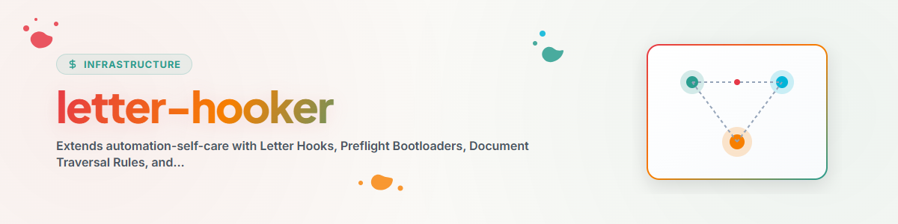

> **Русский** — Официальная русская версия `letter-hooker`.

# Letter-Hooker (Движок предполётной проверки и управления на уровне промпта)

Навык **Letter-Hooker** расширяет `automation-self-care` для фреймворков AI-агентов (таких как **Antigravity / Gemini CLI**), не имеющих встроенных событийно-ориентированных загрузчиков JSON-хуков жизненного цикла (например, `~/.claude/settings.json` или `~/.codex/hooks.json`).

Вместо использования пассивных хуков, срабатывающих при каждом нажатии клавиши, `letter-hooker` запускает **активный цикл предполётной загрузки и внедрения letter-хуков на уровне промпта** с помощью запланированных задач и скриптов обслуживания (`agy_kontext_and_workflow_loader.py`).

---

## Основные возможности

1. **Предполётные бутлоадеры и правила обхода документов**:
   - **Поиск вверх и вниз**: Принудительно исполняет строгие инструкции для агентов по проверке `AGENTS.md`, `CLAUDE.md`, `START.md`, `RULES.md` и `README.md` на уровне текущего рабочего каталога. Если файлы отсутствуют, выполняется обход вверх до их обнаружения, затем проверка вниз.
   - **Предполётная проверка Memory и Gardener**: Обязательный предварительный запрос к `gardener` и `memoryhooker` перед выполнением деструктивных или сложных изменений.

2. **Каталог Letter Hooks и справочные ссылки**:
   - Модульные инструкции в формате `.md`, хранящиеся в `OneDrive/.SYNC/antigravity_kontext_and_workflow_loader_package/letter_hooks/`.
   - Внедряет явные ссылки `file://` непосредственно в текст промпта `sidecar.json`, чтобы агенты считывали точные протоколы безопасности и рабочих процессов при вызове.

3. **Ежедневный список ключевых слов и самовосстанавливающееся обогащение промптов**:
   - Поддерживает ежедневный файл `STICHWORTLISTE.json` на основе активных и резервных задач.
   - Анализирует журналы выполнения (`AUTOMATIONS-MEMORY.md`) на предмет шаблонов сбоев (отсутствие контекста, отсутствие руководства по рабочему процессу, недействительные пути) и динамически обновляет промпты задач.

4. **Маршрутизация навыков и персон**:
   - Проверяет ключевые слова задач и сопоставляет их с соответствующими `.SKILLS` (например, `infrastructure/condition`, `semantic-persona-routing`, `orchestrator`, `think`, `decide`).

---

## Основные Letter Hooks

- **`HOOK-DOC-TRAVERSAL-01`**: [bootloader_doc_traversal.md](file:///<USER_HOME>/OneDrive/.SYNC/antigravity_kontext_and_workflow_loader_package/letter_hooks/bootloader_doc_traversal.md)
- **`HOOK-GARDENER-MEMORY-01`**: [preflight_gardener_query.md](file:///<USER_HOME>/OneDrive/.SYNC/antigravity_kontext_and_workflow_loader_package/letter_hooks/preflight_gardener_query.md)
- **`HOOK-WORKFLOW-HYGIENE-01`**: [workflow_lock_and_git_hygiene.md](file:///<USER_HOME>/OneDrive/.SYNC/antigravity_kontext_and_workflow_loader_package/letter_hooks/workflow_lock_and_git_hygiene.md)
- **`HOOK-PATH-VALIDATION-01`**: [path_validation_and_authority.md](file:///<USER_HOME>/OneDrive/.SYNC/antigravity_kontext_and_workflow_loader_package/letter_hooks/path_validation_and_authority.md)

---

## Интеграция в рабочий процесс

```bash
# Execute the Letter-Hooker Maintenance Engine
python OneDrive/.SYNC/scripts/agy_kontext_and_workflow_loader.py
```

1. **Сканирование Sidecar**: Чтение всех текстов промптов `sidecar.json` в `~/.gemini/config/sidecars/`.
2. **Обновление списка ключевых слов**: Извлечение доменных терминов и сохранение в `.SYNC/STICHWORTLISTE.json`.
3. **Внедрение Letter Hooks**: Добавление правил бутлоадера и справочных ссылок `file://` в промпты.
4. **Журналирование результатов**: Запись обновлений в `ANTIGRAVITY-LOG.txt` и `ANTIGRAVITY-REGISTRY.md`.