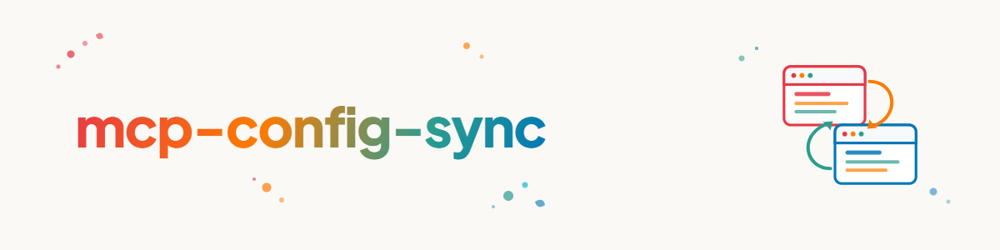

> **English** — Official English version of `mcp-config-sync`.

# MCP Config Sync (English)

This is the MCP-focused entry point to `agent-config-sync`. It assumes no
provider, app or master file.

1. Ask which concrete endpoints or axes the user wants: within one provider
   across app classes, within one app class across providers, an explicit list,
   or every detected provider and class.
2. Run `agent-config-sync/scripts/sync.py --discover`, then `--offer`.
3. Present detected endpoints separately from unverified candidates.
4. Let the user choose truth source, targets, direction and conflict policy.
5. Materialize `registry.json`, review `--plan`, and only then use
   `--apply --yes`.

Discovery and offers are read-only. There is no implicit hub and no implicit
“sync all”. The former Claude Code↔Claude Desktop scripts are a legacy profile,
not the generic default.