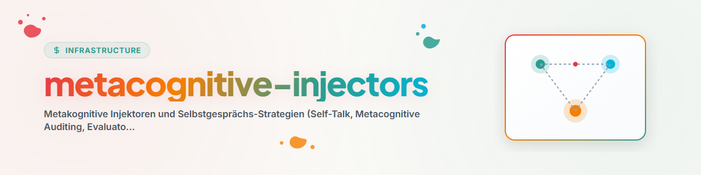

# Metakognitive Injektoren (Metacognitive-Injectors, Active Retrieval & Memory Search)

Die Habilidad **Metacognitive-Injectors** (auch bekannt als **`self-talk`**, **`metacognitive-auditing`**, **`evaluator-hook`**, **`preflight-checklist`**, **`inner-speech`**, **`active-retrieval`** und **`rehearsal`**) etabliert kognitionspsychologische und therapeutisch fundierte Selbstüberwachungs-Strategien für KI-Agenten.

---

## 1. Aktive Informationssuche & Systemgedächtnis (Gardener & USMC)

### A. Aktive Informationssuche in Systemgedächtnissen
- Vor Annahmen oder vorschnellen Behauptungen **aktiv in den Systemgedächtnissen suchen**:
  1. **Gardener DB (`gardener.py` / `hb_garden_*`):** Durchsucht beobachtete Lerneffekte, Nutzerentscheidungen und Pfadvereinbarungen (z. B. `Gardener().find("companion")`).
  2. **USMC SQLite DB (`usmc_memory.db`):** Fragt gespeicherte Fakten, Lektionen und Sitzungsverläufe ab.
  3. **Zentrale Regeldateien (`CLAUDE.md`, `.SYNC`, `AGENTS.md`):** Liest bestehende Konventionen und Pfadangaben.

### B. Rehearsal: Aktives Abrufen & Wiedergeben (Retrieval Practice)
- **Subvokale Rehearsal-Schleife (Phonologische Schleife):**
  Informationen nicht nur passiv einlesen, sondern vor der Ausführung **aktiv abrufen, im Arbeitsgedächtnis rekonstruieren und mit der Realität abgleichen**.
  - *"Habe ich den genauen Pfad zum Script im Gedächtnis abgerufen?"*
  - *"Stimmt die Befehlssyntax mit den im Systemgedächtnis abgelegten Beispielen überein?"*

---

## 2. Kognitionswissenschaftliche & Therapeutische Fundierung

### A. Working Memory = State + Hooks (Baddeley & Cowan)
- **State (Gedächtnis-Inhalt):** Persistiert flüchtige Zwischenstände nach jedem Teilschritt in SQLite-Tabellen (`usmc_memory.db`), `AUTOMATIONS-MEMORY.md` oder lokalen State-Buffern.
- **Hooks (Steuerungs-Mechanik):** Preflight-Bootloader, Letter-Hooks und PreToolUse/PostToolUse Evaluator-Hooks.

### B. Miyakes Exekutivfunktionen (Command & Control)
1. **Inhibition (Impulskontrolle):** Unterdrückt vorschnelles Sign-Off und halluzinierte Erfolgsmeldungen.
2. **Shifting (Kognitive Flexibilität):** Schaltet bei Blockaden dynamisch auf Survival-Routing, Persona-Modi oder alternative Lösungswege um.
3. **Updating (Arbeitsgedächtnis-Update):** Aktualisiert fortlaufend den Arbeitszustand.

### C. Therapeutische Impulse (CBT, ACT & lösungsorientierte Therapie)
- **CBT Kognitive Umstrukturierung:** Reframing von Fehlern als wertvollen diagnostischen Daten.
- **ACT Kognitive Defusion & Akzeptanz:** Eigene Unsicherheit als Zustand akzeptieren und offenlegen.
- **Verhaltensexperimente:** Ausführen von Smoke-Tests/Dry-Runs zur Erbringung echter empirischer Evidenz.

---

## 3. Multi-Modell Ausweichkette & Codex Companion Schnittstelle

| Priorität | Berater / Prüfer | Schnittstelle / Befehl | Funktion / Regel |
| :--- | :--- | :--- | :--- |
| **Primär (1)** | **Gemini Subagent** | `invoke_subagent` / `define_subagent` | Schneller interner Prüfer für Routine-Checks. |
| **Sekundär (2)** | **Codex Companion (Native)** | `node "<USER_HOME>\.codex\.tmp\marketplaces\openai-codex\plugins\codex\scripts\codex-companion.mjs" task "..."` | Nativer Codex-Companion für Prüfungen & **`/goal`-Abnahme**. |
| **Tertiär (3)** | **Codex CLI Direct** | `codex exec --skip-git-repo-check` | Direktaufruf der Codex CLI. |
| **Quartär (4)** | **Claude CLI / Swarm** | `claude -p ...` / `hb_swarm_consensus` | Drittmeinung bei Token-Grenzen. |

---

## 4. Bereichsspezifische Prompt-Injektion (Tailored Injection Pattern)

Der Injektor (`agy_metacognitive_prompt_injector.py`) wählt bereichsspezifisch die passenden Strategien aus:

- **Grund-Block (alle Sidecars):** Anti-Hohl-Vollzug, `/goal`-Abnahme durch externes Modell, Aktive Informationssuche (Gardener/USMC), Rehearsal (Aktives Abrufen), Pre-Flight Checklist.
- **Research-Sidecars (`research-*`):** Erweitert um *Evidenzbasierte Recherche (keine Quelle ohne Abfragebeleg)*, *CBT Reframing & Kognitive Defusion (Nichtergebnisse als Befund)*.
- **Software-/Roblox-Sidecars (`software-*`, `roblox-*`):** Erweitert um *Phonologische Schleife & Rehearsal*, *Working Memory State Persistence*, *Survival-Routing*.
- **Maintainer & Generalists (`maintainer-*`, `generalist-*`):** Erweitert um *Aktive Informationssuche*, *Skill-Finder* und *Memory Hooks*.
