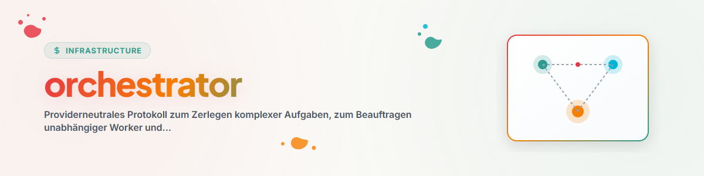

> **English** — Official English version of `orchestrator`.


# Orchestrator (English)

## Overview & Purpose

Use this skill when a task consists of at least two largely independent work packages and delegation provides a real time, context, or quality advantage. For small, tightly coupled tasks, work directly.

The skill describes a protocol. The actual starting, pausing, and resuming of workers occurs via the capabilities of the respective runtime.

## Authority Limit

Delegation does not expand authorization. Every worker receives at most the scope and modification rights that already apply to the main task. External, irreversible, or otherwise approval-requiring actions remain subject to approval.

## Process

### 1. Assess the Situation

1. Record the objective, success criteria, and exclusions of the main task.
2. Check project rules, locks, ongoing changes, and available budgets.
3. Before dispatch, secure the current lock, status, and diff state of the affected areas as a baseline. Only in this way can existing external changes be reliably distinguished from worker changes later.
4. Only parallelize work packages that are sufficiently independent.
5. Separate overlapping write areas or process them sequentially.

### 2. Write Contract

Before each dispatch, create a brief, verifiable contract:

| Field | Required Content |
|---|---|
| ID | stable ID of the work package |
| Objective | exactly one concrete result |
| Inputs | relevant files, data, or context sources |
| Positive scope | what may be read or modified |
| Negative scope | what remains explicitly untouched |
| Success criterion | observable condition for "done" |
| Evidence | expected proof, such as a test, diff, or reference |
| Return format | compact, structured completion message |

A worker receives only the context needed for this contract.

### 3. Execute and Observe

- Keep fan-out small and only increase it when there is independent benefit.
- Track progress via runtime status or a standard project checkpoint.
- In case of conflicts, scope expansion, or lack of authority, stop and escalate.
- A failed worker must not automatically block independent work packages.

### 4. Verify Results

A completion message is initially a claim. The orchestrator verifies itself:

1. Does the claimed artifact or named change exist?
2. Does it belong to the agreed scope?
3. Does the agreed test or proof currently pass?
4. Were external changes, locks, and negative scopes respected?
5. Do results from different workers contradict each other?

Only then is a work package considered complete.

### 5. Integrate and Secure

- Resolve conflicts consciously; do not blindly append results.
- Re-run necessary overall tests after integration.
- Clearly designate open, failed, and deferred packages.
- For longer runs, save objective, status, evidence, and next step in a recoverable checkpoint.

## Minimal Worker Prompt

```text
Auftrag: <Kennung und Ziel>
Eingaben: <Quellen>
Du darfst: <positiver Scope>
Du darfst nicht: <negativer Scope>
Fertig, wenn: <prüfbares Kriterium>
Belege mit: <Test, Diff oder Fundstelle>
Antworte als: <Rückgabeformat>
```

## Stop Conditions

Stop only the affected work package if its scope, authority, or evidence becomes unclear. Independent, safe packages may continue running.

Stop the entire delegation if:

- the subtasks are no longer independent,
- a shared write area cannot be safely separated,
- rules, locks, or authority for the entire remaining scope are unclear,
- the expected costs exceed the discernible benefit,
- the required evidence cannot be generated or verified.

## Changelog

### 1.1.0 (2026-07-28)
- Removed user, path, model, and provider bindings.
- Elaborated contract, authority limit, evidence verification, and checkpoints as portable core mechanics.
- Explicitly separated baseline for external changes as well as package-local and global stops.

### 1.0.0 (2026-06-17)
- Initial local version.