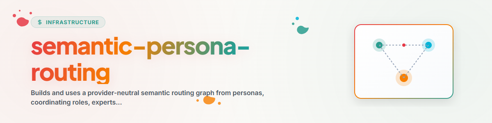

> **日本語** — `semantic-persona-routing` の公式日本語版。

# セマンティックペルソナルーティング (Semantic Persona Routing)

最初に能力に基づいてルーティングし、次にペルソナ（性格）を適用します。セマンティックなロールの選択、決定論的なエンドポイント検索、およびプロバイダー固有のロードを分離して保持するポータブルなマップを構築します。

## ルーティングモデル (Routing model)

```text
request
  -> semantic domain/coordinator role
  -> expert capability
  -> explicit or live-resolved skill endpoint
  -> optional persona overlay
  -> provider adapter loads and executes
```

ペルソナは、コミュニケーションスタイル、優先順位、および相互作用パターンを制御します。ツール、権限、または専門分野の能力を付与するものではありません。ロールは調整（コーディネート）し、エキスパートはドメインを絞り込み、スキルは実行可能なエンドポイントです。

## ルーティングマップの構築 (Build the routing map)

明示的なメタデータを正解（オーソリティ）として使用し、辞書的類似性は候補としてのみ使用します：

```bash
python scripts/build_routing_map.py \
  --roles-dir path/to/roles \
  --personas-dir path/to/personas \
  --skills-dir path/to/skills \
  --out routing-map.json
```

ビルダーは、`type`、`orchestrates.experts`、`parent_agents`、`skills`、説明文、プロヴェナンス（由来情報）などの一般的な `SKILL.md` フィールドを理解します。ソースシステムをインストールすることなくランタイムマップを生成します。フォーマットを拡張する前に [routing-map-schema.md](references/routing-map-schema.md) をお読みください。

`candidate_skills` を自動的に昇格させないでください。最初にライブのスキルリゾルバーまたはソースメタデータに対して確認してください。

## ペルソナの作成と配置 (Create and store personas)

コアはマップを構築するだけで、ペルソナを創作しません。独自のペルソナは
**スキルの隣**に置き、マップを再構築します：`personas/<persona-id>.md`
（ペルソナごとに 1 ファイル）、`roles/<role>/SKILL.md`（調整役と専門家）、
`routing-map.json`（生成されたマップ）、`config.json`（ホストローカル、公開しない）。
ビルダーはロールを `SKILL.md` からのみ、ペルソナは frontmatter 付きの任意の
Markdown から読み込みます。[templates/persona.template.md](templates/persona.template.md)
をコピーして契約を記入します：`name` と `type: persona`；`persona.display_name`、
`short_name`、`gender`、`role`、`default_prompt`；`parent_agents`（所属する調整役）；
`skills`（**スキル名のみ、パスは不可**。これだけがエンドポイントに解決されます）；
`optional_skills`（ホスト依存のスキル。無ければ可視の `GAP` のまま）。ペルソナは
ツールや権限を与えず、安全規則・ロック・ユーザー決定を上書きしません。

**パス：** スキルにはホストパスを書きません。`config.example.json` がパターン
（`ellmos.skill-config.v1`、`<HOME>/<ONEDRIVE>/<TOPICS>` などのプレースホルダーを持つ
`einstellungen.paths`）を示します。ホストローカルの複製は `config.json` で、
デプロイ時に保持され、コミットされません。

**カタログの整理：** `--skills-layout catalog` は `<category>/<name>/SKILL.md` のみを
受け入れ、`_` で始まるディレクトリ（`_archive`、`_reference`、`_templates`）を
スキップして、アーカイブや参照コピーによる `duplicate-skill-id` 問題を防ぎます。

## リクエストのルーティング (Route a request)

### 0. 既存ペルソナの提示 (Offer existing personas)

スキルの隣（`personas/`）にペルソナがあれば、呼び出し時に表示名・ロール・スキルを
列挙し、適合するものへルーティングします。リクエストがペルソナを指定しない場合は
手順 4 で選びます。ルート受領書の形式は変わりません。

### 1. コーディネーターロールをセマンティックに選択する

リクエストをロール名、説明、およびユースケースと比較します。リクエスト全体を調整できる最も限定的なロールを優先します。確信度が低い場合は複数の候補を表示したままにし、選択が結果を実質的に変える場合にのみユーザーに問い合せてください。

### 2. ロール内のエキスパートを選択する

リクエストが明らかに複数のロールにわたる場合を除き、選択したコーディネーターに接続されているエキスパートのみを使用します。直接のエキスパートリクエストは実行時にコーディネーターをスキップできますが、ルートの説明にはコーディネーターへのリンクを保持します。

### 3. 実行可能エンドポイントの解決

次の順序で解決します：

1. 明示的なソースメタデータまたは正確なプロヴェナンスからの `endpoint_skills`；
2. 現在の外部スキルリゾルバーまたはローカルスキルファインダー；
3. 検証済みの `candidate_skills`；
4. エンドポイントが存在しない場合の可視化された `GAP`。

インストールされたスキルであるかのようにエキスパート名へルーティングしないでください。欠落しているエンドポイントは移植上のギャップ（porting gap）であり、捏造する許可ではありません。

ライブレジストリ、辞書的ファインダー、またはプロバイダー固有のスキルローダーを接続する場合は [endpoint-resolution.md](references/endpoint-resolution.md) をお読みください。

### 4. ペルソナオーバーレイの適用

選択したロールまたはエキスパートに紐付けられたペルソナを選択します。複数のペルソナが適合する場合は、宣言された制限とスタイルがタスクに一致するものを優先します。明示的に接続されているペルソナがない場合は、ペルソナを適用しません。

ペルソナの指示は、安全規則、ロック、ユーザーの決定、専門的境界、またはツール権限をオーバーライドすることはできません。

### 5. ロードと実行

プロバイダーネイティブのスキル/エージェントロードメカニズムを使用します。実行前に選択したライブスキル指示をロードします。ルーターは軽量に保ち、実行は解決されたスキルがロードされたワーカーまたは現在のエージェントに属します。

## ルート受領書 (Route receipt)

以下を返却または記録します：

```text
ROLE: <coordinator or direct>
EXPERT: <expert or n/a>
SKILLS: <verified live endpoints>
PERSONA: <overlay or none>
RESOLUTION: explicit | provenance | live-resolver | verified-candidate | GAP
CONFIDENCE: high | medium | low
WHY: <one short reason>
GAPS: <missing endpoints or stale-map warnings>
```

ソースのロールまたはスキルインベントリが変更された場合は、マップを再構築します。ライブリゾルバーはエンドポイントの可用性について古くなったマップを差し替えることができますが、セマンティックロールのタキソノミー（分類体系）を暗黙のうちに書き換えてはなりません。

## 例 (Example)

リクエスト：「領収書を整理して、課税年度の概要を準備してください。」

ルーターはオフィスコーディネーター、次に税務エキスパートを選択し、インストールされている税務スキルを解決し、最後に明示的にリンクされた綿密な税務ペルソナを適用します。税務エキスパートは存在するがポータブルな税務スキルがインストールされていない場合は、`GAP` を報告し、明示的に設定されたフォールバックを通じてのみ継続します。

## 変更履歴 (Changelog)

### 1.1.0 (2026-09-03)

- ペルソナの作成と配置：スキル隣の配置規約、frontmatter 契約、中立テンプレート
  `templates/persona.template.md`、`config.example.json` によるパス規約、呼び出し時の
  振る舞い、重複スキル ID に対する `--skills-layout catalog`。

### 1.0.0 (2026-07-28)

- 実証済みのドメインルーターパターンから、プロバイダーに依存しない ロール/エキスパート/スキル チェーンを抽出し、可視化されたエンドポイントギャップを備えたポータブルマップ生成を追加しました。