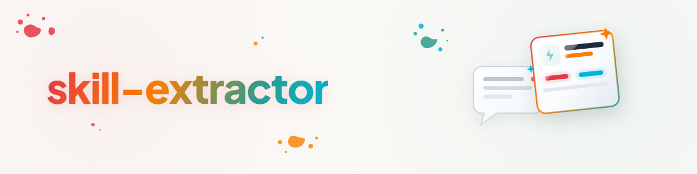

> **English** — Official English version of `skill-extractor`.


# Skill-Extractor — Extracting Skills from Chat Histories (English)

## Overview & Purpose

Valuable workflows emerge during sessions: a problem was laboriously solved, the user provided several corrections, and in the end there is a working process — but next time the agent starts from scratch again. This skill distills what is worth preserving from a chat history and turns it into a skill adhering to the local skill library conventions. Core principle: **Extend before creating new** — if a very similar skill exists, improve it instead of creating a duplicate.

Distinction: The output here is a **callable skill** (a capability/procedure loaded by an agent as needed). If the history should be turned into an **autonomous automation** (recurring prompt, cron, schedule), use the sister skill `workflow-extract`.

## Workflow

### 1. Determine Source

Three input formats:

| Source | Access |
| --- | --- |
| **Current Session** | Use conversation context directly — no files needed |
| **Individual Transcripts** | Read files; locations and parsing: `transcript-quellen.md` |
| **Bulk (many old histories)** | First data reduction via subagents, then extraction: section "Bulk Mode" |

### 2. Identify What Is Worth Extracting

Not every session contains a skill. Look for these signals — they show where hard-earned knowledge lies that will be needed again:

- **Repetition:** The same process occurred ≥2 times (in this session or across multiple sessions).
- **Correction loops:** The user fine-tuned the agent multiple times until it was correct — the final version is the distillate, and the corrections are the rationales ("why this way").
- **Explicit markers:** "remember this", "this is how we always do it", "next time do it directly like this".
- **Tool chains:** A non-obvious sequence of tools/commands that worked (including the dead ends to avoid).
- **Decision rules:** Criteria used to choose between alternatives.

Record for each candidate: Trigger (when is it needed), Workflow (steps), Rationales (why this way and not otherwise), Pitfalls (what went wrong), Output format.

### 3. Dedup Gate: Extend Before Creating New

Before writing anything, check the existing landscape:

1. Search candidate keywords against the skill directories (agent deployment folder, e.g., `~/.claude/skills/`, and — if available — the curated skill library as the source of truth; likewise registered plugin skills).
2. Actually **read** the 2–3 closest skills, don't just compare names.
3. Decide:

| Finding | Action |
| --- | --- |
| Candidate is essentially already covered | **Extend:** incorporate missing elements into the existing skill (new section, new technique, new pitfall), bump MINOR version, add changelog entry |
| Partial overlap, but different core | **New Skill** with cross-reference ("Related Skills") to neighboring skills — do not duplicate content, reference it instead |
| Nothing comparable | **New Skill** |

Rule of thumb: If more than half of the candidate is contained in an existing skill, extend it. A skill repository full of near-twins is worse than a well-maintained skill.

### 4. Neutralize

The raw material is full of session-specific details. Abstract before writing according to the rules in `neutralisierung.md`: separate mechanics (generally applicable) from configuration (user-/system-specific), replace concrete paths/hosts/names with placeholders or a clearly marked configuration block. Goal: The skill works for other users, other systems, other projects.

### 5. Write Skill

- **Format:** Follow the conventions of the target library (frontmatter, naming scheme, language, changelog). In this library: `docs/CONVENTIONS.md` (complete YAML header, kebab-case name, German primary, Semantic Versioning).
- **Formulate description "pushy":** The description is the trigger mechanism. Write both WHAT the skill does and WHEN it should trigger (typical user formulations) — skills are more often triggered too rarely than too frequently.
- **Why before What:** Carry rationales from the correction loops into the skill. A skill that only lists steps will be applied incorrectly at the first edge case; one that explains why can be transferred.
- **Document pitfalls:** The dead ends from the session are gold — include them as a "Red Flags" or "Pitfalls" section.
- **Keep it lean:** Under ~300 lines; offload detailed material into reference files that `SKILL.md` points to.

### 6. Command Wrapper (optional)

If the skill should be invoked directly on a regular basis, create a slash command (for Claude Code: a short Markdown file in `~/.claude/commands/<name>.md` pointing to the skill and passing through arguments). Convention: Command = thin entry point, content lives in the skill.

### 7. Register and Test

- Place in the library (correct category) and deploy to environment (here: `python skill_sync.py deploy <name>` — initial installation requires the explicit name).
- Trigger test: Formulate 2–3 realistic prompts that should trigger the skill, and check if the description takes effect.
- For a full evaluation loop (test cases, baseline comparison, description optimization), use `skill-creator` if installed — this skill here is the extractor, not the test lab.
- Index/Routing maintenance: Update skill finder/index skills if present (here: `code-skill-index`, `skill-finder` routing table).

## Bulk Mode: Many Old Chat Histories

Transcripts are large (often >100k tokens); never load all of them raw into a single context.
Map-Reduce via subagents (pattern: `swarm-operations` skill, task swarm):

1. **Inventory:** List transcript files (locations: `transcript-quellen.md`), group by project/timeframe. For very large collections, reduce first using existing collectors/extractors (e.g., prompt-listener/study datasets containing only user prompts) — user prompts + corrections carry the most signal.
2. **Map:** One subagent per bundle with a narrow task: "Read these transcripts, report skill candidates as a compact list (trigger, workflow, rationales, pitfalls, source session)" — return only distillates, never raw text.
3. **Reduce:** Merge candidate lists, cluster, merge duplicates. Frequency counts: A pattern appearing in 5 sessions is a stronger candidate than a one-off trick.
4. **Gate + Build:** Run steps 3–7 of the standard workflow for top candidates. Present a numbered candidate list to the user for selection before mass creation — bulk extraction creates skill junk otherwise.

## Example & Usage

```text
User: „Wir haben jetzt dreimal PDF-Rechnungen nach demselben Schema geparst —
mach daraus einen Skill."

1. Quelle: aktuelle Session. Signal: Wiederholung (3×) + Korrektur („Beträge immer
   als Dezimalzahl mit Punkt, nicht Komma").
2. Dedup-Gate: Suche findet `pdf`-Skill (generisch, Erzeugung/Extraktion) — Kern
   überlappt nicht (hier: Rechnungs-Schema + Validierungsregeln) → neuer Skill
   `invoice-parsing` mit Querverweis auf `pdf`.
3. Neutralisieren: konkreter Ablageordner und Firmenname → Konfigurationsblock.
4. Skill schreiben: Schema-Tabelle, die Komma/Punkt-Korrektur als Fallstrick,
   Changelog 1.0.0. Trigger-Test mit „lies diese Rechnung ein".
```

## Red Flags

| Thought | Reality |
| --- | --- |
| "I'll quickly create a new skill" | Dedup gate first — extend before creating new. |
| "I'll keep the paths, since it's for this system" | Neutralization is mandatory; concrete details belong in a configuration block. |
| "The history is long, I'll summarize from memory" | Specifically search for signals (corrections, markers) — memory smooths over the exact details that make the skill valuable. |
| "Every session yields a skill" | Without repetition/correction/marker signals: no skill. |

## Related Skills

- `workflow-extract` — same extraction, but target is an autonomous automation.
- `skill-explorer` — audit/cleanup of the skill landscape (uses the dedup gate at scale).
- `skill-creator` (plugin) — eval loop and description optimization for finished skills.
- `swarm-operations` — swarm pattern for bulk mode.

## Changelog

### 1.0.0 (2026-07-03)
- Initial version. Created from the assignment to systematically abstract Codex automations and chat histories into skills.