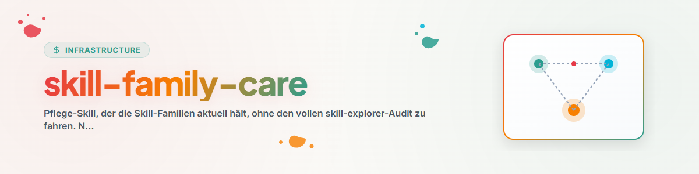

# Skill-Family-Care

## Zweck

Hält die Skill-**Familien** aktuell — ohne den vollen Audit-Lauf von `skill-explorer`. Ausgegründet
nach dem Installer-Prinzip (schlanker Subskill statt Monolith). Referenziert die Skripte von
`skill-explorer`, kopiert sie nicht.

## Quellen (nicht duplizieren)

- **Familienliste:** `<USER_HOME>\OneDrive\.USR\SKILL-MAP.md` (kanonische Family-/Routing-Map).
- **Inventar (Ist-Stand):** `skill-explorer/scripts/inventory_skills.py`.
- **Router setzen/entfernen:** `skill-explorer/scripts/inject_family_header.py`.
- **Config (welche Familien verlinkt):** `~/.claude/skills/skill-explorer/config.json`.

## Aufgaben

### A — Neuen Skill einer Familie zuordnen
1. Inventar neu erheben:
   ```bash
   PYTHONIOENCODING=utf-8 python ~/.claude/skills/skill-explorer/scripts/inventory_skills.py \
       --out ~/.skill-inventory.json --pretty
   ```
2. Passende Familie aus `SKILL-MAP.md` wählen (Achsen: Phase/Breite/Rigidität/Wirkung/Rohstoff).
3. Skill als Mitglied in `config.json` (`families[<fam>].members`) und in `SKILL-MAP.md` eintragen.

### B — Header-Router nach Familienänderung nachziehen
```bash
PYTHONIOENCODING=utf-8 python ~/.claude/skills/skill-explorer/scripts/inject_family_header.py \
    --family <Familie> --skills s1,s2,s3 --router "<Wegweiser>" --inventory ~/.skill-inventory.json
```
- Idempotent: ein vorhandener Block derselben Familie wird ersetzt.
- Nur `editable`/`source=user`-Skills werden verändert (Gate im Skript).

### C — Verwaisten Router entfernen
Gleiches Skript mit `--remove` (kein `--router` nötig).

## Eiserne Regeln

- **Survey ≠ Mutation:** nur user-eigene Skills bekommen Header. Plugin/extern nie anfassen.
- Nach jeder Änderung `config.json` (`families[*].linked`, `updated`) aktualisieren.
- Keine Inhalte aus der Family-Map in die Einzelskills kopieren — nur Wegweiser-Block.

## Changelog

### 0.1.0 (2026-06-17)
- Initiale Version. Erzeugt vom Audit-Modus (P1).
