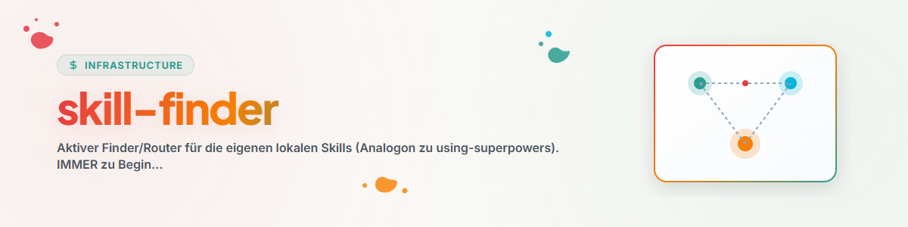

# Skill-Finder

## Die Regel

Vor jeder nicht-trivialen Aufgabe zuerst prüfen, ob ein lokaler Skill sie besser löst. Schon bei
geringem Verdacht den passenden Skill laden und **seiner Live-Anleitung folgen** (Datei lesen, nicht
aus dem Gedächtnis arbeiten). Trifft kein Skill zu, normal fortfahren.

## Familien-Routing

<!-- Generiert/aktualisiert aus SKILL-MAP.md + inventory_skills.py. Thema -> Familie -> Skill.
     Pflege: Subskill skill-family-care oder neuer skill-explorer-Audit-Lauf. Stand: 2026-06-17 -->

| Thema / Absicht | Familie | Skill(s) |
|-----------------|---------|----------|
| Problem durchdenken / analysieren | Denkwerkzeuge | `/structured-thinking` (führt `/think` → `/brainstorm` → `/decide`) |
| neue Ideen / Kreativität | Denkwerkzeuge | `/brainstorm` (vs `/think` Analyse, `/decide` Auswahl) |
| Entscheidungs-Stapel | Denkwerkzeuge | `/decision-briefing` |
| Autorisiertes Nutzerprofil aufbauen oder nutzen | Multi-Agent | `build-your-users-mind` (Aufbau) · `decision-avatar` (Nutzung) |
| Bug / Testfehler | Coding & Debugging | `/bugfix-protocol` (1 Bug), `/bugsweep` (viele, vor Release) |
| neues/bestehendes Projekt oder Pipeline | Projekt/Pipeline | `/projekt-pipeline-umbrella` (→ bootstrapper/onboarding/optimizer) |
| Roblox-Spiel | Game-Dev | `/roblox-dev` (→ `/rojo`, `/roblox-studio`, `/game-design`) |
| Therapie / Beratung / Krise | Therapie | `/therapie-umbrella` (→ stabilization/guideline/counseling) |
| Präsentation / Slides | Office | `/academic-pptx` (Inhalt) + `/pptx` (Datei) |
| Orchestrierung vor komplexer Multi-Agent-Arbeit gemeinsam begrenzen | Multi-Agent | `choose-your-orchestrator` (`/choose-your-orchestrator`) |
| Bestätigte Multi-Agent-Koordination ausführen | Multi-Agent | `orchestrator`, `/swarm-operations`, `/model-strategy` |
| Bewerbung / Selbstmanagement | Persönlich | `/bewerbungsexperte`, `/selbstmanagement` |
| Skills vergleichen/aufräumen/finden | System/Meta | `skill-explorer` (Audit/Explore), `code-skill-index` (Liste) |
| System aufsetzen / MCP syncen / Agenten anbinden | System/Meta | `/system-onboarding`, `/mcp-config-sync`, `/agents-bridge` |
| Datei-Werkzeuge | Utilities | `/document-chunker`, `/migrate-rename`, `/plugin-system` |
| Chatverlauf → Skill konservieren | System/Meta | `skill-extractor` (`/skill-extract`) |
| Chatverlauf/Fremd-Automation → Automatisierung | System/Meta | `workflow-extract` (`/automations-extract`) |
| wiederkehrender Check über viele Projekte | Coding & Debugging | `rotation-check` (Registry/Log-Gerüst) |
| festgefahrenes Problem, Ideen schürfen | Denkwerkzeuge | `idea-mining` (vs `/brainstorm` = frei/breit) |
| DE/EN-Dokumentfassungen synchron halten | Utilities | `bilingual-doc-sync` |
| sehr konfliktreicher Merge / divergente Branches (main vs. master) / alter PR | Coding & Debugging | `reissverschluss-merge` (`/reissverschluss-merge` · `/zipper-merge`; Eskalation: Rebuild statt Merge) |
| KI-Spuren/Chat-Reste aus Texten, AI-Disclosure | Utilities | `llm-text-hygiene` |
| Bedingung/Zeitpunkt/Reihenfolge im Auftrag („erst wenn", „ab 6 Uhr", „sobald X fertig") | Prozess | `condition` (`/if` · `/when` · `/if-only` · `/after` · `/and` · `/or`) |
| Dateien aus einem Ordner regelbasiert einsammeln/sortieren ("hole aus X immer Y und sammle sie in Z", "sortiere Ordner automatisch") | Utilities | `file-collect-sort-action` |
| App-/GUI-Serie gemeinsam mit dem User durchtesten (live testen, Feedback sofort auswerten + Reparatur delegieren) | Coding & Debugging | `human-loop-audit` |
| Projekt nach Sitzungsende aufräumen (Register lösen/einsortieren, Doku auf Ist-Stand bringen, Strays wegräumen) | Coding & Debugging | `tidy-up` (`/tidy-up`; zählt als `work-autonomous`-Ebene-1-Quelle) |
| Regel-/Gedächtnisdatei kürzen, ohne Inhalt zu verändern ("CLAUDE.md ist zu lang", "wird abgeschnitten") | Utilities | `paveman` (deterministisch, kein Modellaufruf; vs. `knappform` = LLM-Sprechstil) |

Vollständige Liste: Skill `code-skill-index`.

## Red Flags (Rationalisierungen, die STOP bedeuten)

| Gedanke | Realität |
|---------|----------|
| „Das ist nur eine kurze Frage." | Fragen sind Aufgaben — Skill-Check zuerst. |
| „Ich kenne das Konzept." | Konzept kennen ≠ Skill nutzen. Live-Datei lesen. |
| „Der Skill ist Overkill." | Einfaches wird komplex — nutzen. |
| „Ich erkunde erst selbst." | Skills sagen WIE man erkundet. Erst prüfen. |

## Pflege

Routing-Tabelle bei Familienänderung aktualisieren (Subskill `skill-family-care` oder neuer
`inventory_skills.py`-Lauf aus `skill-explorer`).

## Changelog

### 0.7.0 (2026-08-20)
- `choose-your-orchestrator` als vorgeschalteten Empfehlungs- und Vertragsdialog für
  komplexe Multi-Agent-Arbeit ergänzt; Ausführungsrouting zu `orchestrator`,
  `swarm-operations` und `model-strategy` davon getrennt.

### 0.6.0 (2026-08-19)
- Routing-Zeile für neuen Skill paveman ("Regel-/Gedächtnisdatei kürzen, ohne Inhalt zu
  verändern"): dünner Wrapper um das bereits installierte, deterministische Kürzungs-Modul
  `paveman` (T-20260819-213392123); Abgrenzung zu `knappform` (LLM-Sprechstil statt Datei-Edit).

### 0.5.0 (2026-08-19)
- Routing-Zeile für neuen Skill tidy-up ("Projekt nach Sitzungsende aufräumen": einmaliger
  Tasksolver+Writer+Maintainer-Durchlauf für den aktiven Projektordner; zählt als
  `work-autonomous`-Ebene-1-Quelle für `/goal`-Konstruktionen).

### 0.4.0 (2026-08-18)
- Routing-Zeile für neuen Skill human-loop-audit ("App-/GUI-Serie gemeinsam mit dem User
  durchtesten", Reißverschluss-Audit mit paralleler Reparatur-Delegation; abgegrenzt vom
  gleichnamig klingenden, aber inhaltlich fremden reissverschluss-merge).

### 0.3.0 (2026-08-18)
- Routing-Zeile für neuen Skill file-collect-sort-action ("Dateien regelbasiert einsammeln/
  sortieren", Erkennung der geparkten f-csa-Trigger-Sätze aus T-20260818-916568570).
- Nachgezogen: Routing-Zeile für reissverschluss-merge fehlte in der Quelle des Skills-Repos
  (nur im Deployment `~/.claude/skills/` vorhanden) — Drift beim Bearbeiten aufgefallen und
  hier wiederhergestellt, damit ein künftiger Deploy sie nicht überschreibt.
- `version:`-Feld an den zuletzt schon erreichten Changelog-Stand (0.2.0) angeglichen und
  auf 0.3.0 weitergezählt — war zuvor bei 0.1.0 stehengeblieben.

### 0.2.0 (2026-07-03)
- Routing-Zeilen für neue Skills: skill-extractor, workflow-extract, rotation-check,
  idea-mining, bilingual-doc-sync (Codex-Automations-Extraktion).

### 0.1.0 (2026-06-17)
- Initiale Version. Erzeugt vom Audit-Modus ([F]) als Analogon zu using-superpowers. Routing-Tabelle
  aus dem Audit vom 2026-06-17 (10 user-Familien).
