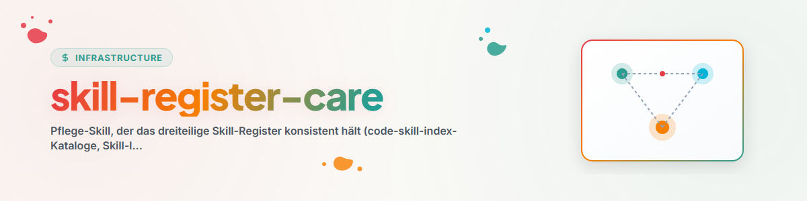

# Обслуживание реестра навыков (Skill-Register-Care)

## Назначение

Поддерживает **реестр** в состоянии без расхождений. Реестр состоит из трех взаимосвязанных артефактов — никогда не создавать четвертый, всегда расширять эти три:

- `~/.claude/skills/code-skill-index/references/catalog-*.md` (каталоги категорий)
- Индекс навыков (главный список)
- `<USER_HOME>\OneDrive\.USR\SKILL-MAP.md` (карта семейств и маршрутизации)

## Процедура проверки расхождений (Drift-Check)

1. **Сбор текущего состояния:**
   ```bash
   PYTHONIOENCODING=utf-8 python ~/.claude/skills/skill-explorer/scripts/inventory_skills.py \
       --out ~/.skill-inventory.json --pretty
   ```
   Только навыки с `source=user` имеют отношение к реестру (плагины/внешние остаются за рамками).
2. **Чтение целевого состояния:** три артефакта реестра.
3. **Вычисление разницы:**
   - **Отсутствует** (есть в инвентаре, нет в реестре) → добавить.
   - **Осиротело** (есть в реестре, больше нет в инвентаре) → пометить/удалить.
   - **Расхождение подсчета** (например, "18 навыков" больше не соответствует действительности) → скорректировать число.
4. **Добавление записей:** для каждого нового навыка добавить строку в соответствующий `catalog-<kategorie>.md`, строку в индекс навыков (+ дата в заголовке) и — если появилось новое/измененное семейство — раздел в `SKILL-MAP.md`.
5. **Установить дату обновления** во всех затронутых файлах на текущую дату.

## Вспомогательный фрагмент (перечислить отсутствующие пользовательские навыки)

```bash
PYTHONIOENCODING=utf-8 python -c "
import json
inv=json.load(open('<USER_HOME>/.skill-inventory.json',encoding='utf-8'))
print('\n'.join(s['dir'] for s in inv['skills'] if s['source']=='user'))
"
```
Сверить вывод с артефактами реестра (вручную или через grep).

## Железные правила

- **Никакого четвертого реестра** — расширять только эти три.
- В реестр входят только навыки, созданные пользователем; сторонние навыки следуют внешнему пути.
- Не угадывать дату — устанавливать текущую актуальную дату.

## История изменений

### 0.1.0 (2026-06-17)
- Первоначальная версия. Создана в режиме аудита (P2). Причина: во время аудита 2026-06-17 в SKILL-MAP отсутствовало ~10 навыков пользователя (swarm-operations, model-strategy, agents-bridge, mcp-config-sync, system-onboarding, update-cli-docs, migrate-rename, plugin-system + семейства терапии и разработки игр).
