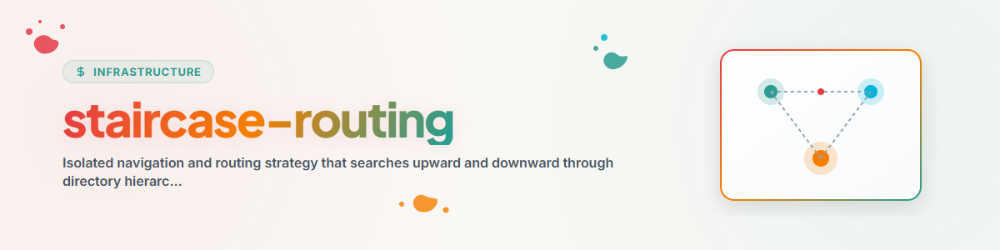

> **日本語** — `staircase-routing` の公式日本語版。

# Staircase-Routing (Up-and-Down / Walking Bass ルーティング)

**Staircase-Routing** スキル（*Up-and-Down Routing* または *Walking Bass Routing* とも呼ばれます）は、AI エージェント向けのディレクトリドキュメント検証戦略を独立・隔離させたものです。

エージェントがディレクトリに入ったりファイルを操作したりする際、コードの変更やアクションを実行する前に、この戦略を使用して信頼できるコンテキスト、ルール、および道標ドキュメントを特定します。

---

## 1. 道標ドキュメント規格

デフォルトでは、Staircase-Routing は以下の標準的な道標ドキュメントを検索します:
- **グローバルおよびプロジェクト制御:** `CLAUDE.md`、`AGENTS.md`、`START.md`、`RULES.md`
- **プロジェクト概要およびタスク:** `README.md`、`TODO.md`、`NOTIZ.md`、`BEWEISNOTIZ.md`
- **カスタムユーザーキーワード:** `staircase-config.json` または `config.json` 経由で設定。

---

## 2. トラバースアルゴリズム

```
                           [ Root / Workspace Level ]
                           ┌────────────────────────┐
                           │   CLAUDE.md / RULES.md │ ◄── (Step 2: Read Root Signpost)
                           └───────────▲────────────┘
                                       │ (Staircase Up)
                           ┌───────────┴────────────┐
                           │ Subfolder / Target Dir │ ◄── (Step 1: Start at CWD)
                           └───────────┬────────────┘
                                       │ (Staircase Down)
                           ┌───────────▼────────────┐
                           │ Child / Module Dir     │ ◄── (Step 3: Discover Sub-Signposts)
                           │   module-rules.md      │
                           └────────────────────────┘
```

### ステップ 1: カレントワーキングディレクトリ (CWD) の検証
- ターゲットファイルのディレクトリまたはアクティブな作業ディレクトリを検証します。
- 道標ドキュメントが存在する場合は、直ちに読み込みます。

### ステップ 2: 上方向へのトラバース (Staircase Up)
- CWD 内に道標ドキュメントが**存在しない**場合、親ディレクトリ (`..`) へ移動します。
- ルート道標ドキュメント (`CLAUDE.md` または `AGENTS.md`) またはワークスペースの境界に達するまで、段階的に上方向への移動を繰り返します。
- 発見されたすべてのルート道標を読み込み、グローバルな指示およびプロジェクトルールを確立します。

### ステップ 3: 下方向への検証 (Staircase Down)
- 確立されたルートディレクトリから、タスクに関連するサブディレクトリへ段階的に下ります。
- モジュールレベルの専用道標ドキュメント、ドメインルール、またはコンポーネント設定を発見し、それらを読み込みます。

---

## 3. ユーザー設定可能なキーワード (`staircase-config.json`)

エージェントはローカルまたはグローバルの `staircase-config.json` を読み込み、ターゲットとなる道標をカスタマイズできます:

```json
{
  "signpost_filenames": [
    "CLAUDE.md",
    "AGENTS.md",
    "START.md",
    "RULES.md",
    "README.md",
    "TODO.md"
  ],
  "custom_buzzwords": [
    "SECURITY",
    "POLICY",
    "GOVERNANCE",
    "PIPELINE"
  ],
  "max_upward_depth": 10,
  "exclude_directories": [
    "node_modules",
    ".git",
    "__pycache__",
    "dist",
    "build",
    "archive"
  ]
}
```

---

## 4. `letter-hooker` およびスケジュールタスクとの統合

`staircase-routing` は、**`letter-hooker`** スキルおよび **`antigravity-kontext-and-workflow-loader-and-divider`** スケジュールタスクにコアプレフライトブートローダーとして組み込まれており、エージェントが編集を開始する前に常に道標ドキュメントを特定し遵守することを保証します。