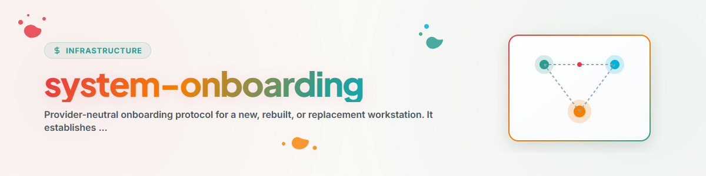

> **日本語** — `system-onboarding` の公式日本語版。

# システムオンボーディング

このプロトコルを使用して、ローカルファーストのエージェント作業用に新規または再構築されたワークステーションを立ち上げます。本ガイドは手順と検証のガイドであり、インストーラーや認証情報の提供元ではありません。稼働中のシステムを変更する前に、各プロバイダーの最新ドキュメントから製品固有の指示を確認してください。

## アクティベーション

新規ワークステーション、OSの再インストール、代替デバイス、または単一のエージェント実行環境の管理された復旧に使用します。まず、OS、対象の実行環境、所有者、共有ルール面、およびリクエストが完全な再構築か限定的なコンポーネント修復かを特定します。あるホストからコピーした構成が別のホストで安全またはサポートされていると仮定しないでください。

## 順序立てられたワークフロー

1. OSのアップデート、Git、認証済みソース管理、Python、および必要に応じて現在サポートされている Node.js LTS を確立します。
2. サポートされているインストーラーを通じて要求されたエージェント実行環境のみをインストールし、プロジェクトファイルにトークンを配置することなくネイティブなログインフローを完了します。
3. ローカル構成のルートを作成し、明示的に選択された標準ルール面をロードします。テンプレートをマージし、既存のローカル状態を盲目的に上書きしないでください。
4. 指定されたデプロイ手順に従ってのみ、ポータブルスキルおよび MCP またはプラグイン構成をインストールします。各プロバイダーの構成フォーマットは異なるものとして扱います。
5. ローカル実行環境が動作した後にのみ、共有同期を構成します。認証情報、完全なプロンプト、またはマシン固有のローカルパスではなく、サニタイズされた契約とレシートのみを共有します。
6. サポートされているネイティブサーフェスを通じてのみ、スケジューラまたは自動化を再作成します。以前の状態を保持し、所有者が有効化を承認するまで新しい作業は無効にしたままにします。
7. 適切なインストール後チェックを実行し、インストール、構成、スケジューラ登録、および成功結果を区別するローカルレシートを書き込みます。

対象プラットフォームに該当するリファレンスのみを参照してください：

- 境界とデータ配置については [概要](references/overview.md)；
- Windows については [Windows チェックリスト](references/windows-checklist.md)；
- macOS については [macOS チェックリスト](references/mac-checklist.md)；および
- 検証と復旧については [インストール後](references/post-install.md)。

## 境界条件

- 認証情報、リカバリコード、プライベートプロンプト、アカウント識別子、または生ログを共有リポジトリや同期フォルダに公開しないでください。
- 仮想環境、依存関係キャッシュ、および大規模な実行環境アーティファクトは、クラウド同期されるプロジェクトフォルダ外に保持してください。
- コピーされた構成を正規としないでください。ターゲットホストは自らサポート状態を検出して読み取る必要があります。
- タスクファイルが存在するという理由だけでスケジュールを登録しないでください。ネイティブ登録と結果のエビデンスは別々の要件です。
- 既存のホストを修復する場合は、構成を変更する前に現在の状態とロックのインベントリを取得してください。

## 完了エビデンス

完全なオンボーディングレシートには、ターゲットOS、選択された実行環境、それらの検証済みバージョン、ロードされた標準ルールリファレンス、デプロイされた明示的なスキルまたは拡張機能、サポートされていない機能、および保留されたユーザー決定事項が記録されます。コマンドが正常終了したことだけでは、アプリケーションが新しい構成をロードしたことや、スケジューリングされたタスクが意図した結果を達成したことのエビデンスにはなりません。

## 変更履歴

### 1.2.0 (2026-07-29)

- ホスト固有のパス、アカウント詳細、およびプライベートな運用資料を削除した後、再利用可能なオンボーディング手順とプラットフォームリファレンスをパブリックスキルカタログに移植しました。