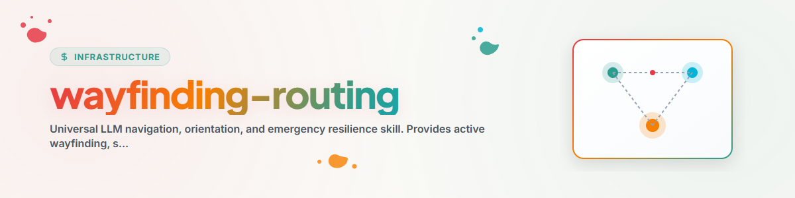

> **日本語** — `wayfinding-routing` の公式日本語版。

# Wayfinding-Routing (自己定位 & 緊急フォールバックエンジン)

The **Wayfinding-Routing** skill (またの名を **`survival-routing`**、**`dead-reckoning`**、**`pathfinder-routing`**、および **`celestial-routing`**) は、LLM エージェントのための決定的なナビゲーションおよび緊急リカバリフレームワークとして機能します。

本スキルは、通常実行時のプロアクティブな経路探索ヒューリスティクスと、コンテキストドリフト、繰り返し発生する実行エラー、API 障害、または行き止まりに遭遇した際の緊急プロトコルをエージェントに装備します。

---

## 同義語 & 戦略の概要

| 同義語戦略 | 比喩 & 核心原則 | 適用ユースケース |
| :--- | :--- | :--- |
| **`wayfinding-routing`** (主要) | **ウェイファインディング / 空間的定位:** 外部 GPS なしで、道標や環境のヒントを読み取ってナビゲートする。 | サイドカー、`workflowhooker`、および `automation-self-care` のメインナビゲーションループ。 |
| **`survival-routing`** | **緊急フォールバック & 自己保存:** ツールが失敗した際やループが形成された際のサーキットブレイクおよび段階的デグラデーション。 | コマンドのタイムアウト、繰り返しの失敗、権限エラーに直面した際の緊急リカバリ。 |
| **`dead-reckoning`** | **航海推測航法 (Koppelnavigation):** 外部ステータスなしで、ステップバイステップのブレッドクラム（足跡）から正確な状態を再構築する。 | 精密なバックトラックを可能にするため、スクラッチファイルや `TODO.md` に実行ステップを記録する。 |
| **`pathfinder-routing`** | **スカウト / パスファインダー先導:** マルチエージェントチームのための事前検査とルート開拓。 | ディレクトリツリー、ロック、およびタスク依存関係の事前検査。 |
| **`celestial-routing`** | **天体航法:** ローカルコンテキストにノイズが多い場合、不可変のノーススター（北極星）アンカードキュメントに整列する。 | プロンプトの指示が競合した場合の `CLAUDE.md`、`AGENTS.md`、`START.md` へのフォールバック。 |

---

## 5 つの中核緊急 & 定位プロトコル

### 1. `PROTOCOL-ANCHOR-RESET` (ノーススター・フォールバック / 天体航法)
- **トリガー:** 長時間のマルチターンセッションにおけるコンテキストドリフト、ユーザー指示の競合、または方向感覚の喪失。
- **ヒューリスティックルール:** 自由テキストの生成を停止する。一時的な仮定をクリアする。ルートアンカードキュメント（`CLAUDE.md`、`AGENTS.md`、`START.md`）を再読する。さらなるアクションを起こす前に、目標状態を公式なルート指示にリセットする。

### 2. `PROTOCOL-STOP-EXPLAIN` (ラバーダック自己反省ループ)
- **トリガー:** ターミナルコマンド、ファイル編集、または API リクエストが同一のエラーで 2 回連続して失敗した場合。
- **ヒューリスティックルール:** **コマンドの実行をロックする。** エージェントは 3 回目の試行を行う前に、以下の正式な自己反省を出力しなければならない：
  1. *試行 1 および 2 で具体的にどのようなエラーが発生したか？*
  2. *前回の診断仮説が失敗した理由は何か？*
  3. *新しい代替アプローチは何か？*
  この明示的な正当化を記述した後にのみ、実行がロック解除される。

### 3. `PROTOCOL-GRACEFUL-DEGRADATION` (マルチティア・フォールバック・カスケード)
- **トリガー:** 主要ツール、MCP サーバー、または外部 API が利用不能であるか、エラーを返す場合。
- **ヒューリスティックルール:** 突然失敗したり盲目的にループしたりしない。デグラデーション階層を順にダウングレードする：
  - **Tier 1 (最適):** 完全なネイティブ API / MCP ツール
  - **Tier 2 (フォールバックツール):** ローカル Python CLI / スクリプト
  - **Tier 3 (読み取り専用状態):** 直接的なファイル解析（`view_file` / 生テキスト）
  - **Tier 4 (ハンドオフ):** 構造化されたステータスレポートと選択可能なオプションをユーザーに提示する。

### 4. `PROTOCOL-BREADCRUMB-BACKTRACK` (推測航法 & 行き止まり検知)
- **トリガー:** 複雑なマルチステップのリファクタリングまたはワークフロールートが、ステップ N で解決不能なブロックに遭遇した場合。
- **ヒューリスティックルール:** 破壊的な変更を行う前にブレッドクラム（足跡）を記録する。ルートが失敗した場合：
  1. 未コミットの変更を取り消す（`git checkout` / 状態の復元）。
  2. 最後のクリーンなブレッドクラムチェックポイントに戻る。
  3. 失敗したルートを `TODO.md` でブロック済みとしてマークする。
  4. 代替ルート B を試行する。

### 5. `PROTOCOL-CIRCUIT-BREAKER` (非常停止 & 安全な退出)
- **トリガー:** 実行制限への到達、無限ループの検知、または重大なシステムロックエラー。
- **ヒューリスティックルール:** 緊急シャットダウンシーケンスを実行する：
  1. 取得したすべてのファイルロックおよび Git ロックを解除する（`python -m workflowhooker check`）。
  2. 現在の一部的状態を `.SYNC/SURVIVAL_STATE.json` または `AUTOMATIONS-MEMORY.md` に保存する。
  3. インシデントを `ANTIGRAVITY-LOG.txt` に記録する。
  4. ユーザーまたはオーケストレーター向けのアクション可能なサマリーを添えてクリーンに終了する。

---

## `automation-self-care` および `workflowhooker` との連携

`wayfinding-routing` は、以下のための基礎となるナビゲーションロジックを提供します：
- **`automation-self-care`**: 自己修復機能を確保するため、5 つのプロトコルに照らしてサイドカープロンプトを評価する。
- **`workflowhooker`**: ステップバイステップのロックチェックおよびブレッドクラム記録のための標準ヒューリスティクスを提供する。
- **`staircase-routing`**: 垂直方向のディレクトリナビゲーションに `PROTOCOL-ANCHOR-RESET` を活用する。