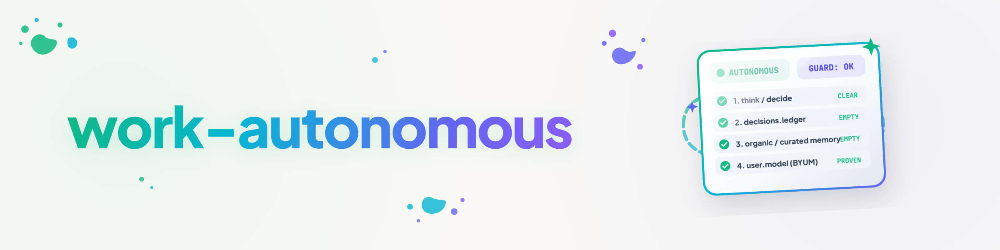

# work-autonomous — Only end the loop once it is proven no autonomous tasks remain

## Purpose

This skill does two things at once:

1. **Keep working autonomously as far as possible** — ordinary session work, nothing special.
2. **Only end a loop once it is PROVEN** that no autonomously executable task remains anymore. The
   suspicion "I can't find anything left to do right now" is **not** a reason to stop — it is the
   **trigger** for a verification chain that first tries to **win** new tasks. Only once that chain
   comes back completely empty does the stop count as proven.

**Deliberately without a built-in `/goal`:** The skill can be used standalone (e.g. invoked
directly as `/work-autonomous` inside a normal session) as well as a condition inside a larger
loop construction: assign `/loop` as usual, then name only this skill as the goal. The goal then
roughly reads: *"End the loop once no autonomous tasks remain — and until then, keep working
autonomously as far as possible."* The skill itself does not call any `/goal` construct; it only
produces the unambiguous stop signal that such a construct can read (see "Termination signal"
below).

## Operating model — two tiers

### Tier 1 — Normal work (every tick)

On every invocation, first look for autonomously executable work the normal way (see the
boundary section below) and do it: open `ACTIONABLE` tickets, unblocked `BLOCKED` tickets, due
`WAITING` tickets, open `TODO.md`/`AUFGABEN.txt` items in projects with no user dependency, due
routine/hygiene checks per local policy, work started but not finished in the previous session
(USMC `working`).

→ **Found & done:** report the outcome briefly, tick ends, the loop keeps running normally. Tier
2 is NOT entered — none of the four expensive verification steps are needed while visible work
exists.

### Tier 2 — Exhaustion check (only on suspicion "nothing left to do")

Only once Tier 1 finds **nothing** autonomous does the suspicion arise. That suspicion alone is
not enough. The following chain now runs **mandatorily** to **win** new tasks.

#### Self-knowledge (before the chain, not after)

Before anything is queried: the skill declares WHICH sources it needs for its judgment. Four
needs (`grounding_seed.self_knowledge.Need`, if `grounding-seed` is installed — otherwise the same
list still applies as a plain declaration with no library binding):

| Role | Chain step | What's behind it |
|---|---|---|
| `decisions.ledger` | 2 | the system's central decision register |
| `memory.organic` | 3 | Gardener (`find()`/`put()`) |
| `memory.curated` | 3 | USMC (`facts`/`lessons`/`working`/`context`) |
| `user.model` | 4 | decision-avatar / BYUM |

**`/think` + `/decide` (step 1) is deliberately NOT a declared source.** It is the model's own
analysis step, not an external system that could be reachable or unreachable — it is always
"available" in the sense of this distinction. Only steps 2–4 can become `unavailable`.

Optional, tested tool for the pure location question (found/unavailable, without content
checking yet): `scripts/exhaustion_check.py` in this skill's folder. It uses
`grounding_seed.resolve()` + `status_from_resolution()` for `decisions.ledger`/`user.model`
(those have a real `source-resolver` provider), but always checks `memory.organic`/
`memory.curated` directly via CLI reachability (`gardener`/`usmc` on PATH) — as of 2026-08-15
there is **no** registered `source-resolver` provider for these two roles yet; querying the
resolver for them would only ever report `unavailable`, regardless of whether Gardener/USMC are
actually installed. Runs identically with and without `grounding-seed` installed.

#### The four chain steps — each reports found | empty | unavailable

Every step runs in two stages: first **location** (do I even know a reachable place to look?),
then — only if located — **content check** (the model actually reads whether something new is
there, using its own tools). A source that could not be located is NEVER content-checked — it
counts as `unavailable`, not `empty`.

1. Apply **`/think` + `/decide`** to the question: "Is there really no autonomously executable
   work left, or am I overlooking something?" — structured analysis, not a gut feeling. No
   found/empty/unavailable status (see above, not a source).
2. **`decisions.ledger`** — location via `source_resolver.resolve("decisions.ledger")` /
   `grounding_seed.resolve(...)`, if installed; otherwise the known fallback path
   (`_control-center/_DECISIONS/`, the `TO-DECIDE-USER*.txt` chain, the host's own
   `TO-DECIDE-USER-<HOST>.txt`, `DECIDED-AND-DONE.md`). Located → read content: have decisions
   been made recently that now unblock work that was previously blocked or waiting for approval?
   Hit → `found`. Read, nothing new → `empty`. Not locatable (resolver missing AND fallback path
   doesn't exist) → `unavailable`.
3. **`memory.organic` (Gardener) + `memory.curated` (USMC)** — two separate sources, one chain
   step. Location: CLI on PATH (`gardener`/`usmc`), see self-knowledge above. Reachable → read
   content (`find()`/`recall()` resp. `usmc facts|lessons|working|context`): open working-memory
   content, a lesson with an unfinished follow-up task, facts pointing at overlooked but
   executable work (this is exactly where earlier sessions leave unfinished items — `RESUME:`
   field, open `note` entries). Hit → `found`. Read, nothing new → `empty`. CLI not on PATH →
   `unavailable`.
4. **`user.model` (decision-avatar/BYUM)** — location as for `decisions.ledger` (resolver or
   fallback path `_control-center/_TOM-lm/`). Located → check content: is there a documented
   pattern showing that the user would want a specific action carried out autonomously here? Only
   count this as `found` at sufficient confidence (🟢/🟡) — 🔴 counts as `empty`, not as a won
   task, but as an item for the "user-only remainder" case below. Not locatable → `unavailable`.

**"Exhausted" may only be reported when ALL FOUR sources (steps 2–4, three steps, four roles)
were actually queryable** — i.e. `found` or `empty`, none `unavailable`. This matches
`grounding_seed.self_knowledge.GroundingReport.all_answerable()`. If at least one role is
`unavailable`, the result is NOT "exhausted" but the dedicated signal "blind" (see termination
signal below) — the loop still ends (it can't query anything either way), but it no longer claims
to have checked what it couldn't check.

If any step finds new work → go back to Tier 1, do the work, set the guard state (see below) to
"found" instead of "exhausted"/"blind".

### Special case: only user-bound remainders left

If the chain finds **no autonomous** task anymore, but `USER/*` tickets or undecided
`_DECISIONS` items remain open, that is still a **stop for autonomy** — but not "nothing to do",
rather "nothing *autonomous* to do". Per the ticket-master autonomy-loop rule, these items are
presented **bundled** (one combined ask, not individual pings). The termination signal explicitly
distinguishes this case from a genuinely empty backlog.

## Boundary — what counts as "autonomously executable"?

Reference: `ticket-master` categories (`.AI/.MODULES/.CONTROL/ticket-master/docs/CATEGORIES.en.md`).

| Case | Autonomous? | Reasoning |
|---|---|---|
| `ACTIONABLE` ticket | **Yes** | No blocker, no user dependency — by definition. |
| `BLOCKED/*` (host-receipt, foreign-state, lock, quota, dependency) | No, unless the blocker has **empirically** lapsed | A periodic re-check is allowed (autonomy loop); "present" alone is not sufficient proof — evidence is required. |
| `WAITING/*` (scheduled, review-due, marker) before its date/marker | No | Time-bound. |
| `WAITING/*` after the date/marker hits | **Yes** | Condition met → moves to `ACTIONABLE`. |
| `USER/*` (decision, data, freigabe, hardware, session) | **Never autonomous** | Strictly requires a user decision/data/approval/hardware/session. Present bundled, see above. |
| `PARKED/*` (skip, backlog, until-trigger) | No, unless an explicit order/trigger exists | Deliberately deferred, no auto re-check. |
| Open `TODO.md`/`AUFGABEN.txt` items without an approval/decision note | **Yes** | Project register, ordinary work. |
| Due routine/hygiene checks (cooldown elapsed, no lock) | **Yes** | Regular maintenance per local policy. |
| Areas locked by `LOCK.user.*` | **Never** | User lock — only the user removes it, see LOCK-SYSTEM. |
| Irreversible or externally-effective steps without policy approval (Zenodo upload, pushing to judged/protected branches, server-spend decisions beyond the laptop threshold, permanent deletion without preview) | **No** | Requires approval/decision even when technically executable. |
| A session only startable via GUI/login (e.g. a Claude Desktop task, interactive login, a physical hardware action) | **Never** | "A session only the user can start" — no loop can take that over. |

Rule of thumb: something is autonomous if it can be brought to completion **without** a user
decision, approval, data, hardware, or session, AND does not require an irreversible or
externally-effective action lacking documented policy approval.

## Guard against infinite loops (mandatory)

**Problem:** without a brake, the four-step chain would run in full on every re-check, even though
nothing has changed since the last empty run — expensive and pointless, especially if the skill
is invoked repeatedly (a loop, a scheduled task, or a manual re-invocation shortly after).

**State is persisted in USMC** (process state belongs there on this system, not in markdown
files):

```bash
# Read the state (filter by tag work-autonomous-guard)
usmc --agent <agent> working --limit 20

# Write the state after a chain run
usmc --agent <agent> note "work-autonomous-guard: result=<exhausted|blind|found> fingerprint=<FP> at=<ISO-time>" \
  --type context --priority 3 --tags "work-autonomous-guard,<project-slug>"
```

**The fingerprint has TWO parts now — situation AND reachability:**

1. **Situation part** (as before): count/IDs of open `ACTIONABLE` tickets, mtime of the
   `_DECISIONS` chain (`TO-DECIDE-USER*.txt`, `DECIDED-AND-DONE.md`), and the number of new USMC
   `working` entries since the last chain run.
2. **Reachability part (new, mandatory since 1.2.0):** the sorted tuple of roles currently
   reported `unavailable` by the self-knowledge check
   (`exhaustion_check.availability_fingerprint_component()`), e.g. `("memory.organic",)` or `()`.

**Why the second part is mandatory — "the guard inherits the gap":** without it, the fingerprint
(part 1) partly relies on the mtime of the `_DECISIONS` chain. If that chain is entirely absent on
a system, that part of the fingerprint stays constant forever — a once-falsely-set
`exhausted`/`blind` would then NEVER be re-checked, even after `source-resolver` is later
installed or `_control-center/_DECISIONS/` is later created. The reachability part fixes this
directly: whenever WHICH roles are unavailable changes (a source appears or disappears), the
fingerprint changes automatically — the guard notices on the next call and re-runs the chain. This
is "transplanting" in the sense of the grounding metaphor (T-20260815-371628859): a change in
environment triggers a new search, without anyone having to manually reset the guard.

**Procedure before every chain run:**

```
guard = read the latest "work-autonomous-guard" entry from USMC
if guard exists
   and guard.result in ("exhausted", "blind")
   and (now - guard.timestamp) < GUARD_INTERVAL   (default: 15 minutes)
   and fingerprint(now) == guard.fingerprint:      # situation part AND reachability part
       → do NOT run the chain again.
       → guard.result == "exhausted":
           report: "Still no autonomous work — unchanged since {guard.timestamp}.
                    No new trigger. STOP (guard active, exhausted unchanged since …)."
       → guard.result == "blind":
           report: "Still blind (sources unavailable) — unchanged since {guard.timestamp}.
                    STOP (guard active, blind unchanged since …)."
else:
       → run the chain in full (self-knowledge check + all four chain steps).
       → write a new guard state (timestamp=now, fingerprint=fingerprint(now),
         result=exhausted|blind|found).
       → all four sources queryable AND all empty → exhausted → STOP (proven).
       → at least one source unavailable → blind → STOP (not proven, just unreachable).
       → at least one source yields a hit → found → back to Tier 1, do the work.
```

A single fully executed chain run in which ALL FOUR sources were queryable and NONE of them
yielded a hit is enough proof of "no autonomous tasks remain" (per the ticket's requirement: "only
once ALL steps of a run come back empty" — "empty" here explicitly means `empty`, not
`unavailable`). The guard does not prevent the finding itself, only the **repeated, unchanged
re-finding** of it on closely spaced re-invocations — kept strictly separate for `exhausted` and
for `blind`, never conflated.

`GUARD_INTERVAL` is configurable (default 15 minutes) — pick it longer in a very slow-moving
environment (rare new tickets/decisions), shorter in a very active one.

## Termination signal

Every run ends with **one** unambiguous, grep-able line so a surrounding `/loop` or a future
`/goal` construct can read whether to continue:

```
WORK-AUTONOMOUS: CONTINUE                                          — Tier 1 did work, the loop keeps running.
WORK-AUTONOMOUS: STOP (exhausted)                                  — all four sources queried, all empty. Proven: no work left.
WORK-AUTONOMOUS: STOP (blind, N/4 sources unavailable: <roles>)    — at least one source unavailable. NOT proven — just unqueryable.
WORK-AUTONOMOUS: STOP (guard, exhausted unchanged since …)         — guard active, still exhausted, no new trigger.
WORK-AUTONOMOUS: STOP (guard, blind unchanged since …)             — guard active, still blind, no source became newly reachable.
WORK-AUTONOMOUS: STOP (user-only)                                  — only USER/* remainders open, presented bundled.
```

`CONTINUE` is the only signal on which a surrounding loop should trigger another tick. Every
`STOP` variant is the proven termination — including which case applies.

**The difference between `exhausted` and `blind` matters to the user, it isn't cosmetic:**
`exhausted` means "I checked everything there was to check — the work is genuinely done". `blind`
means "I'm missing infrastructure to even check — that's not a completed work state, it's a gap".
A `/loop`/`/goal` construct that treats both the same (the loop ends either way) must not REPORT
them the same to the user — otherwise exactly the information T-20260815-205101335 asked for
disappears again.

## Relationship to other skills

- **`think`/`decide`** — provide the structured analysis/decision for chain step 1. Called here as
  a building block, not reinvented.
- **`decision-avatar`** (this skill, user-neutral) — provides chain step 4. On systems with a
  concrete, authorized profile this corresponds to `user-model` + `build-your-users-mind`.
- **`orchestrator`** — governs HOW work is delegated to subagents and how their completion claims
  are verified. `work-autonomous` governs WHEN to stop looking for work at all; the two combine
  freely (the orchestrator can be part of the work done in Tier 1).
- **`bugsweep`** — an example of a different, self-limiting search protocol (doubling escalation
  instead of a four-step chain). `work-autonomous` is more generic: it checks not only code for
  bugs but any source of autonomous work.
- **Ticket categories (`ticket-master`)** — supply the vocabulary for "autonomously executable"
  (see boundary table) and the template for the autonomy loop (BLOCKED re-check, USER bundling,
  WAITING date pulling, PARKED standstill).

## Example run

```
Tick 1: found ACTIONABLE ticket T-... → done. WORK-AUTONOMOUS: CONTINUE
Tick 2: no ACTIONABLE ticket left, no open TODO item.
        → Tier 2: self-knowledge + chain 1–4 runs.
        → Step 2 (decisions.ledger): located, DECIDED-AND-DONE.md got a new entry 10 minutes ago.
          → found, yields a new autonomous task.
        → Guard: result=found written. Task done. WORK-AUTONOMOUS: CONTINUE
Tick 3: nothing visible again. Fully equipped system (Gardener, USMC, _DECISIONS, BYUM all present).
        → Tier 2: all four sources located AND queried, all four empty.
        → Guard: result=exhausted, fingerprint=FP1 (situation + reachability ()), timestamp=T1.
        → WORK-AUTONOMOUS: STOP (exhausted)
Tick 4 (2 minutes later, e.g. triggered by another loop re-invocation):
        → Guard: result=exhausted, fingerprint(now)==FP1, (now-T1) < 15 min.
        → Chain NOT run again.
        → WORK-AUTONOMOUS: STOP (guard, exhausted unchanged since T1)

Counter-example — system WITHOUT Gardener/USMC (the core case from T-20260815-205101335):
Tick 1: nothing visible. Self-knowledge check: decisions.ledger located (empty),
        memory.organic/memory.curated NOT locatable (CLI missing) → unavailable,
        user.model located (empty).
        → not all four sources queryable → NOT exhausted.
        → Guard: result=blind, fingerprint=FP2 (reachability ("memory.curated","memory.organic")).
        → WORK-AUTONOMOUS: STOP (blind, 2/4 sources unavailable: memory.organic, memory.curated)
Tick 2 (user installs grounding-seed + usmc on this system):
        → Self-knowledge check: memory.curated now located (CLI on PATH) → reachability part
          changes to ("memory.organic",) → fingerprint(now) != FP2.
        → Guard notices the change, chain re-runs (transplanting) — without anyone manually
          resetting the guard.
```

## Changelog

### 1.2.0 (2026-08-15)
- Retrofit from ticket T-20260815-205101335 (audit request: "check whether the solution there
  holds up against the grounding metaphor" — finding on the shipped skill: it held up on three
  points, but NOT on the distinction "queried and empty" vs. "couldn't even be queried" — the
  chain reported `STOP (exhausted)` even on systems without Gardener/USMC/`_DECISIONS`, without
  ever having checked that. First real application of `grounding-seed`, ticket
  T-20260815-371628859).
- **Added self-knowledge:** four declared needs (`decisions.ledger`, `memory.organic`,
  `memory.curated`, `user.model`) before the chain, instead of blindly searching four hard-coded
  locations.
- **Every chain step (2–4) now reports found | empty | unavailable** instead of a binary result —
  two-staged: location first (`grounding-seed`/`source-resolver` for `decisions.ledger`/
  `user.model`, direct CLI check for `memory.organic`/`memory.curated`, which don't yet have a
  `source-resolver` provider), content check only on a successful location.
- **`exhausted` now only applies when all four sources were actually queryable** (all
  found/empty, none unavailable). New, distinguishable signal `STOP (blind, N/4 sources
  unavailable: …)` for when at least one source was unreachable — the loop still ends, but no
  longer claims a proven result.
- **Guard fingerprint extended with a reachability part** (sorted tuple of the currently
  unavailable roles). Fixes the follow-up finding "the guard inherits the gap": without this
  part, a once-falsely-set `exhausted`/`blind` stays valid forever if the `_DECISIONS` chain is
  entirely absent (the previous fingerprint part is then constant). With the part, a newly
  reachable source automatically triggers a fresh chain run (transplanting in the sense of the
  grounding metaphor).
- New, tested helper script `scripts/exhaustion_check.py` (+ `tests/test_exhaustion_check.py`, 11
  tests, both operating modes checked: with and without `grounding-seed` installed) — provides
  the self-knowledge/location check deterministically so the skill doesn't have to guess it anew
  every run. Stays optional: the skill remains primarily a protocol a model follows with its own
  tools.
- Dependency: `grounding_seed.self_knowledge.assess()`/`status_from_resolution()` since
  `grounding-seed` 0.2.0 — older `grounding-seed` builds (0.1.0) had a category error
  (`not_found` was wrongly mapped to `empty`) that would have blurred exactly the distinction
  fixed here. Without `grounding-seed` installed, the documented fallback behaves identically.

### 1.1.0 (2026-08-15)
- Reference retrofit from ticket T-20260815-385400870: step 2 (decision register) now resolves
  its location via the `decisions.ledger` role (`source_resolver.resolve(...)`, module
  `source-resolver`) instead of hard-wiring it — with a documented fallback to the previous path
  if the resolver isn't installed. Functional behavior unchanged.

### 1.0.0 (2026-08-15)
- First version from ticket T-20260815-522639345: two-tier operating model, four-step
  verification chain, boundary table following `ticket-master` categories, USMC-backed guard
  against infinite loops, unambiguous termination signal for `/loop`/`/goal` constructs.
