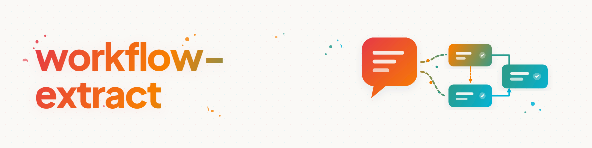

# Workflow-Extract — aus Chatverläufen und Fremd-Automationen Automatisierungen bauen

## Zweck

Manche Abläufe gehören nicht in einen Skill, den man bei Bedarf lädt, sondern in eine
**Automatisierung, die von allein läuft**: nächtliche Checks, rotierende Projekt-Prüfungen,
periodische Pflege-Läufe. Dieser Skill extrahiert solche Workflows aus zwei Quellenarten —
Chatverläufen (ein Ablauf wurde interaktiv entwickelt und soll künftig unbeaufsichtigt laufen)
und bestehenden Automations-Prompts anderer Systeme (z. B. Codex-Automations, Scheduled
Tasks, n8n-Flows) — und macht daraus user-neutrale, robuste Automatisierungs-Prompts oder
-Skills.

Der Unterschied zum interaktiven Ablauf: Eine Automatisierung hat **niemanden, der korrigiert**.
Alles, was in der Session der User abgefangen hat, muss die Automatisierung selbst abfangen.
Genau dafür gibt es die Bausteine in `automation-bausteine.md`.

## Ablauf

### 1. Quelle und Zielform klären

| Quelle | typischer Fall |
| --- | --- |
| Aktuelle Session / Transkript | Ablauf wurde interaktiv entwickelt, soll periodisch weiterlaufen |
| Fremd-Automation (Prompt-Datei, Cron-Task, n8n-Flow) | Portierung/Abstraktion auf ein anderes System oder in die Bibliothek |

Zielformen (eine oder mehrere):

- **Automations-Prompt:** eigenständiger, user-neutraler Prompt-Text, einsetzbar in jedem
  Scheduler (Codex-Automations, Claude `/schedule`/Cron, Scheduled Task, n8n).
- **Workflow-Skill:** Skill in der Bibliothek, der den Ablauf beschreibt und vom
  Automations-Prompt nur noch aufgerufen/parametrisiert wird (bevorzugt, wenn derselbe
  Ablauf für mehrere Pipelines/Systeme gelten soll — eine Quelle der Wahrheit).
- **Command:** dünner Slash-Command für manuelle Auslösung desselben Ablaufs.

### 2. Workflow-Kern extrahieren

Aus der Quelle herausarbeiten:

- **Kernaufgabe:** Was wird geprüft/gepflegt/erzeugt? (ein Satz)
- **Auswahllogik:** Worauf wird die Aufgabe angewandt — festes Ziel oder Rotation über eine
  Menge (ein Projekt pro Lauf)?
- **Vorbedingungen:** Was muss vor der Arbeit gelesen/geprüft werden (Root-Dokumente,
  Registries, Locks)?
- **Dokumentationspflichten:** Wohin werden Ergebnis, Log, Folgeaufgaben geschrieben?
- **Abbruchpfade:** Wann endet der Lauf read-only („nichts zu tun" ist ein gültiges Ergebnis)?

Bei Chatverläufen zusätzlich die Korrekturschleifen auswerten (siehe
`../skill-extractor/transcript-quellen.md`): Jede User-Korrektur ist ein Kandidat für einen
Guard, den die Automatisierung künftig selbst braucht.

### 3. Neutralisieren

Nach den Regeln in `../skill-extractor/neutralisierung.md`: Mechanik von Konfiguration
trennen, Pfade/Hosts/Projektnamen in einen Konfigurationsblock ziehen. Automations-Prompts
brauchen den Konfigurationsblock besonders dringend, weil sie wörtlich in Scheduler kopiert
werden — konkrete Werte gehören an EINE Stelle am Prompt-Anfang.

### 4. Automations-Bausteine ergänzen

Den extrahierten Kern gegen die Checkliste in `automation-bausteine.md` halten und fehlende
Bausteine ergänzen — insbesondere Rotations-Auswahl mit Check-Registry, Idempotenz,
Log-Hygiene, Lock-Respekt, Read-only-Exit und Abschlussbericht. Ein Workflow ohne diese
Bausteine funktioniert im Test und degeneriert im Dauerbetrieb (Doppelprüfungen, wachsende
Logs, Kollisionen mit parallelen Agenten).

### 5. Takt und Budget setzen

- **Frequenz an Änderungsrate koppeln:** Ein Check muss nicht öfter laufen, als sich sein
  Gegenstand ändert. Erfahrungswert aus gewachsenen Automations-Beständen: Viele anfangs
  stündliche Checks wurden auf täglich/wöchentlich reduziert — mit Rotations-Auswahl deckt
  auch ein seltener Takt die ganze Pipeline ab.
- **Nachtfenster für Schweres**, kurze Read-only-Checks dürfen häufiger.
- **Kostenbewusstsein:** Jeder Lauf kostet Tokens/Compute; ein Lauf, der meist read-only
  endet, soll das früh feststellen (Registry lesen VOR teurer Analyse).

### 6. Testen und einsetzen

1. **Trockenlauf:** Den fertigen Prompt einmal interaktiv ausführen (als wäre man der
   Scheduler) und prüfen: Endet er sauber? Schreibt er Registry/Log korrekt? Bleibt er
   im Scope?
2. **Grenzfall-Test:** Einen Lauf simulieren, bei dem nichts zu tun ist — er muss read-only
   mit kurzem Logeintrag enden, nicht „Arbeit erfinden".
3. **Einsetzen:** In den Ziel-Scheduler eintragen; bei Skill-Form zusätzlich in Bibliothek
   ablegen und deployen.
4. **Fehlerpfad beobachten:** Nach den ersten 2–3 echten Läufen Log/Registry kontrollieren —
   Automatisierungen scheitern am häufigsten an Pfad-Drift (Ziel wurde verschoben) und an
   wachsenden Logdateien.

## Fleet-Audit-Modus: eine laufende Automations-Flotte prüfen

Für „prüfe meine Automatisierungen": nicht extrahieren, sondern den BESTAND betreiben
helfen. Über die Automations-Quelle des Zielsystems (Prompt-/Config-Dateien, Schedules,
Run-Logs/Memories) systematisch prüfen:

1. **Silent-Failure/No-op-Erkennung:** Läuft die Automation, tut aber nichts mehr?
   (Run-Memories/Logs der letzten Läufe lesen: nur noch Leerläufe, Fehler, tote Pfade?)
2. **Redundanz + Ertrag:** Überschneiden sich Automationen im Scope? Steht der Ertrag
   (Output, behobene Befunde) noch im Verhältnis zum Verbrauch (Tokens, Läufe)?
3. **Drift:** Passen Prompt-Pfade, Konventionen und Schedules noch zur Realität?
   (Ziele verschoben, Policies geändert, Takt zu hoch für die Änderungsrate.)
4. **Katalog-Abgleich:** Fehlt eine Automation, die es geben sollte (Lücken im
   Muster-Raster)? Vorschläge nur freigabe-gegated (Baustein 12), nie selbst scharf schalten.
5. **Befund-Bericht:** pro Automation eine Zeile (behalten | anpassen | pausieren |
   zusammenlegen | löschen) + Begründung; Änderungen selbst nur nach Freigabe.

## Bulk-Modus: Automations-Bestände oder viele Transkripte sichten

Für „prüfe alle Automationen von System X auf abstrahierbare Workflows" oder „extrahiere
Automatisierungs-Kandidaten aus alten Chatverläufen":

1. **Datenreduktion wie im skill-extractor** (Map-Reduce über Subagenten,
   `swarm-operations`-Muster): Pro Bündel ein Subagent, der je Quelle meldet:
   Kernaufgabe | Muster (z. B. Rotation-Check, Health-Check, Ideen-Mining) |
   einzigartige Elemente | user-neutral abstrahierbar? | abgedeckt durch existierenden Skill?
2. **Muster vor Einzelstücken:** Wenn viele Quellen dasselbe Gerüst teilen (z. B. 40
   Rotations-Checks), wird das GERÜST ein Skill und die Einzelfälle werden Parametrisierungen —
   nicht 40 Einzel-Skills.
3. **Dedup gegen die bestehende Skill-/Command-Landschaft**, dann nummerierte
   Kandidatenliste an den User vor dem Massenbau.

## Beispiel

```text
User: „Wir haben heute die Zitationsprüfung für ein Paper durchgespielt —
das soll ab jetzt wöchentlich über alle Paper laufen."

1. Zielform: Automations-Prompt für den Scheduler + Verweis auf rotation-check.
2. Kern: Zitate eines Papers gegen Originalquellen prüfen (Web/Datenbank),
   Korrekturen einpflegen, bei Änderungen Folgeaufgabe „Neu-Upload" in TODO.md.
3. Neutralisieren: Pipeline-Root, Registry-/Log-Pfade → Konfigurationsblock.
4. Bausteine ergänzen: Rotations-Auswahl (ein Paper pro Lauf), Registry lesen VOR
   Auswahl, Read-only-Exit („alle Quellen ok"), Log-Hygiene, Abschlussbericht.
5. Takt: wöchentlich reicht (Papers ändern sich langsam); Trockenlauf + Leerlauf-Test,
   dann in den Scheduler.
```

## Red Flags

| Gedanke | Realität |
| --- | --- |
| „Der Ablauf lief in der Session, also läuft er auch als Automation" | Ohne User fehlen alle Korrektive — Bausteine-Checkliste ist Pflicht. |
| „Stündlich schadet nicht" | Doch: Tokens, Log-Wachstum, Kollisionsrisiko. Takt an Änderungsrate koppeln. |
| „Ich baue für jede Variante eine eigene Automation" | Gemeinsames Gerüst als Skill, Varianten als Parameter. |
| „Nichts gefunden — dann suche ich mir eben andere Arbeit" | Read-only-Exit mit Logeintrag ist das korrekte Ergebnis eines Leerlaufs. |

## Verwandte Skills

- `skill-extractor` — gleiche Extraktion, Ziel ist ein abrufbarer Skill; teilt
  Neutralisierung und Transcript-Quellen (dort dokumentiert).
- `rotation-check` — das Standard-Gerüst für rotierende Pipeline-Checks (häufigster
  Automations-Typ); als Baustein referenzieren statt neu erfinden.
- `swarm-operations` — Schwarm-Muster für Bulk-Sichtung.

## Changelog

### 1.1.0 (2026-07-03)
- Fleet-Audit-Modus (laufende Automations-Flotte prüfen: Silent-Failures, Redundanz,
  Drift, Lücken) — integriert statt als eigener Skill (Dedup-Entscheid).
- Drei neue Bausteine in automation-bausteine.md: Freigabe-Gate über Sentinel-Dateien (12),
  Gestaffelte Eskalation mit Handoff-Artefakt (13), Melde-Disziplin für Monitore (14).

### 1.0.0 (2026-07-03)
- Initiale Version. Entstanden aus der Abstraktion des Codex-Automations-Bestands
  (77 Automationen, dominantes Rotations-Check-Muster) in user-neutrale Bausteine.
