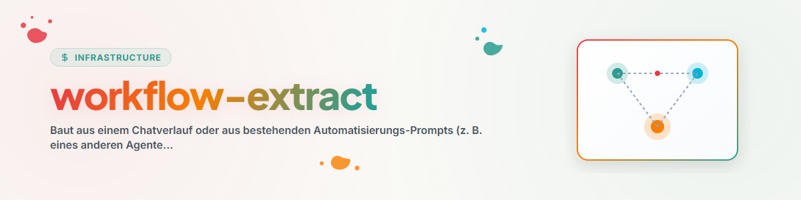

> **中文** — `workflow-extract` 官方中文版本。



# Workflow-Extract — 从对话记录与外部自动化构建自动化流程

## 概述与目的

有些工作流程并不适合做成按需加载的 Skill，而应该做成**自主运行的自动化程序**：夜间检查、轮换项目审计、定期维护运行等。本 Skill 用于从两类来源提取此类工作流程：对话记录（互动式开发出的流程，未来需无监督运行）以及其他系统的现有自动化 Prompt（例如 Codex-Automations、Scheduled Tasks、n8n 工作流），并将其转化为用户中立、稳健的自动化 Prompt 或 Skill。

与交互式流程的关键区别在于：自动化程序**没有用户在现场修正错误**。用户在交互 Task 中拦截和纠正的所有问题，必须由自动化程序自身予以拦截。这正是 `automation-bausteine.md` 中各个构建块的作用所在。

## 流程

### 1. 明确来源与目标形式

| 来源 | 典型场景 |
| --- | --- |
| 当前 Session / 对话转录 | 流程已通过交互开发完成，需要定期继续运行 |
| 外部自动化（Prompt 文件、Cron 任务、n8n 工作流） | 迁移/抽象到其他系统或放入库中 |

目标形式（一种或多种）：

- **自动化 Prompt（Automation Prompt）：** 独立且用户中立的 Prompt 文本，可用于任何调度器（Codex-Automations、Claude `/schedule`/Cron、Scheduled Task、n8n）。
- **工作流 Skill（Workflow Skill）：** 存在于 Skill 库中描述该流程的 Skill，由自动化 Prompt 调用或参数化（当同一流程适用于多个 Pipeline/系统时优先使用 — 单一事实来源）。
- **Command：** 用于手动触发同一流程的轻量级 Slash Command。

### 2. 提取工作流核心

从来源中整理提取：

- **核心任务：** 检查/维护/生成什么？（一句话说明）
- **选择逻辑：** 任务应用于什么 — 固定目标还是在一组目标中轮换（每次运行一个项目）？
- **前置条件：** 在开始工作前必须读取/检查什么（根文档、注册表/Registry、锁/Locks）？
- **文档记录职责：** 结果、日志、后续任务写入何处？
- **退出/中断路径：** 运行何时以只读方式结束（“无事可做”也是合法结果）？

对于对话记录，还需评估修正循环（参见 `../skill-extractor/transcript-quellen.md`）：用户的每次修正都是自动化未来自身所需 Guard（防护逻辑）的候选对象。

### 3. 中立化（Neutralize）

遵循 `../skill-extractor/neutralisierung.md` 中的规则：将运行机制与配置分离，将路径、主机名、项目名称提取到配置块中。自动化 Prompt 尤其需要配置块，因为它们会被逐字复制到调度器中 — 具体数值应当统一定义在 Prompt 开头的唯一位置。

### 4. 补充自动化构建块

对照 `automation-bausteine.md` 中的检查清单核对提取出的核心，补充缺失的构建块 — 特别是带有检查注册表（Check-Registry）的轮换选择、幂等性、日志卫生、尊重锁机制、只读退出以及总结报告。缺乏这些构建块的工作流在测试中可行，但在长期运行中会逐渐恶化（重复检查、日志无限膨胀、与并行 Agent 发生碰撞）。

### 5. 设定节奏与预算

- **将频率与变更速率挂钩：** 检查运行的频率无需高于其检查对象的变更频率。来自成熟自动化集群的经验：许多最初设为每小时一次的检查后来都降到了每天/每周一次 — 结合轮换选择，较低的频率也能覆盖整个 Pipeline。
- **重型任务安排在夜间窗口**，短小的只读检查可以更为频繁。
- **成本意识：** 每次运行都会消耗 Token/算力；绝大多数情况下以只读结束的运行应当尽早确认（在进行昂贵分析之前读取 Registry）。

### 6. 测试与部署

1. **试运行（Dry run）：** 将编写完成的 Prompt 交互式执行一次（模拟调度器的行为）并检查：是否正常结束？Registry/Log 写入是否正确？是否保持在 Scope 范围内？
2. **边界情况测试：** 模拟一次无事可做的运行 — 它必须以只读及简短日志条目结束，而不是“虚构工作”。
3. **部署：** 录入目标调度器；如果是 Skill 形式，还需放入 Skill 库并部署。
4. **观察错误路径：** 在前 2–3 次实际运行后检查 Log/Registry — 自动化最常因路径漂移（目标被移动）和日志文件膨胀而失败。

## Fleet-Audit 模式：检查运行中的自动化集群

针对“检查我的自动化程序”：不进行提取，而是协助维护现有存量。通过目标系统的自动化来源（Prompt/配置文件、Schedule、运行 Log/Memory）进行系统化检查：

1. **静默失败/空转识别（Silent-Failure/No-op）：** 自动化是否在运行但不再产生实际效果？（读取近期运行的 Memory/Log：是否只剩空转、报错、死路径？）
2. **冗余 + 收益：** 自动化程序在 Scope 上是否存在重叠？收益（产出、已修复的问题）是否与消耗（Token、运行次数）仍保持合理比例？
3. **漂移（Drift）：** Prompt 路径、约定和 Schedule 是否仍符合实际情况？（目标已移动、策略已变更、节奏相对于变更速率过高。）
4. **目录对照：** 是否缺少本应存在的自动化（模式网格中的空白）？建议必须经过审批门控（构建块 12），绝不自行直接上线。
5. **诊断报告：** 每个自动化程序一行（保留 | 调整 | 暂停 | 合并 | 删除） + 理由；仅在获得批准后才执行变更。

## Bulk 模式：审查自动化存量或大量对话转录

针对“检查系统 X 的所有自动化程序以寻找可抽象的工作流”或“从旧对话记录中提取自动化候选”：

1. **如 `skill-extractor` 中的数据归约**（通过 Subagent 进行 Map-Reduce，`swarm-operations` 模式）：每个批次安排一个 Subagent，按来源汇报：核心任务 | 模式（如轮换检查、健康检查、创意挖掘） | 独特性要素 | 是否可中立抽象？ | 是否已被现有 Skill 覆盖？
2. **模式优于单品：** 当多个来源共享同一骨架（例如 40 个轮换检查）时，将该骨架提炼为一个 Skill，而具体案例作为参数传入 — 而非创建 40 个独立的 Skill。
3. **针对现有 Skill/Command 体系进行去重**，然后在批量构建前向用户呈送带编号的候选列表。

## 示例与应用

```text
User: "我们今天完成了一篇论文的引用检查 — 从现在开始这应该每周在所有论文上运行一次。"

1. 目标形式：调度器的自动化 Prompt + 引用 rotation-check。
2. 核心：检查论文引用与原始来源（Web/数据库），应用修正，若有变更在 TODO.md 中记录后续任务"重新上传"。
3. 中立化：Pipeline 根目录、Registry/Log 路径 → 配置块。
4. 补充构建块：轮换选择（每次运行一篇论文），选择前读取 Registry，只读退出（"所有来源正常"），日志卫生，总结报告。
5. 节奏：每周一次即可（论文变更缓慢）；试运行 + 空转测试，然后写入调度器。
```

## 红线 warnings（Red Flags）

| 想法 | 现实 |
| --- | --- |
| "流程在 Session 中运行良好，所以作为自动化也能运行" | 没有用户在场就缺少了所有修正力量 — 构建块检查清单是强制要求的。 |
| "每小时运行一次没坏处" | 有坏处：Token 消耗、日志膨胀、碰撞风险。将节奏与变更速率挂钩。 |
| "我为每种变体单独构建一个自动化" | 共享骨架作为 Skill，变体作为参数。 |
| "什么都没找到 — 那我就找点别的事做" | 带有日志记录的只读退出才是空转运行的正确结果。 |

## 相关 Skill

- `skill-extractor` — 相同的提取过程，目标是可调用的 Skill；共享中立化与转录来源（在处有文档记录）。
- `rotation-check` — 轮换 Pipeline 检查的标准骨架（最常见的自动化类型）；作为构建块引用，而非重新发明。
- `swarm-operations` — 用于批量审查的群体模式。

## 变更日志

### 1.1.0 (2026-07-03)
- Fleet-Audit 模式（检查运行中的自动化集群：静默失败、冗余、漂移、空白）— 集成到本 Skill 中而非独立 Skill（去重决策）。
- `automation-bausteine.md` 中新增三个构建块：通过 Sentinel 文件的审批门控 (12)、带 Hand-off 产物的分级递进 escalate (13)、监控程序的上报纪律 (14)。

### 1.0.0 (2026-07-03)
- 初始版本。源自将 Codex-Automations 存量（77 个自动化，轮换检查为主导模式）抽象为用户中立构建块的总结。