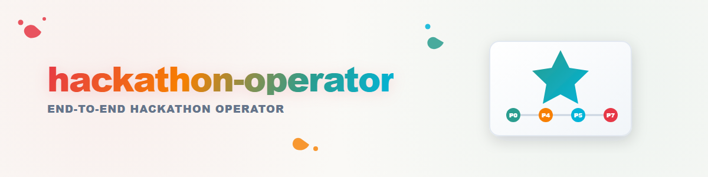

# Hackathon-Operator

## Zweck

Einen kompletten Hackathon als Operator führen. Grundlage: die empirische Analyse
`.HACKATHONS/_analysis/PROZESS-ANALYSE-roshambo-2026-07.md` — dort steht, was 2026-07
wirklich passiert ist (inkl. Fallen). Dieser Skill ist die verdichtete,
wiederholbare Form davon.

## Aktivierung

- „Neuer Hackathon: <link/text>" → Phase 0
- „Nimm Hackathon-Projekt <name> wieder auf" → STATE.md lesen, an `phase` weitermachen
- Jeder Prompt des Nutzers wird erst gegen die Prompt-Taxonomie (§6) klassifiziert.

## Projekt-Anlage (einmalig, Phase 0)

```
.HACKATHONS/<jahr>-<name>/
├── STATE.md            ← DER Zwischenstand (Pflicht, wird nach jedem Schritt fortgeschrieben)
├── BRIEF.md            ← Ausschreibungstext (Link/Volltext/Scrape)
├── REQUIREMENTS.md     ← Anforderungsanalyse aus BRIEF
├── IDEENSPEICHER.md    ← Phase A: unbewertet sammeln; Phase B: Abgleich mit REQUIREMENTS
├── DECISIONS.md        ← Nutzer-Entscheidungen mit Datum (Anker-Fakten!)
├── LINKS.md            ← Pflicht-Linkverzeichnis (wird laufend gepflegt)
├── _analysis/          ← Portfolio-Analyse, Feld-Scrapes
├── _evidence/          ← Beweisprotokolle (EVIDENCE-*.md-Äquivalent)
└── _media/             ← Video, Thumbnails, Audio, Boards
```

Baubereich lokal (nicht OneDrive): `C:\_Local_DEV\repos\<name>` bzw.
`C:\_Local_DEV\_<name>-assets\`. OneDrive = Konzepte/State, lokal = Bau/Render.

## STATE.md — Format (Herzstück)

> **Schema v2 seit 2026-08-18** (Entscheidung D-20260817-001, Kandidat C,
> Ticket T-20260815-40). Ersetzt das reine YAML-Format unten drunter — das
> scheiterte in beiden echten Projekten (call-e, roshambo) am Parsen, weil
> Operatoren narrative Freitexte mit Doppelpunkten direkt als YAML-Werte
> schrieben (`operator: ... Handoff-Dokument: ...`). Vollstaendige Spec:
> `.HACKATHONS/_TEMPLATES/project/STATE-SCHEMA.md`, Validator:
> `.HACKATHONS/_tools/validate_state.py <STATE.md>`.

```markdown
---
project: roshambo
phase: 7                 # aktuelle Phase (0-9, siehe unten)
mode: interactive        # silent | interactive | auto
operator: kimi-k3        # KURZE ID, kein Freitext, kein ":" -- Operator-Wechsel/Begruendung gehoert nach ## History
gates:                   # unumkehrbare Aktionen — NUR nach ausdrücklicher Nutzer-Freigabe
  repo_public: {status: done, date: "2026-07-31"}
  video_upload: {status: done, date: "2026-07-31", evidence: "durch Nutzer"}
  submitted: {status: done, date: "2026-07-31", evidence: "durch Nutzer"}
decisions_ref: DECISIONS.md
updated: "2026-07-31T02:00+02:00"
---

## Anchors
- "Keine erfundenen Zahlen; was nicht gemessen ist, bleibt Platzhalter"
- "Der Himmel ist erfunden — nie als Astronomie ausgeben"
- "Absenden immer durch den Nutzer"

## Artifacts
- `video_final`: <path> -- approved: true

## Open
- "YouTube-Neuupload nach Jitter-Fix → Link nachtragen"
  <!-- NIE mit ERLEDIGT/FERTIG/DONE/GELÖST beginnen -- das gehoert nach History -->

## History
(append-only, freie Prosa, jede Zeile mit ISO-Datum am Anfang)
- "2026-07-31T02Z phase 5→6: Video 2 final, 178s"
```

**Regeln:**
1. Nach JEDER abgeschlossenen Aktion: STATE.md fortschreiben (`updated`-Feld nachziehen)
   + USMC-Notiz (eine Zeile). Erledigte Punkte wandern von `## Open` nach `## History` —
   niemals als „ERLEDIGT ..." in `## Open` stehen bleiben.
2. Wiederaufnahme = STATE.md lesen, `## History` verifizieren (nicht blind vertrauen:
   Existenz/Integrität der Artefakte prüfen, z. B. ffprobe bei Videos). Vor groesseren
   Aenderungen `_tools/validate_state.py` laufen lassen.
3. Gates sind die EINZIGEN Punkte, an denen der Operator pausieren MUSS — aber sie
   sind nicht alle gleich hart, siehe nächster Abschnitt. Gate-Status-Aenderungen sind
   IMMER eine bewusste Operator-/Nutzerentscheidung, nie eine Nebenwirkung eines
   Formatumbaus oder einer Normalisierung.
4. Operator-Wechsel: neuer Operator liest STATE.md + DECISIONS.md + letzte 3
   History-Zeilen und schreibt sich als `operator` ein (kurze ID). Kein
   Mund-zu-Mund-Briefing nötig.
5. Migration eines Altbestands-STATE.md (Schema v1) auf v2: verlustfrei, siehe
   Migrationsregel in `STATE-SCHEMA.md` — nichts loeschen, Ueberholtes in `## Archiv`-
   Abschnitte verschieben statt entfernen.

## Weiche und harte Gates

> Nutzer-Entscheidung 2026-08-02: *„Alle Gates bis einschließlich 6 sind sehr weiche
> Gates, denn es geht um Präferenzen. Hier kann mein Decision-Avatar und /think /decide
> /brainstorm mich ersetzen auf Entwurfsebene."*

**Weich (Phasen 0–6): Präferenzentscheidungen.** Welche Idee, welcher Hook, welche
Bildsprache, ob der Beweis „steht". Sie sind rückholbar und wirken nur nach innen —
ein Storyboard lässt sich verwerfen, ein Entwurf neu schneiden. Hier **entscheidet der
Operator selbst**, statt zu warten:

- Eigener Decision-Avatar (`/decide-like-me`) — der Loop: Projekt-DECISIONS.md → belegte
  frühere Aussagen → Vorhersage mit Konfidenz. **Nur bei roter Konfidenz eskalieren.**
- `/decide` für die strukturierte Abwägung, `/brainstorm` wenn die Optionen fehlen.
- Jede so getroffene Entscheidung wird **nachvollziehbar hinterlegt** — Begründung im
  Commit und im Bericht, damit der Avatar aus dem Feedback lernt.
- Wo eine Alternative ernsthaft im Rennen war: **als zweite Variante danebenlegen**
  statt sie wegzuentscheiden (siehe „Varianten statt Iteration").

**Hart (Phase 7 und alles mit Außenwirkung): Nur der Nutzer.** Public-Schaltung,
Absenden, Pull Request, Upload, `git push` — dazu alles, was **Geld kostet oder
Fremde erreicht** (ein echter Anruf, eine Mail an Dritte). Diese Grenze verschiebt
kein Avatar: Sie ist nicht rückholbar.

**Die Trennlinie in einem Satz:** *Was sich verwerfen lässt, entscheidet der Operator;
was hinausgeht, entscheidet der Nutzer.*

## Die Phasen

**Phase 0 — Intake.** BRIEF anlegen (Link/Text/Scrape), Projektstruktur, STATE.md
initialisieren. Frist + Bewertungskriterien prominent in REQUIREMENTS.md.

**Phase 1 — Analyse.** REQUIREMENTS.md (Pflicht/Kann, Werkzeug-Anforderungen mit
Beleg-Pflicht). Portfolio-Analyse: eigene Repos/Module/frühere Hackathons als
Baukasten (`_analysis/portfolio.md`). DevPost-Standardfelder scrapen, wenn möglich.

**Phase 2 — Ideen.** Kreativ-Skills anwenden (idea-mining/idea-crafting/brainstorming):
Phase A divergent ohne Bewertung. Phase B: jede Idee gegen REQUIREMENTS prüfen.
**Drei Ideen antesten** (kleinster echter Test: Schema, 30-Sekunden-Demo, Technik-Risiko)
→ dem Nutzer als Vergleich vorlegen. GATE: Nutzer wählt.

**Phase 3 — Konzept & Plan.** Nutzer-Input in DECISIONS.md. Umsetzungsplan mit
Evidence-Disziplin von Tag 1 (Protokolle wörtlich, keine Glättung; Zählregeln VOR
dem Lauf committen). Architektur-Diagramm früh.

**Phase 4 — Bau.** Code in Trennung: Kern → Dry-Tests → volle Tests, jeweils mit
Rückkopplung zum Plan und Review-Schleifen. Bugs sofort fixen, auch spät.

**Phase 5 — Abnahme & Beweis.** Große Tests MIT Beweisführung: gutes Logging,
reproduzierbare Kernprobe für Juroren ohne Zugänge (z. B. 30-Sekunden-Dry-Run),
Feldversuch mit echten Bedingungen. Beweis zeigt auch eigene Fehler.
GATE: Nutzer sieht Auswertung, Freigabe „Beweis steht".

**Phase 6 — Medienproduktion.** Repos fertig (README aktuell? Text gegen Verlauf
prüfen, Privacy/Lizenz/Topics, Cross-Links). Dann die Videokette — **die Reihenfolge
ist nicht beliebig, siehe eigener Abschnitt unten.**
Kompositionsauftrag: Musik passend zur Videostory — Sinnabschnitte als
Wechselindikator, Stimmungsbogen (music-composer-Skill, Storyline-JSON).
Zwei Varianten (geduckt/ungeduckt) → GATE Nutzer wählt. YouTube-Titel/Beschreibung
als Dateien + Play-Thumbnail.

**Phase 7 — Einreichung.** DevPost-Entwurf aus gescrapten Feldern (Listen statt
Markdown-Tabellen!). Modus-abhängig:
- *interactive:* Nutzer lädt Video hoch + reicht ein; Link zurück an Operator.
- *auto:* Operator nutzt open-compute (Nutzer-Browser) für Upload + Formular.
Danach: Link überall nachtragen (READMEs, DevPost, LINKS.md), letzte Überarbeitungen,
GATE Nutzer: Public-Schaltung + Absenden. Einreichung ist bis Frist anpassbar.

**Phase 8 — Abschluss.** Abschlussberichte (USMC + _evidence/), Lessons in die
Analyse-Datei der Pipeline zurückspielen, Ideen-Reste in IDEENSPEICHER.

**Phase 9 — Post-Submission (optional).** Postanalyse, Ausblicke, Nebenprodukte
hardenen (z. B. entstandene Skills/Werkzeuge in ihre Heimat-Repos).

## Modi (pro Projekt in STATE.md)

- **silent:** Operator arbeitet, meldet nur an Gates und bei Blockern.
- **interactive (Default):** Jedes fertige Artefakt wird dem Nutzer GEÖFFNET
  (Video, Thumbnail, Dateien, Repo-Seiten) — er muss nicht nachfragen.
- **auto:** Wie interactive, plus open-compute für outward actions (YouTube-Upload,
  DevPost-Formular). Gates bleiben Gates: Public/Submit nur auf Freigabe.

## Prompt-Taxonomie (§6 der Analyse)

Jeder Nutzer-Prompt wird klassifiziert als: Auftrag / Richtungs-Korrektur /
Qualitäts-Feedback (kurz, mit Zeitcode) / Entscheidungs-Freigabe (Gate) /
Meta-Steuerung (Modus, State-Regeln) / Anker-Fakt (→ DECISIONS.md + STATE.anchors) /
Kreativ-Impuls (→ IDEENSPEICHER, nicht sofort bauen) / Abnahme (→ Gate frei).
Richtungs-Korrekturen dürfen nie teuer sein: Artefakte immer wiederverwendbar halten
(Daten > Inszenierung, Boards/Clips modular).

## Die Videokette — Story zuerst, Bilder danach

**Die Story ist das Wichtigste.** Nicht nur im Video, sondern schon bei der
Konzeptschärfung. Sie besteht aus zwei Teilen:

> **Der Use Case ist das Problem. Die Story ist, wie unser Ding das Problem ändert.**

Stimmt das, ergibt sich alles Weitere fast von selbst: Man findet gute Bilder, weil man
weiß, was sie zeigen sollen. Man bekommt eine Erzählung, die trägt. Man fängt den
Zuschauer. Und man kann später Musik darunterlegen, die passt — weil es einen Bogen gibt,
zu dem sie passen kann.

Stimmt die Story nicht, hilft keine Gestaltung. Dann sind schöne Bilder nur Dekoration um
ein Loch.

### Die Reihenfolge

**1. Hook** — die Idee in einem Satz, die Story in zwei. So kurz, dass man sie im Vorbeigehen
erzählen kann. Sitzt der Hook nicht, ist alles Weitere verfrüht.

**2. Text** — was wird gesagt, und wann. Der gesprochene Text mit Zeitabschnitten, nicht als
Stichpunkte, sondern **im Wortlaut**. Er ist die Wirbelsäule des Videos.

**3. Bilder zum Text** — erst jetzt: Was unterstützt diese Worte? Visualisierung, Schema,
Bildschirmaufnahme, Comicfigur, Kamerafahrt. Zu jeder Textstelle die Frage: *Was sieht man
dabei, und warum hilft das?*
**Was noch nicht existiert, wird zum Platzhalter — mit der Notiz, was später dort steht.**
Ein Platzhalter ohne diese Notiz ist eine Lücke, kein Platzhalter.

**4. Entscheidungen für das ganze Video** — was durchgehend gilt: Farbkonzept ·
Kameraführung · Art des Videos · Schnitt (hart oder weich) · Bewegungsmuster · Typografie
und Design. Das sind **Policies für das Video**: einmal entschieden, überall gültig.
Wer sie je Szene neu entscheidet, bekommt ein Flickwerk.

**5. Ablauf entwerfen** → **Entwurf bauen** → **Learnings festhalten**.

### Entwürfe sind Skizzen — und dürfen es sein

Ein Entwurf zeigt, **wie es aussehen könnte**, nicht was ist. Erfundene Zahlen,
Beispieldialoge und Platzhalter-Adressen sind darin **erlaubt** — unter einer Bedingung:

> **Durchgehend sichtbare Kennzeichnung: „Konzept- und Story-Entwurf, nicht datengebunden."**

Damit kann kein Ausschnitt als Beleg missverstanden werden. Für die **Einreichung** gilt
das Gegenteil: keine Zahl ohne Messung, keine „verifiziert"-Behauptung ohne Beleg, keine
erfundene Adresse.

### Varianten statt Iteration — wie Zweige in einem Repository

**Mehrere Varianten bauen und vergleichen schlägt einen Strang immer weiter zu verbessern.**
Man sieht erst nebeneinander, was trägt.

Das Muster ist dasselbe wie bei Zweigen im Code:

```
        ┌── Variante A ──┐
Main ───┼── Variante B ──┼──→  eine wird zum neuen Main
        └── Variante C ──┘      die anderen werden aufgegeben
                                 ihre Learnings wandern mit
```

**Aufgegeben heißt nicht verloren.** Was an einer verworfenen Variante gut war, kommt in
den neuen Hauptstrang — als Learning, als übernommene Szene, als Gestaltungsentscheidung.
Danach geht es an diesem Ast weiter, und beim nächsten Mal zweigt man erneut ab.

### Jeder Entwurf hinterlässt Learnings

**Der nächste Entwurf baut auf den Learnings aller vorherigen auf** — auch auf denen der
aufgegebenen Varianten. Sie werden neben dem Video abgelegt (`LEARNINGS.md`) und vor dem
nächsten Anlauf gelesen; sonst wiederholt sich jeder Fehler.

### Und dann zurück in die Entwicklung

**Ein fertiger Entwurf ist kein Endpunkt.** Er ist der erste Moment, in dem man das Ganze
ansehen kann — und genau deshalb der Moment, an dem auffällt, was am *Produkt* noch fehlt:
eine Ansicht, die es nicht gibt; ein Ablauf, der sich nicht zeigen lässt; ein Versprechen,
das der Code nicht hält.

Also: Entwurf ansehen → **zurück in die Entwicklung** → nächster Entwurf. Wer das Video
erst ganz am Ende baut, verpasst diese Rückkopplung.

Typische Einträge aus dem ersten Durchgang: Stimme und Sprache müssen zusammenpassen
(eine deutsche Stimme spricht englische Sätze falsch betont) · Audio-Elemente brauchen
eine `id`, sonst rendert das Video stumm · Einblendungen kollidieren mit Titel, Badges
oder Untertiteln — besser ein vorhandenes Element umtexten als ein neues darüberlegen ·
Renderdauer einplanen (Minuten, nicht Sekunden) · Länge: Was in 90 Sekunden nicht erzählbar
ist, gehört nicht ins Video.

## Öffentliche Repos: internes bleibt draußen — strukturell, nicht durch Disziplin [C 2026-08-05]

**Lehrfall CALL-E 2026-08-05:** Alle drei App-Repos trugen ~20 interne Dokumente öffentlich
(Subagenten-Reports `_AGY-*`/`_CODEX-*`/`_OPUS-*`, `AUFGABEN.txt`, `CLAUDE.md`/`AGENTS.md`,
Specs, DevPost-Entwürfe, sogar den eigenen Privacy-Audit-Bericht). Ursachenkette:
(1) Die `.gitignore` deckte Credentials/Personendaten ab, aber **keine Arbeitsdokumente** —
Worker legten Berichte ins Repo-Root und committeten mit `git add -A`.
(2) Das Publish-Gate prüfte die **Erst**-Veröffentlichung; **Folge-Pushes hatten kein
Privacy-Gate** („sofort committen+pushen"-Regel ohne Gegen-Check).
(3) Plan-D („Planung in OneDrive, gitignored") wurde auf Hackathon-Repos nicht angewandt.

**Regeln ab jetzt:**
1. **Repo-Anlage:** `.gitignore` enthält von Commit 1 an den Block für Arbeitsdokumente:
   `AGENTS.md CLAUDE.md AUFGABEN.txt TODO.md SPEC*.md UI-SPEC.md BLUEPRINT-*.md ABLAUF.md
   DEVPOST*.md PR-VORSCHAU.md HOST-READINESS.md VIDEO-ENTWURF.md STORYBOARD*.md GAP-*.md
   _AGY*.md _CODEX*.md _OPUS*.md TERRA-*.md LUNA-*.md _reports/ docs/audits/`
2. **Worker-Konvention:** Subagenten schreiben Berichte nach `_reports/` (gitignored),
   NIE ins Repo-Root. Steht im Worker-Prompt, nicht nur in der Doku.
3. **Pre-Push-Blick:** Vor jedem Push auf ein public Repo einmal `git diff --stat
   origin/<branch>..HEAD -- '*.md' '*.txt'` — jede neue Root-Markdown-Datei ist
   verdächtig, bis das Gegenteil belegt ist.
4. Bewusst öffentliche Doku (README, EVIDENCE/FINDINGS als Jury-Nachweis, Architektur-
   Doku, Compliance-Statements) wird im README **verlinkt** — was nicht verlinkt ist
   und nach Arbeitsdokument aussieht, gehört nicht ins Repo.

## Fallen (aus der Analyse, immer prüfen)

- ffmpeg `fade=in` schwärzt alles vor dem Startpunkt → Testframes nach jedem Eingriff.
- OneDrive: Shell-Writes gehen im Sync verloren; CRLF bricht Suchen →
  FileCommander-MCP / zeilenbasierte Edits.
- Fremdlauf-Timeout → IMMER Integrität prüfen (ffprobe), nicht nur Dateiexistenz.
- Reproduktions-Behauptungen selbst ausführen, nie aus Doku abschreiben.
- Teilnehmer-/Zahlen-Claims gegen die Daten prüfen, nicht aus Erinnerung.
- Markdown-Tabellen auf DevPost → Listen.

## Querverweise

- Analyse: `.HACKATHONS/_analysis/PROZESS-ANALYSE-roshambo-2026-07.md`
- Musik: `music-composer` Skill (Storyline-JSON → Score)
- Video: HyperFrames-Skills, ai-media-editor
- GUI-Automation (auto-Modus): open-compute (`oc capture/do`, SKILL.md im Modul)
- State-Backend: USMC (`usmc note`)
