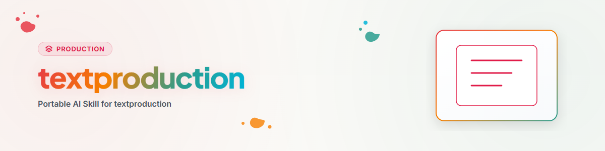

> **Español** — Versión oficial en español de `textproduction`.


# Textproduction — Router (Español)

Esta habilidad cubre todas las formas de producción de texto. Redirige a la
subhabilidad adecuada: lee las instrucciones detalladas en la subcarpeta.

## Tabla de enrutamiento

| Subhabilidad | Ejemplos de activadores | Instrucciones detalladas |
|---|---|---|
| **text** | «Escribe una entrada de blog», «5 publicaciones de LinkedIn», «Boletín informativo», «Descripción de producto», «Correo electrónico formal», «Resume X» | `text/WORKFLOW.md` |
| **storys** | «Escribe un guión», «Historia corta», «Crear aventura de RPG», «Ficha de personaje», «Construcción de mundos» | `storys/WORKFLOW.md` |
| **pr** | «Redactar comunicado de prensa», «Documento de posición», «Paquete de RR. PP.», «Generar PDF» | `pr/WORKFLOW.md` (+ `pr/press_compiler.py`) |

## Flujo de trabajo y procedimiento

```
1. Solicitud del usuario → Tabla de enrutamiento arriba → determinar la subhabilidad adecuada.
2. Leer las instrucciones detalladas en la subcarpeta (WORKFLOW.md).
3. Seleccionar plantilla de prompt, rellenar marcadores de posición, generar texto.
4. Control de calidad (especificado por subhabilidad).
```

## Notas

- **Neutral para el usuario:** Sin datos personales, claves de API ni datos de cuenta en la habilidad.
  La configuración (tonalidad, límites de caracteres, datos de contacto para RR. PP.) corresponde al usuario.
- **Herramienta de RR. PP.:** `pr/press_compiler.py` compila comunicados de prensa y documentos de posición
  a PDF a través de LaTeX (pdflatex/xelatex). Configuración única: copiar `pr/config.example.json`
  a `pr/config.json` e introducir los datos de contacto.
- Optimización de estilo opcional: DeepL Write (gratuito hasta 500.000 caracteres/mes).

## Historial de cambios

### 2.0.0 (2026-06-22)
- Reestructuración al patrón de enrutador: SKILL.md = punto de entrada + tabla de enrutamiento.
- Tres subhabilidades: text/ (6 tipos de texto), storys/ (4 formatos narrativos),
  pr/ (comunicado de prensa + documento de posición + compilador PDF LaTeX).
- press_compiler.py + plantillas LaTeX + config.example.json movidos aquí desde
  ai-media-editor/production/pr/ (SSOT).
- Referencias de habilidades relacionadas actualizadas a rutas internas de subhabilidades.

### 1.0.0 (2026-06-22)
- Versión inicial. Extraído de ai-media-editor/production/text/WORKFLOW.md.
- Procedencia: BACH agents/_experts/textproduction/ (MIT).