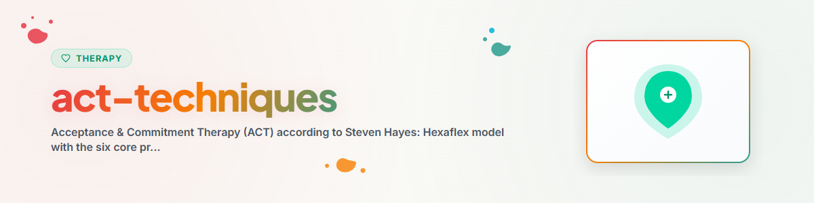

> Acceptance & Commitment Therapy (ACT): Hexaflex-Modell und die sechs Kernprozesse psychischer Flexibilität nach Steven Hayes

# ACT-Techniken -- Acceptance & Commitment Therapy

## Grundlage

Die Acceptance & Commitment Therapy (ACT, gesprochen als Wort "act") wurde von **Steven C. Hayes** entwickelt und gehört zur dritten Welle der Verhaltenstherapie. ACT zielt nicht auf Symptomreduktion, sondern auf **psychische Flexibilität** -- die Fähigkeit, im gegenwärtigen Moment offen und bewusst zu handeln, geleitet von persönlichen Werten.

Kernaussage: **Nicht der Schmerz ist das Problem, sondern der Kampf gegen den Schmerz.**

---

## Das Hexaflex-Modell

Das Hexaflex ist das zentrale Modell der ACT. Sechs Kernprozesse bilden zusammen psychische Flexibilität. Jeder Prozess ist das Gegenstück zu einem pathologischen Prozess (psychische Inflexibilität).

```
                    Gegenwärtigkeit
                         /    \
                        /      \
              Akzeptanz          Selbst-als-Kontext
                |    \          /    |
                |  PSYCHISCHE  |
                | FLEXIBILITÄT|
                |  /          \     |
              Defusion          Werte
                        \      /
                         \    /
                    Engagiertes Handeln
```

### Flexibilität vs. Inflexibilität

| Kernprozess (flexibel) | Gegenpol (inflexibel) |
|---|---|
| Akzeptanz | Erlebnisvermeidung |
| Kognitive Defusion | Kognitive Fusion |
| Gegenwärtigkeit | Vergangenheits-/Zukunftsfokus |
| Selbst-als-Kontext | Konzeptualisiertes Selbst |
| Werte | Mangelnde Werteklärung |
| Engagiertes Handeln | Untätigkeit/Impulsivität |

---

## Die sechs Kernprozesse

### 1. Akzeptanz

**Definition:** Bereitschaft, innere Erlebnisse (Gefühle, Gedanken, Körperempfindungen) zuzulassen, ohne sie zu verändern, zu vermeiden oder zu kontrollieren.

**Wichtig:** Akzeptanz ist NICHT Resignation. Es ist eine aktive, bewusste Entscheidung, dem Erleben Raum zu geben.

#### Techniken

- **Bereitschaftsskala (0-10):** "Wie bereit bist du gerade, dieses Gefühl einfach da sein zu lassen?"
- **Expansion:** Das Gefühl im Körper lokalisieren, ihm Form/Farbe/Textur geben, es "atmen lassen"
- **Kampf-Schalter-Metapher:** Es gibt einen Schalter in uns -- nicht für Schmerz, sondern für den Kampf gegen Schmerz. Akzeptanz bedeutet, den Kampf-Schalter umzulegen.

#### Metapher: Treibsand

> Wenn du in Treibsand geraten bist, ist der natürliche Instinkt zu kämpfen, sich zu wehren, zu strampeln. Aber genau das zieht dich tiefer hinein. Das einzig Hilfreiche: Sich flach hinlegen, die Oberfläche vergrößern, den Kontakt mit dem Treibsand akzeptieren. Nicht weil Treibsand toll ist -- sondern weil der Kampf dagegen das eigentliche Problem ist.

---

### 2. Kognitive Defusion

**Definition:** Sich von Gedanken lösen -- sie als das sehen, was sie sind: mentale Ereignisse, nicht die Realität selbst. Statt "Ich bin wertlos" -> "Ich habe den Gedanken, dass ich wertlos bin."

#### Techniken

- **"Ich habe den Gedanken, dass..."** -- Gedanken sprachlich distanzieren
- **"Danke, Verstand!"** -- Den Verstand als überaktiven Berater anerkennen, ohne ihm zu gehorchen
- **Gedanken singen:** Den belastenden Gedanken auf die Melodie von "Happy Birthday" singen (verringert die Glaubwürdigkeit)
- **Gedanken auf Blätter:** Sich einen Bach vorstellen. Jeden Gedanken auf ein Blatt legen und vorbeitreiben lassen
- **Passagier-Benennung:** Dem inneren Kritiker einen Namen geben ("Ah, da ist wieder der Perfektionist-Peter")
- **Wiederholungsübung:** Ein belastendes Wort 30 Sekunden schnell wiederholen -- es verliert seine emotionale Ladung

#### Metapher: Der ungebetene Gast

> Stell dir vor, du gibst eine Party und ein ungebetener Gast kommt. Du hast drei Möglichkeiten: (1) Du wirfst ihn raus -- aber er kommt immer wieder und macht Lärm. (2) Du lässt ihn rein und verbringst den ganzen Abend damit, ihn zu überwachen -- dann verpasst du deine eigene Party. (3) Du lässt ihn rein, nimmst zur Kenntnis dass er da ist, und feierst weiter deine Party. Option 3 ist Defusion.

---

### 3. Gegenwärtigkeit (Kontakt mit dem gegenwärtigen Moment)

**Definition:** Bewusste, nicht-wertende Aufmerksamkeit auf das Hier und Jetzt. Weder in der Vergangenheit grübelnd noch in der Zukunft sorgend.

#### Techniken

- **5-4-3-2-1 Übung:** 5 Dinge sehen, 4 hören, 3 fühlen, 2 riechen, 1 schmecken
- **Atemachtsamkeit:** 3 bewusste Atemzüge -- nur beobachten, nicht steuern
- **Sensorisches Ankern:** Einen Gegenstand mit voller Aufmerksamkeit erforschen (Textur, Gewicht, Temperatur)
- **Check-in-Fragen:** "Was passiert gerade in meinem Körper? Was für Gedanken sind da? Was für Gefühle?"

---

### 4. Selbst-als-Kontext (Beobachtendes Selbst)

**Definition:** Unterscheidung zwischen dem Selbst als Inhalt ("Ich BIN ängstlich") und dem Selbst als Kontext ("Ich BEMERKE Angst"). Das beobachtende Selbst ist der Raum, in dem alle Erlebnisse stattfinden -- aber es ist nicht diese Erlebnisse.

#### Techniken

- **Himmels-Metapher:** "Du bist der Himmel, nicht das Wetter. Wolken, Stürme, Sonnenschein -- alles zieht vorbei. Aber der Himmel ist immer da."
- **Schachbrett-Metapher:** "Du bist nicht die weißen oder schwarzen Figuren. Du bist das Brett, auf dem das Spiel stattfindet."
- **Beobachter-Übung:** Augen schließen. Gedanken beobachten. Gefühle beobachten. Körperempfindungen beobachten. Dann: "Wer ist es, der all das beobachtet?"
- **Perspektiv-Übungen:** "Wenn dein 80-jähriges Selbst auf diese Situation zurückblicken würde -- was würde es sagen?"

---

### 5. Werte

**Definition:** Frei gewählte Richtungen des Lebens. Werte sind keine Ziele (die man erreichen kann), sondern Kompassrichtungen (denen man folgt). Man "erreicht" niemals den Wert "liebevoller Partner sein" -- man lebt ihn, Moment für Moment.

#### Werteklärung -- Lebensbereiche

| Lebensbereich | Leitfrage |
|---|---|
| Beziehungen | Was für ein Partner/Freund/Familienmitglied möchte ich sein? |
| Arbeit/Beruf | Was macht Arbeit für mich bedeutsam? |
| Persönliches Wachstum | In welche Richtung möchte ich mich entwickeln? |
| Gesundheit | Wie möchte ich mit meinem Körper umgehen? |
| Freizeit/Erholung | Was nährt mich wirklich? |
| Spiritualität | Was gibt meinem Leben tieferen Sinn? |
| Gemeinschaft | Was möchte ich zur Welt beitragen? |

#### Techniken

- **Grabstein-Übung:** "Was soll auf deinem Grabstein stehen? Nicht was du erreicht hast, sondern wofür du gestanden hast."
- **Kompass-Übung:** Für jeden Lebensbereich eine Richtung bestimmen und auf einer Skala von 1-10 bewerten: "Wie wichtig ist mir das?" und "Wie sehr lebe ich das gerade?"
- **Süße-Stelle-des-Schmerzes:** "Hinter jedem Schmerz steckt ein Wert. Wer nicht liebt, kann nicht verletzt werden. Dass es wehtut, zeigt, dass dir etwas wichtig ist."

---

### 6. Engagiertes Handeln

**Definition:** Konkrete Handlungen, die mit den eigenen Werten übereinstimmen. Nicht perfekt, nicht "wenn ich bereit bin", sondern JETZT, mit allen Schwierigkeiten.

#### Techniken

- **SMART-Werte-Ziele:** Spezifisch, Messbar, Attraktiv, Realistisch, Terminiert -- aber immer an einen Wert gekoppelt
- **Kleinster möglicher Schritt:** "Was ist der kleinste Schritt, den du HEUTE in Richtung dieses Wertes gehen könntest?"
- **Bereitschafts-Check:** "Bist du bereit, [unangenehmes Gefühl] mitzunehmen, wenn es auftaucht, während du diesen Schritt gehst?"
- **Hindernisse einplanen:** "Welche inneren Barrieren könnten auftauchen? Wie willst du mit ihnen umgehen?" (nicht: "Wie beseitigst du sie?")

#### Metapher: Passagiere im Bus

> Du bist der Busfahrer deines Lebens. Im Bus sitzen Passagiere -- das sind deine Gedanken, Gefühle, Erinnerungen, Körperempfindungen. Manche sind laut, bedrohlich, hässlich. Sie schreien: "Fahr rechts! Fahr links! Halt an!" Du hast drei Möglichkeiten:
>
> 1. **Anhalten und kämpfen:** Du hörst auf zu fahren und versuchst, die Passagiere rauszuwerfen. Aber du kommst nicht voran.
> 2. **Verhandeln:** Du fährst dahin, wo die Passagiere wollen. Aber es ist nicht DEINE Richtung.
> 3. **Weiterfahren:** Du lässt die Passagiere schreien, nimmst sie mit -- und fährst trotzdem in DEINE Richtung. Die Passagiere dürfen da sein. Aber SIE bestimmen nicht die Route.
>
> Engagiertes Handeln bedeutet: Den Bus in Richtung deiner Werte zu fahren, egal welche Passagiere mitfahren.

---

## Anwendungsbereiche

ACT ist evidenzbasiert wirksam bei:

- **Depression und Angststörungen**
- **Chronische Schmerzen**
- **Suchterkrankungen**
- **Essstörungen**
- **Burnout und Stress am Arbeitsplatz**
- **Trauma und PTBS** (ergänzend)
- **Psychotische Störungen** (ergänzend)

---

## Wann welchen Prozess ansprechen?

| Situation des Nutzers | Primärer ACT-Prozess |
|---|---|
| Vermeidet bestimmte Gefühle/Situationen | Akzeptanz |
| Ist in Grübeln/Sorgen gefangen | Defusion |
| Lebt im Autopilot, dissoziiert | Gegenwärtigkeit |
| Definiert sich über Probleme ("Ich BIN...") | Selbst-als-Kontext |
| Fühlt sich orientierungslos, sinnlos | Werte |
| Weiß was wichtig ist, handelt aber nicht | Engagiertes Handeln |

---

## Ethische Leitlinien

Ein KI-Assistent darf ACT-Techniken psychoedukativ erklären und Übungen anleiten.

Ein KI-Assistent darf NICHT:
- Diagnosen stellen
- Eine therapeutische Beziehung simulieren
- Bei akuter Suizidalität allein handeln -- Verweis an professionelle Hilfe
- ACT als Ersatz für Psychotherapie darstellen

Siehe: [ETHICS.md](../ETHICS.md)

---

## Quellenangaben

- Hayes, S. C., Strosahl, K. D., & Wilson, K. G. (2012). *Acceptance and Commitment Therapy: The Process and Practice of Mindful Change.* 2nd Edition.
- Harris, R. (2009). *ACT Made Simple.*
- Hayes, S. C. (2005). *Get Out of Your Mind and Into Your Life.*

---

*Portiert aus BACH v3.8.0 | Standalone-Version*
