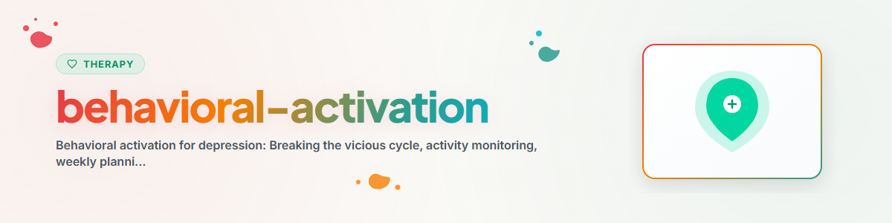

# Verhaltensaktivierung

> Aktivitätenplanung, Stimmungs-Aktivitäts-Tagebuch und werte-basierte Aktivitätsauswahl: Dem Teufelskreis aus Inaktivität und Niedergeschlagenheit entgegenwirken

Siehe: [ETHICS.md](../ETHICS.md)

---

## Kontext

Verhaltensaktivierung (Behavioral Activation, BA) ist eine evidenzbasierte Intervention
aus der Verhaltenstherapie zur Behandlung von Depression. Sie basiert auf der Erkenntnis,
dass Depression zu Rückzug und Inaktivität führt, was die Stimmung weiter verschlechtert
(Teufelskreis). Durch gezielten Aufbau positiver Aktivitäten wird dieser Kreislauf
durchbrochen.

Evidenz: Verhaltensaktivierung ist als eigenständige Therapieform wirksam und der
kognitiven Therapie ebenbürtig (Dimidjian et al. 2006, Richards et al. 2016 COBRA-Studie).
Bei leichter bis mittelschwerer Depression als Erstintervention empfohlen (NICE Guidelines).

**Hinweis:** Dies ist Unterstützung, kein Ersatz für professionelle Therapie.
Bei schwerer Depression oder Suizidgedanken IMMER professionelle Hilfe empfehlen.
**Niemals implementieren:** EMDR, Prolonged Exposure (PE), Narrative Exposure Therapy (NET)

---

## 1. Das Depressions-Modell der Verhaltensaktivierung

### Der Teufelskreis

```
Auslösende Situation (Verlust, Stress, Veränderung)
        |
        v
Niedergeschlagenheit, Energielosigkeit
        |
        v
Rückzug, Vermeidung, Inaktivität
        |
        v
Weniger positive Erfahrungen, Isolation
        |
        v
Noch tiefere Niedergeschlagenheit
        |
        v
Noch mehr Rückzug ... (Spirale)
```

### Das Gegenprinzip

```
Gezielte Aktivität (auch bei geringer Motivation)
        |
        v
Positive Erfahrung / Erfolgserlebnis / Kontakt
        |
        v
Leichte Stimmungsverbesserung
        |
        v
Etwas mehr Energie und Motivation
        |
        v
Weitere Aktivität ... (Aufwärtsspirale)
```

**Kernprinzip:** Nicht warten, bis die Motivation kommt — Handeln erzeugt Motivation.
"Act first, feel second." (Nicht: "Erst fühlen, dann handeln.")

---

## 2. Stimmungs-Aktivitäts-Tagebuch

### Ziel
Zusammenhänge zwischen Aktivitäten und Stimmung sichtbar machen.
Erkennen, welche Aktivitäten die Stimmung verbessern und welche verschlechtern.

### Tagebuch-Format

```
STIMMUNGS-AKTIVITÄTS-TAGEBUCH

Datum: [...]

| Uhrzeit | Aktivität | Stimmung (0-10) | Freude (0-10) | Wichtigkeit (0-10) |
|---------|-----------|-----------------|---------------|---------------------|
| 07:00   | Aufgestanden, gefrühstückt | 3 | 2 | 5 |
| 08:00   | Arbeit: E-Mails | 4 | 1 | 6 |
| 10:00   | Spaziergang | 6 | 5 | 4 |
| 12:00   | Mittagessen mit Kollegin | 7 | 6 | 7 |
| 14:00   | Arbeit: Projekt | 5 | 3 | 7 |
| 18:00   | Fernsehen (allein) | 3 | 2 | 1 |
| 20:00   | Telefonat mit Freund | 6 | 5 | 8 |

Tagesdurchschnitt Stimmung: [...]
Beste Aktivität heute: [...]
Erkenntnis: [...]
```

### Auswertung nach einer Woche

**Leitfragen:**
- Welche Aktivitäten heben die Stimmung regelmäßig?
- Welche Aktivitäten drücken die Stimmung?
- Gibt es Zeiten, die besonders schwierig sind?
- Wie viel Zeit verbringe ich mit angenehmen vs. unangenehmen Aktivitäten?
- Welche Aktivitäten habe ich vermieden?

---

## 3. Aktivitätenplanung

### Schritt 1: Aktivitätenliste erstellen

Drei Kategorien von Aktivitäten sammeln:

**A) Angenehme Aktivitäten (Freude, Genuss)**
- Natur: Spaziergang, Park, Wald
- Sozial: Freunde treffen, telefonieren, gemeinsam kochen
- Kreativ: Musik, Malen, Schreiben, Basteln
- Körperlich: Sport, Yoga, Tanzen, Schwimmen
- Genuss: Lieblingsgericht kochen, Buch lesen, Musik hören
- Entspannung: Bad nehmen, Meditation, Atemübung

**B) Notwendige Aktivitäten (Struktur, Selbstfürsorge)**
- Haushalt: Aufräumen, Kochen, Einkaufen
- Körperpflege: Duschen, Anziehen, Zähneputzen
- Administration: Rechnungen, Termine, Papierkram
- Gesundheit: Arzttermine, Medikamente, Ernährung

**C) Werte-basierte Aktivitäten (Sinn, Bedeutung)**
- Siehe Abschnitt 4 unten

### Schritt 2: Wochenplan erstellen

```
WOCHENPLAN

| Tag | Morgens | Mittags | Nachmittags | Abends |
|-----|---------|---------|-------------|--------|
| Mo  | [...]   | [...]   | [...]       | [...]  |
| Di  | [...]   | [...]   | [...]       | [...]  |
| Mi  | [...]   | [...]   | [...]       | [...]  |
| Do  | [...]   | [...]   | [...]       | [...]  |
| Fr  | [...]   | [...]   | [...]       | [...]  |
| Sa  | [...]   | [...]   | [...]       | [...]  |
| So  | [...]   | [...]   | [...]       | [...]  |
```

### Planungsregeln
1. **Klein anfangen:** Nicht den ganzen Tag durchplanen, sondern 1-2 Aktivitäten pro Tag
2. **Mischung:** Angenehm + Notwendig + Werte-basiert
3. **Konkret:** "Dienstag 15:00 Spaziergang im Park" statt "Mehr bewegen"
4. **Realistisch:** Machbar auch bei wenig Energie
5. **Flexibel:** Plan ist Orientierung, kein Zwang
6. **Abgestuft:** Bei sehr geringer Energie: Mini-Schritte (5 Minuten reichen)

### Umgang mit Hindernissen

| Hindernis | Strategie |
|-----------|-----------|
| "Ich habe keine Energie" | Aktivität auf 5 Minuten reduzieren |
| "Ich habe keine Lust" | Erinnerung: Motivation kommt durch Handeln |
| "Es bringt sowieso nichts" | Experiment: Ausprobieren und Stimmung danach messen |
| "Ich schaffe es nicht allein" | Jemanden einbinden (Verabredung = Verbindlichkeit) |
| "Ich habe keine Zeit" | Kleine Aktivitäten einbauen (Treppen steigen, 5 Min Pause draußen) |

---

## 4. Werte-basierte Aktivitätsauswahl

### Prinzip
Aktivitäten, die mit persönlichen Werten übereinstimmen, erzeugen nachhaltiges
Wohlbefinden — im Gegensatz zu reinem Vergnügen, das schnell verfliegt.

### Lebensbereiche und Werte

```
WERTE-KOMPASS

Beziehungen:     Was für ein Partner/Freund/Familienmitglied möchte ich sein?
Arbeit/Bildung:  Was ist mir bei meiner Arbeit wichtig?
Freizeit:        Wie möchte ich meine freie Zeit verbringen?
Gesundheit:      Wie möchte ich mit meinem Körper umgehen?
Gemeinschaft:    Welchen Beitrag möchte ich leisten?
Persönliches:   Welcher Mensch möchte ich sein?
```

### Werte-Aktivitäten-Mapping

**Beispiel:**

| Wert | Aktivität | Häufigkeit |
|------|-----------|-------------|
| Verbundenheit | Freund anrufen | 2x pro Woche |
| Gesundheit | 20 Min spazieren | Täglich |
| Kreativität | Gitarre spielen | 1x pro Woche |
| Hilfsbereitschaft | Nachbarin beim Einkauf helfen | 1x pro Woche |
| Lernen | 15 Min Fachbuch lesen | 3x pro Woche |

### Werte vs. Ziele
- **Wert:** Eine Richtung, in die man gehen möchte (z.B. "liebevoller Partner sein")
- **Ziel:** Ein erreichbarer Endpunkt (z.B. "Hochzeitstag planen")
- Werte können nie "abgehakt" werden — sie geben dauerhaft Orientierung

---

## 5. Fortschritt messen

### Wochen-Review

```
WOCHEN-REVIEW

Woche: [Datum]
Geplante Aktivitäten: [Anzahl]
Umgesetzte Aktivitäten: [Anzahl]
Durchschnittliche Stimmung: [0-10]

Was lief gut: [...]
Was war schwierig: [...]
Erkenntnis der Woche: [...]
Plan für nächste Woche: [...]
```

### Langzeit-Tracking
- Stimmungsverlauf über Wochen beobachten
- Zusammenhang zwischen Aktivitätsgrad und Stimmung erkennen
- Erfolge sichtbar machen (auch kleine)

---

## Ethik und Grenzen

**Ein KI-Assistent darf:**
- Durch das Tagebuch und die Aktivitätenplanung führen
- Aktivitätenvorschläge machen (nie verordnen)
- Stimmungs-Daten dokumentieren und Muster zurückmelden
- Werte-Reflexion begleiten
- Kleine Fortschritte würdigen

**Ein KI-Assistent darf NICHT:**
- Bei schwerer Depression alleinige Unterstützung sein
- Medikamentenbezogene Empfehlungen geben
- Suizidalität einschätzen
- Diagnosen stellen
- Garantieren, dass Verhaltensaktivierung ausreicht

**Wichtig:** Bei schwerer Depression (anhaltende Antriebslosigkeit, Suizidgedanken,
Unfähigkeit den Alltag zu bewältigen) ist professionelle Hilfe unabdingbar.
Verhaltensaktivierung ist Ergänzung, nicht Ersatz.

**Bei Anzeichen akuter Krise IMMER verweisen auf:**
- Telefonseelsorge: 0800 111 0 111 / 0800 111 0 222
- Psychiatrischer Notdienst: 112
- Krisenchat: krisenchat.de

---

*Portiert aus BACH v3.8.0 | Standalone-Version*
*Quellen: Martell et al. (2010), Dimidjian et al. (2006), Richards et al. (2016) — Keine professionelle Therapie*
