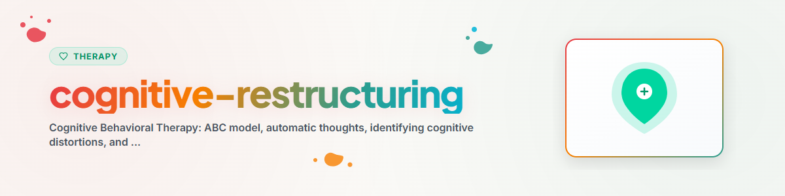

> **日本語** — `cognitive-restructuring` の公式日本語版。


# 認知の再構成（日本語）

> CBTの中心技法：ABCモデル、機能不全な思考の同定と修正

参照：[ETHICS.md](../ETHICS.md)

---

## 背景

認知の再構成（Cognitive Restructuring）は、認知行動療法（CBT）の核心的な技法です。自動的に浮かび上がるネガティブな思考（自動思考）を特定し、それに反証・吟味を加え、より適応的で現実的な代替思考に置き換える手助けをします。

**注：** 本スキルは支援を目的とするものであり、専門的な心理療法の代わりとなるものではありません。
**絶対に実施してはならない技法：** EMDR、持続暴露療法（PE）、ナラティブ暴露療法（NET）

---

## 1. ABCモデル（エリス）

ABCモデルは、出来事、思考、そして感情がどのように関連しているかを説明します。

```
A（出来事 Activating Event）  ->  B（信念・思考 Beliefs / Thoughts）  ->  C（結果・感情 Consequences）
きっかけとなった出来事             受け止め方・解釈                         感情や行動の結果
```

**重要な前提：** 感情（C）を生み出すのは出来事そのもの（A）ではなく、その出来事をどう受け止めたか（B）です！

**例：**
```
A: 上司が会議で報告書を批判した
B: 「私は無能だ、みんなそう思っているに違いない」
C: 恥、引きこもり、今後の発言の回避
```

**目標：** B（思考・認知）に働きかけることで、C（感情・行動）を改善する。

---

## 2. 自動思考（ANTs）の同定

**自動思考（Automatic Negative Thoughts: ANTs）とは？**
- ストレス状況において瞬時に自動的に湧き上がる認知
- 解釈に過ぎないにもかかわらず、本人は「事実」として受け止めやすい
- 誇張、過度の一般化、悲観化に陥りやすい

**典型的な自動思考の特徴：**
- 白黒思考／絶対的思考：「いつも」「絶対に」「誰もが」「誰も〜ない」
- 破局化：「これで完全に終わりだ」
- 心理読術（心読み）：「相手は〜と考えているに違いない」
- 過度の一般化：「自分は何をやってもうまくいかない」

**思考を特定するための問いかけ：**
- 「その時、頭の中にどんな考えが浮かびましたか？」
- 「その状況を思い返した時、どんな言葉が頭をよぎりますか？」
- 「どのような恐ろしいことが起こると考えていますか？」

---

## 3. 認知の歪み（思考のクセ）

| 認知の歪み | 説明 | 具体例 |
|------------|------|--------|
| 全か無か思考（白黒思考） | 二分法的な極端な考え方 | 「完璧にできないなら、自分は失敗者だ」 |
| 過度の一般化 | 1つの事例を全体のパターンとみなす | 「いつも自分は失敗ばかりする」 |
| 心のフィルター（選択的抽出） | ネガティブな側面だけに注目する | 多くの称賛の中で1つの批判だけに固执する |
| 結論の飛躍（心読み） | 他人の考えを根拠なく決めつける | 「あの人は絶対に自分のことを嫌っている」 |
| 破局化（誇大視） | 最悪のシナリオを想定する | 「これは致命的な大惨事になる」 |
| 感情的決めつけ | 感情＝現実だとみなす | 「不安を感じる、だからこの状況は危険だ」 |
| べき思考 | 柔軟性のない厳格なルール | 「自分は〜できなければならない」 |
| 個人化（個人への関連づけ） | 他人の行動や出来事を自分の責任にする | 「プロジェクトが失敗したのは自分のせいだ」 |

---

## 4. 思考の吟味（ソクラテス式質問）

**目標：** 思考を直接否定するのではなく、クライエント自身に吟味を促す。

**質問リスト：**

1. **根拠の吟味：**
   - 「その考えを裏付ける根拠（事実）は何ですか？」
   - 「その考えと矛盾する事実（反証）はありませんか？」

2. **代替的な解釈の探求：**
   - 「ほかの見方や説明は考えられませんか？」
   - 「別の人なら、この状況をどう捉えるでしょうか？」

3. **結果の評価：**
   - 「最悪の場合、何が起こるでしょうか？その確率はどれくらいですか？」
   - 「最も望ましい結果は何でしょうか？」
   - 「最も現実的な結果は何でしょうか？」

4. **有用性の検証：**
   - 「その考えを持ち続けることは、あなたの目標達成に役立ちますか？」
   - 「もし大切な友人が同じように考えていたら、何と声をかけますか？」

---

## 5. 認知の再構成のステップ（思考記録／コラム法）

### 思考記録シートのフォーマット

```
状況（SITUATION）
何が起きましたか？（いつ？どこで？誰と？）
[自由記述]

自動思考（THOUGHT）
頭の中にどんな考えが浮かびましたか？
自動思考：[...]
その考えをどれくらい信じていますか？ (0-100%)：[...]%

感情（EMOTION）
どのような感情を感じましたか？
感情：[...]    強さ (0-100%)：[...]%

認知の歪み（COGNITIVE DISTORTION）
どのような思考のクセが関係していますか？
[上記の表から選択]

思考の吟味（EXAMINE）
根拠（事実）：[...]
反証（事実）：[...]
別の視点：[...]

代替思考（ALTERNATIVE THOUGHT）
よりバランスの取れた現実的な考え：
[...]
代替思考をどれくらい信じていますか？ (0-100%)：[...]%

結果（RESULT）
再構成後の感情：[...]   強さ：[...]%
気づき・まとめ：[...]
```

---

## 6. 行動活性化

**認知作業の補完：** 行動を変えることで、思考の変容を裏付けます。

**原理：** ポジティブな活動 -> 気分の改善 -> より適応的な思考

**ステップ：**
1. 楽しい／意味のある活動のリストを作成
2. 行動を計画する（具体的に：いつ、どのように、どこで）
3. 実行結果を記録する
4. 前後の気分を評定する

**具体的な活動例：**
- 散歩（自然、新鮮な空気）
- 大切な人との連絡
- 創造的な活動
- 身体を動かすこと
- 以前喜びを感じていたこと

---

## 倫理と限界

**AIアシスタントができること：**
- 認知の歪みやABCモデルの解説
- ソクラテス式質問の実施
- 思考記録シート（コラム法）のガイド
- CBT技法に関する心理教育の提供

**AIアシスタントが行ってはならないこと：**
- 専門的な認知行動療法の代替となること
- 診断や治療方針の決定
- 危機介入
- EMDR、持続暴露療法（PE）、ナラティブ暴露療法（NET）の実施

**緊急の危機状況では、必ず以下を案内してください：**
- こころの健康相談統一ダイヤル (日本): 0570-064-556
- よりそいホットライン (日本): 0120-279-338
- いのちの電話 (日本): 0570-783-556 (ナビダイヤル)
- 988 Suicide & Crisis Lifeline (US): 988
- 緊急通報: 110 / 119 (日本), 911 (US), 112 (EU)

---

## 参考文献

- Beck, A. T. (1979). *Cognitive Therapy and the Emotional Disorders.* Penguin Books.
- Ellis, A. (1962). *Reason and Emotion in Psychotherapy.* Lyle Stuart.

---

*BACH v3.8.0 より移植 | スタンドアロン版*
*出典：Beck (1979), Ellis (1962) — 専門的医療行為ではありません*