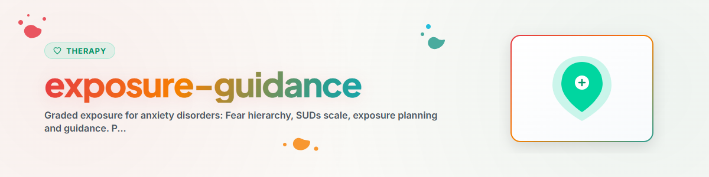

> **Español** — Versión oficial en español de `exposure-guidance`.


# Orientación en Exposición (Español)

> Jerarquía de miedos, escala SUDs, exposición graduada y habituación: Planificación y orientación — implementación real únicamente con un terapeuta

Ver: [ETHICS.md](../ETHICS.md)

---

## Contexto

La exposición (terapia de confrontación) es uno de los métodos más efectivos de la terapia conductual para los trastornos de ansiedad, fobias, TOC y TEPT. Se basa en los principios de habituación y extinción: cuando uno se enfrenta repetidamente a una situación que provoca ansiedad, la respuesta de ansiedad disminuye con el tiempo.

Evidencia: La terapia de exposición es el tratamiento estándar de oro para fobias específicas, ansiedad social, trastorno de pánico y agorafobia (Guías NICE, Bandelow et al. 2014, Guía S3 de Trastornos de Ansiedad). Los tamaños del efecto se encuentran entre los más altos en la investigación psicoterapéutica.

**IMPORTANTE:** Esta habilidad apoya la PLANIFICACIÓN de ejercicios de exposición y transmite la comprensión de los mecanismos. La IMPLEMENTACIÓN real de la exposición debe llevarse a cabo bajo la guía de un terapeuta cualificado.
**Nunca aplicar:** EMDR, Exposición Prolongada (PE), Terapia de Exposición Narrativa (NET)

---

## 1. Comprensión de los Mecanismos

### Habituación

```
HABITUACIÓN: Adaptación mediante la confrontación repetida

Nivel de ansiedad
100 |  *
    | * *
 80 |*   *
    |     *
 60 |      *
    |       *
 40 |        *
    |         *  *
 20 |          **  * *
    |                  * * * * * *
  0 |________________________________
    Tiempo (durante la exposición)

La ansiedad aumenta inicialmente, alcanza un pico,
y luego disminuye por sí sola SIN huida ni evitación.

Experiencia clave: "La ansiedad pasa, incluso cuando
permanezco en la situación."
```

### Extinción (Nuevo Aprendizaje)

```
EXTINCIÓN: Las nuevas experiencias sobrescriben las viejas asociaciones de miedo

Vieja experiencia: Perro -> Peligro -> Ansiedad -> Huida
Nueva experiencia: Perro -> No hay peligro -> La ansiedad disminuye -> Estoy a salvo

La vieja asociación no se borra, sino que se superpone con nuevas
experiencias. Por lo tanto, la ansiedad puede regresar en ciertos
contextos (renovación, restablecimiento), lo cual es NORMAL.
```

### Por qué la Evitación Mantiene el Problema

```
EL CÍRCULO DE LA EVITACIÓN:

Situación que provoca ansiedad
        |
        v
La ansiedad aumenta (desagradable)
        |
        v
Evitación / huida
        |
        v
Alivio a corto plazo (la ansiedad disminuye de inmediato)
        |
        v
Refuerzo a largo plazo de la ansiedad
("La situación SÍ ES peligrosa, qué bueno que hui")
        |
        v
La próxima vez: Aún más ansiedad, aún más evitación
```

---

## 2. La Escala SUDs

### Unidades Subjetivas de Angustia / Malestar (0-100)

```
ESCALA SUDs (Subjective Units of Distress)

  0  Completamente relajado, sin ansiedad
 10  Tensión mínima, apenas perceptible
 20  Malestar leve, fácilmente tolerable
 30  Notablemente desagradable, pero controlable
 40  Ansiedad perceptible, aún capaz de funcionar
 50  Ansiedad moderada, extenuante pero manejable
 60  Ansiedad fuerte, claro impulso de evitar
 70  Ansiedad muy fuerte, difícil de soportar
 80  Ansiedad intensa, al límite de la tolerancia
 90  Ansiedad extrema, sensación de pánico
100  Ansiedad máxima, el peor malestar imaginable
```

### Uso de la Escala SUDs

**Antes de la exposición:**
- Ansiedad estimada en la situación planificada (valor esperado)

**Durante la exposición:**
- Evaluar el valor SUDs actual cada 5 minutos
- Documentar la progresión (en aumento, en descenso, fluctuante)

**Después de la exposición:**
- ¿Valor SUDs más alto? ¿Valor final? ¿Qué tan rápido disminuyó la ansiedad?
- ¿Fue tan malo como se esperaba?

---

## 3. Creación de una Jerarquía de Miedos

### Principio

Una jerarquía de miedos clasifica las situaciones que provocan ansiedad desde el nivel más bajo hasta el más alto. La exposición comienza con situaciones fáciles y aumenta paso a paso.

### Ejemplo: Fobia a los Perros

```
JERARQUÍA DE MIEDOS: Fobia a los perros

SUDs | Situación
-----|--------------------------------------------------
 10  | Mirar una foto de un perro
 15  | Ver un video de perros jugando
 25  | Hablar sobre experiencias propias con perros
 30  | Observar a un perro pequeño desde 10 metros de distancia
 40  | Observar a un perro pequeño desde 5 metros de distancia
 50  | Estar al lado de un perro pequeño con correa (2 metros)
 55  | Tocar a un perro pequeño con correa (el dueño sujetándolo)
 60  | Observar a un perro mediano desde 5 metros
 65  | Sentarse al lado de un perro mediano con correa
 70  | Acariciar a un perro mediano
 75  | Caminar cerca de un perro sin correa (parque)
 80  | Estar a solas en una habitación con un perro tranquilo
 85  | Acariciar a un perro grande
 90  | Estar en un parque con varios perros sueltos
 95  | Darle de comer a un perro
100  | Dejar que un perro desconocido corra hacia ti
```

### Plantilla para Completar

```
MI JERARQUÍA DE MIEDOS

Tema de ansiedad: [...]

SUDs | Situación
-----|--------------------------------------------------
     | [...]
     | [...]
     | [...]
     | [...]
     | [...]
```

---

## 4. Tipos de Exposición

### Exposición Graduada (In Vivo)

**Principio:** Confrontación paso a paso con situaciones reales, comenzando con valores SUDs bajos.

### Inundación (Flooding)

**Principio:** Confrontación directa con situaciones altamente ansiógenas durante períodos prolongados. Únicamente bajo supervisión terapéutica. NO debe ser guiada por un asistente de IA, solo explicada.

### Exposición en Sensu (Imaginaria)

**Principio:** Experimentar situaciones que provocan ansiedad en la imaginación. Útil como preparación para la exposición real.

### Exposición Interoceptiva

**Principio:** Inducir deliberadamente síntomas físicos de ansiedad (ej. aumento del ritmo cardíaco mediante ejercicio, mareo mediante giros). ÚNICAMENTE bajo guía terapéutica.

---

## 5. Planificación Guiada de la Exposición

### Protocolo de Preparación

```
PROTOCOLO DE PLANIFICACIÓN DE LA EXPOSICIÓN

Fecha: [...]
Terapeuta informado: [ ] Sí  [ ] No (¡OBLIGATORIO!)

Tema de ansiedad: [...]
Situación elegida: [...]
Valor SUDs esperado: [...]
Nivel en la jerarquía: [...]

Qué haré exactamente: [...]
Dónde: [...]
Cuándo: [...]
Cuánto tiempo: [...]
Solo o acompañado: [...]

Mi mayor temor: [...]
Qué sucederá de manera realista: [...]

Plan de emergencia (si SUDs > 90 o disociación):
1. Anclaje / Заземление (5-4-3-2-1)
2. Ejercicio de respiración (respiración en caja)
3. [Llamar a persona de confianza]: Tel. [...]
4. Abandonar la situación de forma ordenada (sin huida presa del pánico)
```

### Protocolo Posterior a la Sesión

```
EVALUACIÓN DE LA EXPOSICIÓN

Fecha: [...]
Situación: [...]

SUDs antes (expectativa): [...]
SUDs valor más alto durante: [...]
SUDs al final: [...]

Cuánto tiempo permaneció en la situación: [...]
Ocurrió habituación: [ ] Sí  [ ] Parcial  [ ] No

Lo que aprendí: [...]
¿Fue tan malo como temía?: [ ] Peor  [ ] Como esperaba  [ ] Menos malo

Lo que quiero hacer diferente la próxima vez: [...]
Siguiente nivel: [...]
```

---

## 6. Notas de Seguridad y Criterios de Interrupción

### Requisitos Previos para la Exposición

```
LISTA DE COMPROBACIÓN ANTES DE COMENZAR LA EXPOSICIÓN:

[ ] Hay un terapeuta cualificado involucrado
[ ] Existe una estabilización suficiente
[ ] La jerarquía de miedos está creada y discutida
[ ] El plan de emergencia está preparado
[ ] La persona comprende el mecanismo (habituación)
[ ] Sin suicidabilidad aguda
[ ] Sin síntomas psicóticos no controlados
[ ] Sin trastorno disociativo severo (sin apoyo terapéutico)
[ ] Sin intoxicación aguda por sustancias
[ ] La persona ha dado su consentimiento voluntario (¡sin exposición forzada!)
```

### Criterios de Interrupción

```
INTERRUMPIR LA EXPOSICIÓN SI:

- Ocurre disociación (la persona está "ausente", no responde)
- Ataque de pánico con pérdida de control
- La persona desea explícitamente parar (¡respetar la autonomía!)
- Síntomas físicos: dolor en el pecho, falta de aire grave, desmayo
- Pensamientos suicidas durante la exposición
- La situación se vuelve objetivamente insegura

AL INTERRUMPIR:
1. Anclaje y estabilización (5-4-3-2-1, ejercicio de respiración)
2. Asegurarse de que la persona esté orientada y estable
3. Discutir la experiencia (qué sucedió, qué se aprendió)
4. Sin culpabilizar ("Deberías haberte quedado")
5. Planificar el siguiente paso con el terapeuta
```

---

## Ética y Límites

**Un asistente de IA puede:**
- Explicar los principios de exposición (psicoeducación)
- Crear jerarquías de miedos conjuntamente
- Explicar y utilizar la escala SUDs
- Apoyar la planificación de la exposición (llenar protocolos)
- Documentar las evaluaciones posteriores
- Proporcionar información de seguridad
- Motivar y normalizar ("La ansiedad durante la exposición es deseada y normal")

**Un asistente de IA NO debe:**
- Realizar o guiar de forma independiente la exposición
- Guiar la inundación / flooding (SOLO el terapeuta)
- Guiar la exposición interoceptiva (SOLO el terapeuta)
- Realizar exposición prolongada para el TEPT
- Acompañar la exposición en disociación severa
- Presionar hacia la exposición ("Tienes que enfrentarte a esto")
- Garantizar resultados
- Realizar diagnósticos o crear planes de tratamiento
- Hacer recomendaciones sobre medicación

**LÍMITE ESPECIALMENTE ESTRICTO:** Un asistente de IA planifica y explica. La exposición real tiene lugar bajo la guía de un terapeuta cualificado. Para cualquier solicitud de implementación real: derivar al profesional. La exposición sin apoyo profesional puede revincular o intensificar la ansiedad.

**En caso de crisis aguda, SIEMPRE derivar a:**
- 988 Suicide & Crisis Lifeline (EE. UU.): 988
- Crisis Text Line (EE. UU.): Envíe HOME al 741741
- Samaritans (Reino Unido): 116 123
- Telefonseelsorge (Alemania): 0800 111 0 111 / 0800 111 0 222
- Servicios de emergencia: 911 (EE. UU.) / 112 (UE)

---

*Adaptado de BACH v3.8.0 | Versión independiente*
*Fuentes: Foa & Kozak (1986), Craske et al. (2014), Bandelow et al. (2014), Guía S3 Trastornos de Ansiedad (2014) — No es terapia profesional*