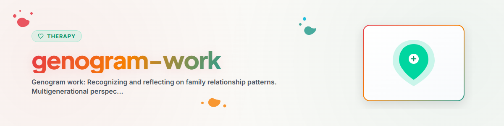

> **Español** — Versión oficial en español de `genogram-work`.


# Trabajo con Genogramas

> Reconocimiento y reflexión sobre los patrones de relaciones familiares: Perspectiva multigeneracional, símbolos del genograma, reconocimiento de patrones y recursos en la historia familiar

Ver: [ETHICS.md](../ETHICS.md)

---

## Contexto

El genograma es una herramienta de la terapia sistémica y la terapia familiar. Fue desarrollado significativamente por Murray Bowen (enfoque multigeneracional) y Monica McGoldrick (estandarización del genograma). Representa gráficamente las relaciones familiares a lo largo de varias generaciones y visibiliza patrones, roles y dinámicas.

Evidencia: El trabajo con genogramas es un componente de todos los programas de formación en terapia sistémica y está consolidado en la práctica clínica como una herramienta diagnóstica y reflexiva (McGoldrick, Gerson & Petry 2020, von Schlippe & Schweitzer 2012).

**Nota:** Esta es una herramienta de reflexión, no un sustituto de la terapia profesional.
**Nunca implementar:** EMDR, Exposición Prolongada (PE), Terapia de Exposición Narrativa (NET)

---

## 1. ¿Qué es un genograma?

### Definición
Un genograma es una representación gráfica ampliada de un árbol genealógico que recoge no solo la descendencia biológica, sino también la calidad de las relaciones, los patrones emocionales, los conflictos, las enfermedades y los acontecimientos vitales significativos, normalmente a lo largo de tres generaciones.

### Diferencia respecto a un árbol genealógico

| Árbol genealógico | Genograma |
|-------------------|-----------|
| ¿Quién está emparentado con quién? | ¿Cómo se relacionan las personas entre sí? |
| Descendencia biológica | Calidad relacional y emocional |
| Hechos estáticos | Patrones dinámicos |
| Orientado a la historia | Orientado a los patrones |

---

## 2. Símbolos del genograma (Estándar de McGoldrick)

### Personas

```
Male:         [ ]     (Square)
Female:       ( )     (Circle)
Non-binary:   < >     (Diamond)
Deceased:     [X]     (Symbol with X)
Index person: [=]     (Double border)
```

### Relaciones

```
Marriage/Partnership:   ———————      (solid line)
Separation:            ——/——        (line with one slash)
Divorce:               ——//——       (line with two slashes)
Close relationship:    ═══════      (double line)
Enmeshed relationship: ≡≡≡≡≡≡≡      (triple line)
Conflict:              /\/\/\/\     (zigzag line)
Distance:              · · · · ·   (dotted line)
Cutoff:                ——||——      (line with double bar)
```

---

## 3. ¿Cómo crear un genograma?

### Guía paso a paso

**Paso 1: Recopilar datos**
Para cada persona (al menos 3 generaciones):
- Nombre, año de nacimiento, año de fallecimiento si procede
- Ocupación, lugar de residencia
- Acontecimientos vitales especiales (migración, enfermedad, pérdidas)
- Estado relacional / civil

**Paso 2: Dibujar la estructura básica**
- Abuelos en la parte superior, hijos en la parte inferior
- Parejas lado a lado
- Hijos de izquierda a derecha (el mayor primero)

**Paso 3: Añadir la calidad de las relaciones**
- ¿Qué relaciones son cercanas y cuáles distantes?
- ¿Dónde hay conflictos?
- ¿Dónde hay aglutinamiento (fusión) o cortes emocionales?

**Paso 4: Marcar patrones**
- Código de colores para temas recurrentes
- P. ej.: Adicciones (rojo), enfermedades mentales (azul), separaciones (naranja)

---

## 4. Reconocimiento de patrones — Perspectiva multigeneracional

### Patrones multigeneracionales típicos

**Patrones de repetición:**
- Divorcios a lo largo de varias generaciones
- Conductas adictivas (alcohol, trabajo, ...)
- Maternidad / paternidad temprana
- Elección de carrera / distribución de roles

**Patrones relacionales:**
- Aglutinamiento / Fusión (relación demasiado estrecha, sin límites)
- Corte emocional (ruptura de contacto, exclusión)
- Triangulación (el hijo es arrastrado al conflicto parental)
- Parentificación (el hijo asume el rol de los padres)

**Roles y mandatos:**
- "El/la fuerte" / "El/la cuidador(a)"
- "La oveja negra"
- "El/la pacificador(a)"
- Mandatos familiares no expresados ("Tú deberías tenerlo mejor")

### Preguntas de reflexión sobre patrones
- "¿Qué temas aparecen en su familia a lo largo de las generaciones?"
- "¿Qué rol ha asumido en su familia?"
- "¿Existen reglas familiares que nunca se dijeron en voz alta?"
- "¿A quién de la familia se parece más y en qué aspecto?"
- "¿Qué patrones relacionales de sus padres reconoce en usted mismo/a?"

---

## 5. Recursos en el genograma

### No solo problemas, también fortalezas

El genograma no solo muestra cargas, sino también recursos:
- ¿Quién superó momentos difíciles?
- ¿Qué fortalezas existen en la familia?
- ¿Quién fue un modelo a seguir positivo?
- ¿Qué valores transmitidos resultan de ayuda?

### Preguntas de reflexión sobre recursos
- "¿Quién en su familia le admira? ¿Por qué?"
- "¿De quién heredó o aprendió una fortaleza?"
- "¿Qué miembro de la familia gestionó especialmente bien una crisis?"
- "¿Qué tradiciones familiares positivas le gustaría continuar?"
- "¿Qué es lo que ha mantenido unida a su familia?"

---

## 6. Ejercicios

### Ejercicio 1: Mi genograma
Dibuje su propio genograma (3 generaciones). Utilice los símbolos de la sección 2. Anote 2-3 palabras clave para cada persona.

### Ejercicio 2: Calidad relacional
Añada la calidad de las relaciones a su genograma:
- ¿Dónde están las relaciones más cercanas?
- ¿Dónde hay conflictos?
- ¿Dónde hay distancia o corte emocional?

### Ejercicio 3: Búsqueda de patrones
Observe su genograma terminado y responda:
1. ¿Qué temas se repiten?
2. ¿Qué roles reconoce?
3. ¿Qué patrones desea continuar y cuáles no?

### Ejercicio 4: Genograma de recursos
Marque todos los recursos positivos en su genograma: fortalezas, talentos, crisis superadas, valores positivos.

---

## Ética y límites

**Un asistente de IA PUEDE:**
- Explicar conceptos y símbolos del genograma
- Apoyar en la creación de un genograma sencillo
- Formular preguntas de reflexión sobre los patrones familiares
- Señalar recursos en la historia familiar

**Un asistente de IA NO DEBE:**
- Realizar diagnósticos familiares
- Procesar secretos familiares o traumas
- Realizar constelaciones familiares
- Fomentar la culpabilización hacia miembros de la familia
- Llevar a cabo intervenciones terapéuticas familiares

**En caso de crisis aguda, derivar SIEMPRE a:**
- 988 Línea de Prevención del Suicidio y Crisis (EE. UU.): 988
- Crisis Text Line (EE. UU.): Envía HOME al 741741
- Samaritans (Reino Unido): 116 123
- Telefonseelsorge (Alemania): 0800 111 0 111 / 0800 111 0 222
- Servicios de emergencia: 911 (EE. UU.) / 112 (UE)

---

## Referencias

- McGoldrick, M., Gerson, R. & Petry, S. (2020). *Genograms: Assessment and Treatment.* Norton.
- Bowen, M. (1978). *Family Therapy in Clinical Practice.* Jason Aronson.
- von Schlippe, A. & Schweitzer, J. (2012). *Lehrbuch der systemischen Therapie und Beratung.* Vandenhoeck & Ruprecht.

---

*Adaptado de BACH v3.8.0 | Versión independiente*
*Fuentes: McGoldrick et al. (2020), Bowen (1978), von Schlippe & Schweitzer (2012) — No sustituye la terapia profesional*