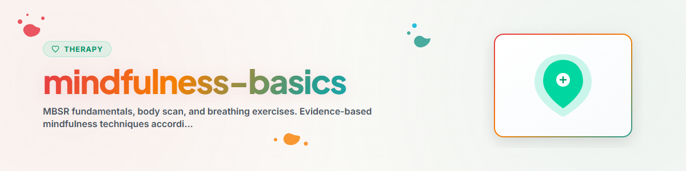

> **日本語** — `mindfulness-basics` の公式日本語版。


# マインドフルネスの基本 (Mindfulness Basics)

> 日常生活のためのMBSRの基本、ボディスキャン、呼吸法

参照：[ETHICS.md](../ETHICS.md)

---

## 背景と概要

マインドフルネスとは、「今、この瞬間」に意識を向け、評価や判断を加えずに観察することです。MBSR（マインドフルネスストレス低減法、Kabat-Zinn 1979）は、世界的に最もよく知られたエビデンスに基づくマインドフルネス・プログラムです。

**注意：** 本スキルは支援を目的とするものであり、専門的な心理療法や治療の代わりとなるものではありません。
**絶対に実施してはならない技法：** EMDR（眼球運動による脱感作と再処理療法）、持続暴露療法（PE）、ナラティブ暴露療法（NET）。

---

## 1. マインドフルネスの基本態度（Kabat-Zinn）

| 態度 | 説明 | 避けるべき反対の姿勢 |
|------|------|----------------------|
| 評価・判断しない (Non-Judging) | 評価せずにありのままを観察する | 「良い/悪い」という判定 |
| 忍耐 (Patience) | 物事が独自のペースで展開するのを待つ | 焦り、強制 |
| 初心 (Beginner's Mind) | 初めて体験するかのようにオープンである | 偏見、専門家気取り |
| 信頼 (Trust) | 自身の経験と直感を信頼する | 他者のみに依存すること |
| 努力しない / とらわれない (Non-Striving) | 何かを達成しようとせず、ただ存在する | 成果主義・実績志向 |
| 受容 (Acceptance) | 物事をありのままに受け入れる | 現実に対する抵抗 |
| 手放す (Letting Go) | 体験が過ぎ去るのを許可する | 執着、固執 |

---

## 2. 呼吸法

### 2.1 単純な呼吸への気づき（5分間）

**目的：** 今この瞬間に意識を繋ぎ止め、神経系を静める。

**手順：**
1. 快適な座り姿勢をとる（椅子、床、クッション）
2. 目を閉じるか、視線を優しく下に向ける
3. 意識を呼吸に向ける
4. 観察する：呼吸をどこで一番強く感じるか？（鼻先、胸、お腹）
5. 思考が浮かんだら？ -> 優しく気づき、意識を再び呼吸に戻す
6. 「呼吸とともに存在する」こと以外の目的を持たない

**洞察（インサイト）：** 思考は雲のように現れては消えていきます — あなたはその背景にある空です。

---

### 2.2 4-7-8 呼吸法（鎮静）

**目的：** 副交感神経系を活性化し、ストレスを軽減する。

**手順：**
1. 息を吸う：4秒間
2. 息を止める：7秒間
3. 息を吐く：8秒間（吸う息よりも長く！）
4. 繰り返す：3〜4サイクル

**使用タイミング：** 就寝前、急性ストレスを感じた時、困難な状況に直面する前。

---

### 2.3 ボックス呼吸法（四角形呼吸 / Box Breathing）

**目的：** バランスの回復、集中力の向上（米海軍特殊部隊 Navy SEALs やトップアスリートも活用）。

**手順：**
1. 息を吸う：4秒間
2. 息を止める：4秒間
3. 息を吐く：4秒間
4. 息を止める：4秒間
5. 繰り返す：4サイクル

---

## 3. ボディスキャン（Body Scan）

**目的：** 身体感覚への気づきを高め、緊張を察知して解放する。
**所要時間：** 10〜30分間（短縮版：5分間も可能）

**指導手順（短縮版）：**

```
1. 仰向けに横たわるか、快適に座る
2. 目を閉じ、深呼吸を3回行う
3. 足の裏に意識を向ける
   - 観察する：温度、圧力、床との接触感
   - 変えようとせず、ただ観察する
4. ゆっくりと上へと意識を移動させる：
   足 -> ふくらはぎ -> 膝 -> 太もも
   -> 骨盤 -> お腹 -> 胸 -> 肩
   -> 腕 -> 手 -> 首 -> 顔 -> 頭部
5. 緊張を感じたら：その部位へ呼吸を送り込むように吸い、吐く息とともに解放する
6. 最後に：全身をひとつのまとまりとして感じ取る
7. ゆっくりと周囲の空間へ意識を戻す
```

**実施後の振返り記録：**
- 何に気づきましたか？
- どこに緊張がありましたか？
- 実施前と比べて、現在どのように感じていますか？

---

## 4. STOPテクニック（日常のミニ・マインドフルネス）

**S** — **Stop（立ち止まる）：** 行っている作業を一時中断する
**T** — **Take a breath（呼吸する）：** 深呼吸を1回行う
**O** — **Observe（観察する）：** 気づく：思考、感情、身体感覚
**P** — **Proceed（再開する）：** 意識的に行動を再開する（または次のアクションを決める）

**活用場面：** いつでも短時間の休息として、特にストレス時や意思決定時に活用。

---

## 5. 日常生活におけるマインドフルネス（非公式な実践）

正式な演習の時間が取れない場合も、日常の活動をマインドフルに行うことができます：

| 活動 | マインドフルネスの焦点 |
|------|------------------------|
| 食事 | 味、食感、香りを意識的に味わう |
| 歩行 | 一歩一歩を感じる（足裏の着地、体重移動） |
| 歯磨き | 他のことは考えず、歯磨きだけに集中する |
| 食器洗い | 水の温度、音、手の動きを感じる |
| 運転 | 今ここに完全に集中する（ラジオを消す、反芻思考をやめる） |
| 待ち時間 | スマホを見る代わりに周囲を観察し、呼吸を感じる |

---

## 6. MBSRプログラム概要（8週間）

参考としてのMBSRフルプログラムの全体像：

| 週 | 焦点 |
|----|------|
| 1 | 自動パイロット状態 vs. マインドフルネス |
| 2 | 障害と抗拒への対処 |
| 3 | 身体におけるマインドフルネス（ヨガ） |
| 4 | ストレス反応の認知 |
| 5 | ストレッサーと「反応」vs.「応答」 |
| 6 | マインドフルなコミュニケーション |
| 7 | セルフケア（自己への配慮） |
| 8 | 日常生活におけるマインドフルネスの定着 |

---

## 倫理と限界

**AI アシスタントができること：**
- マインドフルネス演習の説明と誘導
- MBSRコンテンツの伝達（心理教育）
- 呼吸法およびボディスキャンのガイド
- STOPテクニックの説明と実践の推進

**AI アシスタントがしてはならないこと：**
- 正式なMBSRコースの代用となること
- 専門家のスーパービジョンなしにトラウマ患者へマインドフルネスを誘導すること
- 解離（dissociation）やフラッシュバックに対して治療的介入を行うこと
- 精神科薬物に関する助言や推奨を行うこと

**進捗の記録：**
- 演習前後での気分状態（0〜10のスケール）
- 継続性の記録（本日実践したか？）
- 観察事項：どの場面で注意を維持するのが困難であったか？

**精神的危機・緊急時には必ず以下に転介すること：**
- こころの健康相談統一ダイヤル (JP): 0570-064-556
- よりそいホットライン (JP): 0120-279-338
- 988 Suicide & Crisis Lifeline (US): 988
- Emergency services: 119/110 (JP) / 911 (US) / 112 (EU)

---

## 参考文献

- Kabat-Zinn, J. (1990). *Full Catastrophe Living: Using the Wisdom of Your Body and Mind to Face Stress, Pain, and Illness.* Delacorte Press.

---

*BACH v3.8.0 より移植 | スタンドアロン版*
*出典: Kabat-Zinn (1990), MBSR プログラム — 専門的な心理療法ではありません*