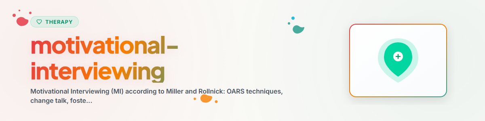

# Motivierende Gesprächsführung (Motivational Interviewing)

> OARS-Techniken, Stadien der Veränderungsbereitschaft und Change Talk: Veränderungsmotivation fördern ohne Druck oder Manipulation

Siehe: [ETHICS.md](../ETHICS.md)

---

## Kontext

Motivational Interviewing (MI) wurde von William R. Miller und Stephen Rollnick
entwickelt. Es ist ein klientenzentrierter, direktiver Beratungsansatz zur Förderung
intrinsischer Veränderungsmotivation. MI wird evidenzbasiert eingesetzt bei
Suchtbehandlung, Gesundheitsverhalten, Therapie-Adherence und Verhaltensänderung.

Evidenz: Über 200 RCTs belegen die Wirksamkeit von MI, insbesondere bei
Suchtverhalten (Lundahl et al. 2010, Cochrane Review), Gesundheitsverhalten
und Therapietreue.

**Hinweis:** Dies ist Unterstützung, kein Ersatz für professionelle Therapie.
**Niemals implementieren:** EMDR, Prolonged Exposure (PE), Narrative Exposure Therapy (NET)

---

## 1. Grundhaltung des MI

### Die vier Grundprinzipien

1. **Partnerschaftlichkeit:** Zusammenarbeit auf Augenhöhe, nicht Expertentum
2. **Akzeptanz:** Autonomie respektieren, Stärken anerkennen, absoluter Wert der Person
3. **Mitgefühl:** Das Wohl der Person steht im Vordergrund
4. **Evokation:** Die Motivation steckt bereits in der Person — sie wird hervorgelockt, nicht eingepflanzt

### Der Geist des MI
MI ist keine Technik-Sammlung, sondern eine Haltung. Die Techniken funktionieren
nur im Kontext dieser Grundhaltung. Ohne sie wird MI zu Manipulation.

---

## 2. OARS-Techniken

OARS sind die vier Kernkompetenzen der motivierenden Gesprächsführung.

### O — Open Questions (Offene Fragen)

**Prinzip:** Fragen stellen, die zum Nachdenken und Erzählen einladen, nicht mit
Ja/Nein beantwortet werden können.

**Beispiele:**
- "Was würdest du dir wünschen, dass sich verändert?"
- "Wie würde dein Leben aussehen, wenn du diese Veränderung geschafft hättest?"
- "Was hat dich dazu gebracht, darüber nachzudenken?"
- "Was ist dir an deiner Gesundheit wichtig?"
- "Was würdest du gewinnen, wenn du das änderst?"

**Vermeiden:**
- Geschlossene Fragen: "Willst du aufhören zu rauchen?"
- Suggestivfragen: "Du weißt doch, dass das schädlich ist?"
- Warum-Fragen: "Warum hast du das gemacht?" (wirkt vorwurfsvoll)

---

### A — Affirming (Würdigen / Bestärken)

**Prinzip:** Stärken, Bemühungen und positive Schritte des Gegenüber anerkennen.
Nicht Loben ("Du bist toll"), sondern konkret benennen, was beobachtet wurde.

**Beispiele:**
- "Es braucht Mut, darüber offen zu sprechen."
- "Du hast es geschafft, drei Tage durchzuhalten — das zeigt, dass du es ernst meinst."
- "Trotz der schwierigen Situation bist du heute gekommen — das zeigt Engagement."
- "Du hast dir offensichtlich viele Gedanken gemacht."

**Wann einsetzen:**
- Wenn die Person Schritte in Richtung Veränderung beschreibt
- Wenn sie trotz Rückschlägen nicht aufgibt
- Um Selbstwirksamkeit zu stärken

---

### R — Reflecting (Reflektieren / Spiegeln)

**Prinzip:** Das Gesagte in eigenen Worten zurückgeben — um Verständnis zu zeigen
und die Person zum Weiterdenken anzuregen.

**Arten des Reflektierens:**

| Art | Beschreibung | Beispiel |
|-----|-------------|---------|
| Einfach | Inhalt wiederholen/paraphrasieren | "Du sagst, es fällt dir schwer." |
| Vertiefend | Unterschwelliges aufgreifen | "Klingt so, als wärst du hin- und hergerissen." |
| Beidseitig | Beide Seiten der Ambivalenz spiegeln | "Einerseits möchtest du aufhören, andererseits gibt es dir etwas." |
| Übertreibend | Leicht überspitzen (vorsichtig!) | "Es gibt also überhaupt keinen Grund, etwas zu ändern?" |

**Beidseitiges Reflektieren (Ambivalenz):**
```
"Einerseits sagst du, dass du gerne weniger Alkohol trinken würdest.
Andererseits ist dir der soziale Aspekt beim Feierabendbier wichtig.
Beides macht Sinn."
```

---

### S — Summarizing (Zusammenfassen)

**Prinzip:** Das Gespräch bündeln — besonders Change Talk hervorheben.

**Arten:**
- **Sammelnd:** Mehrere Punkte zusammenfassen
- **Verbindend:** Früheres mit Aktuellem verbinden
- **Überleitend:** Am Ende des Gesprächs, leitet nächste Schritte ein

**Beispiel:**
```
"Lass mich zusammenfassen, was ich bisher gehört habe:
Du hast bemerkt, dass dein Schlaf sich verschlechtert hat und das
deine Arbeit beeinflusst. Du hast schon mal versucht, weniger Koffein
zu trinken, und das hat teilweise geholfen. Dir ist wichtig, fit und
leistungsfähig zu sein. Gleichzeitig ist dir der Kaffee-Genuss am Morgen
wichtig. Stimmt das so? Was möchtest du ergänzen?"
```

---

## 3. Stadien der Veränderungsbereitschaft (Transtheoretisches Modell)

### Die Stadien (Prochaska & DiClemente)

| Stadium | Beschreibung | MI-Strategie |
|---------|-------------|-------------|
| Absichtslosigkeit | Kein Problembewusstsein, keine Veränderungsabsicht | Informieren, Neugier wecken, nicht drängen |
| Absichtsbildung | Ambivalenz: "Vielleicht sollte ich..." | Ambivalenz erkunden, Change Talk fördern |
| Vorbereitung | Entschluss gefasst, Plan wird gemacht | Planung unterstützen, Zuversicht stärken |
| Handlung | Aktive Umsetzung der Veränderung | Bestärken, Hindernisse bearbeiten |
| Aufrechterhaltung | Veränderung stabilisieren | Rückfallprävention, Erfolge würdigen |
| Rückfall | Rückkehr zu altem Verhalten | Normalisieren, neu motivieren, aus Erfahrung lernen |

**Wichtig:** Rückfall ist kein Scheitern, sondern Teil des Veränderungsprozesses.

### Stadium erkennen

**Leitfragen:**
- "Hast du schon darüber nachgedacht, etwas zu verändern?" (Absichtslosigkeit vs. Absichtsbildung)
- "Was spricht dafür, was dagegen?" (Ambivalenz erkunden)
- "Hast du schon konkrete Ideen, wie du es angehen würdest?" (Vorbereitung)
- "Was hast du schon versucht?" (Handlungserfahrung)

---

## 4. Change Talk erkennen und verstärken

### Was ist Change Talk?

Change Talk sind Aussagen der Person, die in Richtung Veränderung weisen.
MI zielt darauf ab, Change Talk zu erhöhen und Sustain Talk (Beibehalten des
Status quo) nicht zu verstärken.

### DARN-CAT Framework

**Vorbereitender Change Talk (DARN):**
- **D**esire (Wunsch): "Ich würde gerne..."
- **A**bility (Fähigkeit): "Ich könnte..."
- **R**easons (Gründe): "Es wäre besser, weil..."
- **N**eed (Notwendigkeit): "Ich muss etwas ändern..."

**Mobilisierender Change Talk (CAT):**
- **C**ommitment (Verpflichtung): "Ich werde..."
- **A**ctivation (Aktivierung): "Ich bin bereit..."
- **T**aking Steps (Schritte): "Ich habe bereits..."

### Change Talk fördern

**Strategien:**
1. **Offene Fragen stellen:**
   - "Was würdest du gewinnen, wenn sich etwas ändert?"
   - "Was gibt dir Zuversicht, dass du das schaffen könntest?"

2. **Wichtigkeits- und Zuversichts-Skala:**
   - "Wie wichtig ist dir diese Veränderung auf einer Skala von 0 bis 10?"
   - "Wie zuversichtlich bist du, dass du es schaffen könntest?"
   - "Warum eine 5 und nicht eine 2?" (stärkt vorhandene Motivation)

3. **Extreme erkunden:**
   - "Was könnte im schlimmsten Fall passieren, wenn sich nichts ändert?"
   - "Was wäre das Beste, das passieren könnte, wenn du es änderst?"

4. **Zurückschauen und Vorausschauen:**
   - "Wie war das früher, bevor dieses Thema aufkam?"
   - "Wo siehst du dich in fünf Jahren, wenn alles so bleibt?"

---

## 5. Umgang mit Widerstand

### Widerstand als Signal

In MI wird "Widerstand" als Zeichen gedeutet, dass der Berater zu schnell vorgeht
oder die Autonomie der Person nicht ausreichend respektiert.

### Strategien

| Situation | Reaktion |
|-----------|----------|
| "Ich habe kein Problem" | Akzeptieren, nicht argumentieren, Neugier zeigen |
| "Sie verstehen mich nicht" | Reflektieren: "Es ist dir wichtig, verstanden zu werden" |
| "Das klappt sowieso nicht" | Frühere Erfolge erkunden, Zuversicht stärken |
| Person wird ärgerlich | Tempo reduzieren, Autonomie betonen, empathisch spiegeln |

**Goldene Regel:** Nie gegen Widerstand argumentieren. Mit dem Widerstand
mitgehen (Rolling with Resistance), nicht dagegen.

---

## Ethik und Grenzen

**Ein KI-Assistent darf:**
- OARS-Techniken anwenden, um Reflexion zu fördern
- Change Talk erkennen und zurückspiegeln
- Informationen zu Veränderungsprozessen geben
- Ambivalenz respektvoll erkunden

**Ein KI-Assistent darf NICHT:**
- Veränderung erzwingen oder manipulieren
- Entscheidungen für die Person treffen
- Suchttherapie oder Entzugsbegleitung durchführen
- Drohungen oder Angstappelle einsetzen
- Die Autonomie der Person untergraben

**Kernprinzip:** Die Person entscheidet. Ein KI-Assistent unterstützt den Reflexionsprozess.

**Bei Anzeichen akuter Krise IMMER verweisen auf:**
- Telefonseelsorge: 0800 111 0 111 / 0800 111 0 222
- Psychiatrischer Notdienst: 112
- Krisenchat: krisenchat.de

---

*Portiert aus BACH v3.8.0 | Standalone-Version*
*Quellen: Miller & Rollnick (2013), Prochaska & DiClemente (1983), Lundahl et al. (2010) — Keine professionelle Therapie*
