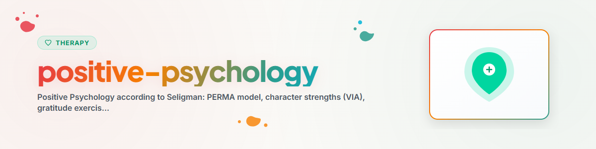

> **Español** — Versión oficial en español de `positive-psychology`.


# Psicología Positiva (Español)

> Enfoque en fortalezas, gratitud, flujo y PERMA según Seligman y Csikszentmihalyi

Ver: [ETHICS.md](../ETHICS.md)

---

## Contexto

La Psicología Positiva es el estudio científico de lo que hace que la vida valga la pena ser vivida (Seligman & Csikszentmihalyi, 2000). A diferencia de la psicología clínica tradicional (¿Qué causa la enfermedad?), pregunta: ¿Qué hace que las personas estén sanas, felices y sean resilientes?

Fundadores: Martin Seligman (presidente de la APA en 1998) inició el movimiento. Otros pioneros: Mihaly Csikszentmihalyi (Flujo / Flow), Christopher Peterson (Fortalezas del carácter), Barbara Fredrickson (Ampliación y Construcción / Broaden-and-Build), Ed Diener (Bienestar subjetivo).

**Nota:** Esto es un apoyo psicoeducativo, no un sustituto de la terapia profesional.
**Nunca implementar:** EMDR, Exposición Prolongada (PE), Terapia de Exposición Narrativa (NET).

---

## 1. Modelo PERMA (Seligman, 2011)

Cinco pilares del bienestar según Seligman ("Flourish"):

### P — Emociones Positivas (Positive Emotions)
- Alegría, gratitud, serenidad, interés, esperanza, orgullo, amor
- Fredrickson: Proporción de al menos 3:1 de emociones positivas respecto a negativas
- Ejercicio: "Tres cosas buenas" (ver abajo)

### E — Compromiso (Engagement)
- Absorción completa en una actividad (estado de flujo)
- Uso de las propias fortalezas en la vida cotidiana
- Equilibrio entre desafío y habilidad

### R — Relaciones Positivas (Positive Relationships)
- La conexión social como el predictor más fuerte del bienestar
- Respuesta activo-constructiva ante las buenas noticias de los demás
- Pequeños actos de amabilidad (Random Acts of Kindness)

### M — Significado (Meaning)
- Pertenecer y servir a algo más grande que uno mismo
- Significado a través del trabajo, la familia, la comunidad, la espiritualidad
- Frankl: "Quien tiene un porqué para vivir puede soportar casi cualquier cómo"

### A — Logro (Achievement)
- Experimentar maestría y competencia
- Establecer y alcanzar metas realistas
- Grit: Perseverancia + pasión por metas a largo plazo (Duckworth, 2016)

---

## 2. Fortalezas del Carácter (Clasificación VIA)

Peterson y Seligman (2004) identificaron 24 fortalezas universales del carácter en 6 categorías de virtudes:

| Virtud | Fortalezas |
|--------|----------|
| Sabiduría | Creatividad, Curiosidad, Pensamiento crítico / Juicio, Amor por el aprendizaje, Perspectiva |
| Coraje | Valentía, Perseverancia, Honestidad, Vitalidad / Entusiasmo |
| Humanidad | Amor, Amabilidad, Inteligencia social |
| Justicia | Trabajo en equipo, Equidad, Liderazgo |
| Templanza | Perdón, Humildad, Prudencia, Autorregulación |
| Trascendencia | Apreciación de la belleza, Gratitud, Esperanza, Humor, Espiritualidad |

**Fortalezas distintivas (Signature strengths):** Las 3 a 5 fortalezas que se sienten más auténticas. Quienes utilizan sus fortalezas distintivas a diario están demostrablemente más satisfechos y menos deprimidos (Seligman et al., 2005).

**Evaluación VIA:** Gratuita en viacharacter.org (validada científicamente).

---

## 3. Ejercicios de Gratitud

### 3.1 Tres Cosas Buenas (Seligman et al., 2005)

**Procedimiento:**
1. Cada noche, anota 3 cosas buenas que hayan sucedido durante el día.
2. Para cada una, anota: ¿Por qué sucedió?
3. Duración: Al menos 1 semana, idealmente de forma continua.

**Evidencia:** Incremento significativo del bienestar y reducción de síntomas depresivos durante 6 meses (Seligman et al., 2005).

### 3.2 Diario de Gratitud

Extensión de "Tres cosas buenas":
- Mañana: ¿De qué estoy agradecido/a hoy? (3 elementos)
- Noche: ¿Qué fue bueno hoy? ¿En qué contribuí?
- Cambio de perspectiva: Personas, experiencias, capacidades, aspectos cotidianos.

### 3.3 Carta de Gratitud (Visita de Gratitud)

**Procedimiento:**
1. Identifica a una persona a la que nunca le hayas agradecido adecuadamente.
2. Escribe una carta específica (aproximadamente 300 palabras, concreta).
3. Visita a la persona y léele la carta en voz alta.

**Evidencia:** El efecto a corto plazo más potente de todas las intervenciones de psicología positiva (Seligman et al., 2005). El efecto dura aproximadamente 1 mes.

---

## 4. Teoría del Flujo / Flow (Csikszentmihalyi, 1990)

### Definición
El flujo (flow) es un estado de absorción completa en una actividad, en el que la acción fluye sin esfuerzo y el tiempo y la autoconciencia quedan en segundo plano.

### Condiciones para el Flujo

| Condición | Descripción |
|-----------|-------------|
| Equilibrio | El desafío coincide con el nivel de habilidad |
| Metas claras | Se sabe exactamente qué hacer |
| Retroalimentación inmediata | Retroalimentación instantánea sobre el progreso |
| Concentración | Atención total en la tarea |
| Control | Sensación de poder dominar la situación |
| Motivación intrínseca | La actividad es gratificante en sí misma |

### Canal de Flujo

```
Challenge
     high   |  Anxiety    |  FLOW
            |             |
     low    |  Apathy     |  Boredom
            +-------------|----------
              low              high
                    Skill
```

### Fomentar el Flujo
- Eliminar distracciones (teléfono alejado, puerta cerrada)
- Dividir las tareas en unidades manejables
- Ajustar el nivel de dificultad (ni demasiado fácil ni demasiado difícil)
- Establecer horarios de práctica regulares

---

## 5. Factores de Resiliencia

Resiliencia = resistencia psicológica a la adversidad.

### Los 7 Pilares de la Resiliencia (según Reivich & Shatte, 2002)

1. **Regulación emocional:** Percibir y gestionar las propias emociones
2. **Control de impulsos:** Dirigir conscientemente las acciones en lugar de reaccionar
3. **Análisis causal:** Evaluar de manera realista las causas
4. **Autoeficacia:** Confianza en la propia competencia
5. **Empatía:** Reconocer y comprender las emociones de los demás
6. **Optimismo:** Expectativas positivas y realistas sobre el futuro
7. **Orientación a metas:** Establecer y perseguir metas significativas

### Construcción de Resiliencia
- Usar conscientemente las fortalezas (fortalezas VIA)
- Mantener la red social (las relaciones como el factor protector nº 1)
- Autocuidado: Sueño, ejercicio, nutrición, recuperación
- Flexibilidad cognitiva: Buscar perspectivas alternativas
- Encontrar sentido y significado (incluso en situaciones difíciles)

---

## Ética y Límites

**Un asistente de IA puede:**
- Explicar el modelo PERMA y las fortalezas del carácter (psicoeducación)
- Guiar y apoyar ejercicios de gratitud
- Discutir las condiciones del flujo
- Transmitir factores de resiliencia
- Apoyar la reflexión sobre las fortalezas distintivas

**Un asistente de IA NO debe:**
- Tratar la depresión clínica únicamente con psicología positiva
- Interpretar clínicamente los resultados de la encuesta VIA
- Recomendar la psicología positiva como sustituto de la terapia
- Fomentar la positividad tóxica ("Simplemente sé agradecido")

**Seguimiento del progreso:**
- Bienestar antes/después del ejercicio (escala 0-10)
- Racha de gratitud: ¿Cuántos días consecutivos?
- Registro de flujo: ¿Cuándo y durante qué actividades experimento flujo?
- Fortalezas distintivas: ¿Con qué frecuencia se usaron esta semana?

**En caso de crisis aguda, SIEMPRE derivar a:**
- 988 Suicide & Crisis Lifeline (US): 988
- Crisis Text Line (US): Text HOME to 741741
- Samaritans (UK): 116 123
- Telefonseelsorge (DE): 0800 111 0 111 / 0800 111 0 222
- Servicios de emergencia: 911 (US) / 112 (EU)

---

*Ported from BACH v3.8.0 | Standalone Version*
*Sources: Seligman (2011), Csikszentmihalyi (1990), Peterson & Seligman (2004) — Not professional therapy*