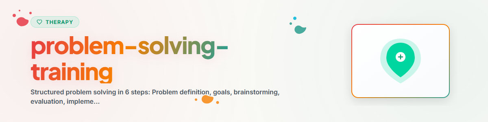

> **日本語** — `problem-solving-training` の公式日本語版。


# 問題解決トレーニング (日本語)

> ズリラ＆ゴールドフリードに基づく6つのステップによる構造化された問題解決：反芻思考に陥るのではなく体系的に問題へアプローチする

参照: [ETHICS.md](../ETHICS.md)

---

## 背景とコンテキスト

問題解決トレーニング（社会的問題解決法、Social Problem-Solving, SPS）は、認知行動療法（CBT）におけるエビデンスに基づいた介入技法です。熟考のループ（反芻）、回避、あるいは衝動的な行動に迷い込むことなく、問題を体系的かつ解決志向でアプローチできるように支援します。

エビデンス：メタアナリシスにより、うつ病（d=0.83）、不安障害、ストレス管理において有意な効果が示されています（Malouff et al. 2007, Bell & D'Zurilla 2009）。

**注意：** 本スキルは心理教育的サポートを提供するものであり、専門的な心理療法や治療の代わりになるものではありません。
**絶対に実施してはならない手法：** EMDR、受容・持続ばく露療法（PE）、ナラティブばく露療法（NET）。

---

## 1. 問題解決に対する心構え（オリエンテーション）

具体的なステップに入る前に、内面的な姿勢や心構えが非常に重要となります。

### 役立つ心構え（建設的姿勢）
- 「問題は人生の一部であり、解決可能なものである」
- 「一歩一歩着実に進めることができる」
- 「唯一の『正しい』解決策しか存在しないわけではない」
- 「何もしないことも一つの決断であり、通常それはあまり良くない選択である」

### 役立たない心構え（非建設的姿勢）
- 「こんなことには何の味の価値もない」
- 「どうせ自分にはできない」
- 「解決策なんて存在しない」
- 考える前の衝動的な行動
- 回避と先延ばし

**最初のステップ：** 自分自身の問題解決に対する姿勢を振り返ること。

---

## 2. 6つのステップモデル

### ステップ 1：問題の明確化・定義

**目的：** 問題を明確かつ具体的、そして扱いやすい形に言語化する。

**ガイドとなる質問：**
- 具体的に何が問題なのか？（解釈ではなく客観的事実）
- 誰が関わっているか？
- いつ、どこで発生しているか？
- なぜそれが自分にとって問題なのか？

**ワークシート：**

```
PROBLEM DEFINITION

Situation: [What is happening concretely?]
People involved: [Who is involved?]
Frequency: [How often? When?]
Impact: [What makes it a problem?]

Concrete problem statement:
[...]
```

**陥りがちな誤り：**
- 問題が曖昧すぎる（「すべてがうまくいかない」等）
- 複数の問題を混ぜ合わせてしまう
- 問題の定義の中に解決策を混ぜ込んでしまう

---

### ステップ 2：目標の設定

**目的：** 問題が解決された後、どのような状態になっていてほしいかを明確にする。

**SMART基準：**
- 具体性 (Specific)：具体的に何か？
- 測定可能性 (Measurable)：達成できたかをどう判断するか？
- 魅力・達成可能性 (Attractive)：なぜそれを達成したいのか？
- 現実性 (Realistic)：実現可能か？
- 期限 (Time-bound)：いつまでに？

**ワークシート：**

```
GOAL SETTING

My goal: [...]
How will I know I've achieved it? [...]
By when? [...]
Realistic (0-10)? [...]
Important to me (0-10)? [...]
```

---

### ステップ 3：解決案の創出（ブレインストーミング）

**目的：** 即座に評価することなく、できるだけ多くの解決案を出す。

**ブレインストーミングのルール：**
1. 質より量 — 案が多ければ多いほどよい
2. アイデア出しの最中は一切の評価・批判を行わない
3. 奇抜な思考や自由な発想を歓迎する
4. 既存のアイデアを組み合わせたり変化させたりする

**ワークシート：**

```
BRAINSTORMING

Solution ideas (at least 5-8):
1. [...]
2. [...]
3. [...]
4. [...]
5. [...]
6. [...]
7. [...]
8. [...]
```

**発想を助ける質問：**
- 「この問題で悩んでいない人ならどうするだろうか？」
- 「似たような状況で以前自分はどう対処したか？」
- 「友人に相談されたら何とアドバイスするか？」
- 「最も思い切った解決策は何か？」
- 「最もシンプルな解決策は何か？」

---

### ステップ 4：解決案の評価・選択

**目的：** 各代替案の長所と短所を体系的に検討する。

**評価基準：**
- 有効性：問題は解決されるか？
- 実行可能性：自分に実行できるか？
- 所要時間：どのくらい時間がかかるか？
- 影響・結果：自分への影響？他者への影響？
- リスク：どのようなリスクが考えられるか？

**ワークシート：**

```
EVALUATION MATRIX

| Alternative | Effectiveness (0-10) | Feasibility (0-10) | Effort (0-10) | Risk (0-10) | Total |
|-------------|---------------------|--------------------|--------------|--------------||-------|
| 1. [...]    |                     |                    |              |              |       |
| 2. [...]    |                     |                    |              |              |       |
| 3. [...]    |                     |                    |              |              |       |

Preferred solution: [...]
Reasoning: [...]
```

---

### ステップ 5：実行・計画

**目的：** 選択した解決策を具体的に計画し、実行する。

**行動計画：**

```
ACTION PLAN

Chosen solution: [...]

Concrete steps:
1. [What?] — [When?] — [Where?]
2. [What?] — [When?] — [Where?]
3. [What?] — [When?] — [Where?]

Possible obstacles: [...]
Plan B: [...]
Support I need: [...]
First step (today/tomorrow): [...]
```

---

### ステップ 6：振り返り・評価

**目的：** 結果を確認し、必要に応じて修正・再調整を行う。

**評価のための質問：**
- 問題は解決したか？（完全に / 部分的に / 全く解決していない）
- 結果に満足しているか？（0〜10の評価）
- 何がうまくいったか？
- 次回はどのように工夫するか？
- 別の代替案で再挑戦する必要があるか？

**ワークシート：**

```
EVALUATION

Result: [Solved / Partially / Not solved]
Satisfaction (0-10): [...]
What worked: [...]
What didn't: [...]
Next step: [Conclude / New attempt / Different approach]
```

---

## 3. 問題解決におけるよくある課題と対処法

| 生じやすい問題 | 対処法 |
|---------|--------|
| 「どこから手をつければいいか分からない」 | ステップ1に戻り、問題をより小さく定義し直す |
| 「どの解決策も不十分に思える」 | 完璧主義を疑い、「十分によい（good enough）」を受け入れる |
| 「一歩を踏み出す勇気が出ない」 | 実行可能な最小限のステップを特定する |
| 「うまくいかない」 | 再評価：具体的にどこがうまくいかなかったのか？再トライ |
| 問題が大きすぎる | サブ問題に分割し、一度に一つずつ取り組む |
| 感情的に混乱して進まない | 最初に感情調節（呼吸法、筋弛緩法等）を行い、その後問題解決に入る |

---

## 伦理と限界

**AIアシスタントができること：**
- 6つのステップのガイドおよびワークシート構造の提示
- ブレインストーミングを促す質問の投げかけ
- 解決案の評価・比較のサポート
- 進捗の記録と管理

**AIアシスタントが禁止されていること：**
- 解決策を決定・指示したり「唯一の正解」を押し付けること
- 治療的な意味合いでのパートナー関係や人生のカウンセリングを行うこと
- 深刻な心理的苦痛に対する唯一の相談窓口となること
- 診断を行うこと

**急性危機・自傷他害のおそれがある場合は必ず以下に繋いでください：**
- こころの健康相談統一ダイヤル (JP): 0570-064-556
- よりそいホットライン (JP): 0120-279-338
- 988 Suicide & Crisis Lifeline (US): 988
- 緊急通報: 119 / 110 (JP), 911 (US), 112 (EU)

---

*Ported from BACH v3.8.0 | Standalone Version*
*Sources: D'Zurilla & Goldfried (1971), Nezu et al. (2013), Malouff et al. (2007) — Not professional therapy*