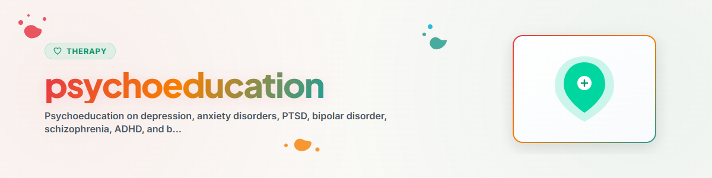

> **日本語** — `psychoeducation` の公式日本語版。

# 心理教育 (日本語)

> 精神疾患、症状、および治療アプローチに関する専門知識の共有

参照: [ETHICS.md](../ETHICS.md)

---

## 背景とコンテキスト

心理教育（Psychoeducation）とは、精神疾患についての科学的知識を、当事者やそのご家族に対して体系的に共有・伝えるアプローチです。疾患についての理解を深め、セルフマネジメント力を強化し、社会的なスティグマ（偏見や差別）を軽減することを目的としています。

エビデンス：心理教育は、すべての主要な診療ガイドライン（DGPPN、NICE、APA）で標準治療の構成要素として推奨されており、再発率を統計的に有意に低下させることが示されています（Xia et al. 2011, Cochrane Review）。

**注意：** 本スキルは心理教育的サポートを提供するものであり、専門的な心理療法や医学的診断の代わりになるものではありません。
**絶対に実施してはならない手法：** EMDR、受容・持続ばく露療法（PE）、ナラティブばく露療法（NET）。

---

## 1. 心理教育とは何か？

### 定義
精神疾患に関する専門的知識を構造化して伝え、当事者やご家族が「自分自身の状態に関するエキスパート（専門家）」となれるよう支援すること。

### 主な目的
- 疾患の理解：「自分に何が起きているのか？なぜなのか？」を把握する
- 早期警戒サイン（前兆症状）の認識
- 選択可能な治療法や支援策の把握
- 自己効力感の向上
- セルフ・スティグマおよび社会的スティグマの軽減
- 治療への服薬・行動の継続（アドヒアランス）の向上

### 科学的エビデンス
- 統合失調症の再発予防：NNT = 9（Xia et al. 2011）
- うつ病：治療アドヒアランスの30〜50%向上（Donker et al. 2009）
- 不安障害：心理教育単独でも軽度〜中程度の効果を実証（Donker et al. 2009）

---

## 2. 精神疾患の概要

### 2.1 うつ病（大うつ病性障害）

**どのような状態か？** 通常の悲しみを超え、少なくとも2週間以上にわたって持続的な気分低下、興味の喪失、意欲の減退が続く状態。

**中核症状 (ICD-11)：**
- 抑うつ気分（一日の大半、ほぼ毎日）
- 興味の喪失 / 喜びを感じられない状態（アンヘドニア）
- 意欲の低下 / 易疲労性（疲れやすさ）

**その他の伴随症状：** 集中力の低下、過剰な罪悪感、睡眠障害、食欲の変動、自殺念慮、精神運動制止・焦燥。

**一般的な治療法：** 認知行動療法（CBT）、薬物療法（SSRI、SNRI等）、運動療法、高照度光療法（季節性の場合）。
**セルフヘルプ：** 日常の生活リズムの構造化、活動記録・計画、対人交流の維持、運動、睡眠衛生。

### 2.2 不安障害（不安症）

**どのような状態か？** 日常生活に重大な支障をきたす、過剰でコントロール不可能な不安や恐怖。

**主なタイプ：**
- 全般不安症 (GAD)：慢性的な全般性の取り越し苦労
- パニック症 (Panic Disorder)：身体症状を伴う突発的なパニック発作
- 社交不安症 (Social Anxiety Disorder)：社交場面での否定的な評価に対する恐怖
- 限局性恐怖症 (Specific Phobias)：特定対象や状況に対する強烈な恐怖
- 広場恐怖症 (Agoraphobia)：逃げ出すことが困難な場所や状況に対する恐怖

**一般的な治療法：** CBT（ばく露療法、認知の再構成）、SSRI、リラクゼーション技法。
**セルフヘルプ：** 不安日記、腹式呼吸法、段階的な挑戦・対峙。

### 2.3 創傷後ストレス障害（PTSD）

**どのような状態か？** 生命の危険、暴力、事故、災害などのトラウマ体験の後に生じる持続的な反応。再体験、回避、過覚醒が特徴です。

**中核症状：**
- 侵入症状（フラッシュバック、悪夢）
- 回避行動（トラウマに関連する刺激や場面の回避）
- 感情の麻痺または過覚醒（過度な驚愕反応、イライラ）
- 認知や気分の持続的な否定的な変化

**一般的な治療法：** トラウマ焦点セットのCBT、EMDR、ナラティブばく露療法。
**セルフヘルプ：** 安定化技法、グラウンディング（地に足をつける）、安全な場所の想起 — 自我流のばく露は禁止。

### 2.4 双極性障害

**どのような状態か？** うつ病エピソードと（軽）躁病エピソードが交互に現れる状態。再発リスクの高い慢性的な経過を辿ります。

**躁病エピソードの特徴：** 感情の高揚・易怒性、睡眠欲求の減少、誇大思考、活動の著しい増加、リスク行動、談話迫迫。

**一般的な治療法：** 気分安定薬（リチウム、バルプロ酸等）、非定型抗精神病薬。
**セルフヘルプ：** 気分記録（ムードチャート）、規則正しい睡眠リズム、早期警戒サインの把握。

### 2.5 統合失調症

**どのような状態か？** 思考、知覚、体験の著しい歪みを伴う重篤な精神障害。人口の約1%に影響を及ぼします。

**陽性症状：** 幻覚、妄想、思考の混乱。
**陰性症状：** 意欲の欠如、社会的引きこもり、感情の平板化。
**認知機能障害：** 集中力、作業記憶、実行機能の低下。

**一般的な治療法：** 抗精神病薬、精神症状に対するCBT、精神科リハビリテーション、家族への介入。
**セルフヘルプ：** 確実な服薬の継続、過剰なストレスの回避、再発の兆候の把握、日常の生活構造の維持。

### 2.6 注意欠如・多動症（ADHD）

**どのような状態か？** 不注意、衝動性、および/または多動性を特徴とする神経発達症。小児期に始まり、約50%のケースで成人期まで持続します。

**一般的な治療法：** 多角的なアプローチ（薬物療法、心理教育、コーチング、CBT）。
**セルフヘルプ：** 外部の構造的ツール（タイマー、チェックリスト、定常ルーチン）、適度な運動。

### 2.7 境界性パーソナリティ障害（BPD）

**どのような状態か？** 対人関係、自己像、感情の著しい不安定さと、強い衝動性を特徴とするパターン。感情的な脆弱性が非常に高い状態です。

**中核症状：** 不安定な対人関係、アイデンティティの混乱、衝動的行動、感情の激しい動揺、自傷行為、慢性的な空虚感、解離症状。

**一般的な治療法：** 弁証法的行動療法（DBT）、スキーマ療法、メンタライゼーションに基づく治療（MBT）、移情焦点化心理療法（TFP）。
**セルフヘルプ：** スキルキット、緊急時プラン、苦痛耐性スキル。

---

## 3. スティグマの軽減

### よくある誤解と事実

| 誤解 | 事実 |
|------|------|
| 「精神疾患の人は危険だ」 | 当事者は加害者になるよりも被害者になる確率の方が実証的に高い |
| 「うつ病は気の持ちよう・甘えだ」 | うつ病は神経生物学的および心理学的な実体のある疾患である |
| 「心理療法は単なる雑談だ」 | エビデンスに基づく心理療法は脳構造や機能を変化させることが実証されている |
| 「放置しておけば自然に治る」 | 多くの精神疾患は適切な治療を受けないと慢性化する |
| 「精神科の薬は癖になって中毒になる」 | 抗抑うつ薬には身体的依存性や依存中毒性はない |

### 言語表現とスティグマ
- 「統合失調症患者」ではなく「統合失调症のある人」
- 「うつ病患者」ではなく「うつ病を経験している人」
- 人間優先の言語表現（Person-first language）は、スティグマを明確に低下させることが証明されています（Granello & Gibbs, 2016）。

---

## 4. ご家族の視点

- 精神疾患は、当事者だけでなく周囲の家族や社会環境全体に影響を及ぼします。
- ご家族自身も、独自の心理教育や情緒的なサポート・負担軽減を必要としています。
- 感情表出（Expressed Emotion, EE）：家族内の過剰な批判や過干渉（高EE）は、再発リスクを高めることが知られています。
- 推奨事項：家族会、多家族心理教育グループへの参加。

---

## 倫理と限界

**AIアシスタントができること：**
- 精神疾患に関する客観的事実や知識の提供
- 一般的な疑問や心配事への回答
- 専門機関や信頼できる情報源への案内

**AIアシスタントが禁止されていること：**
- 診断を行ったり、診断を確定させたりすること
- 個別の医療・治療上の指示を与えること
- 専門家によるグループ・個別の心理教育を代替すること

**急性危機・自傷他害のおそれがある場合は必ず以下に繋いでください：**
- こころの健康相談統一ダイヤル (JP): 0570-064-556
- よりそいホットライン (JP): 0120-279-338
- 988 Suicide & Crisis Lifeline (US): 988
- 緊急通報: 119 / 110 (JP), 911 (US), 112 (EU)

---

*Ported from BACH v3.8.0 | Standalone Version*
*Sources: ICD-11, DGPPN Guidelines, Xia et al. (2011), Donker et al. (2009), Cochrane Reviews — Not professional therapy*