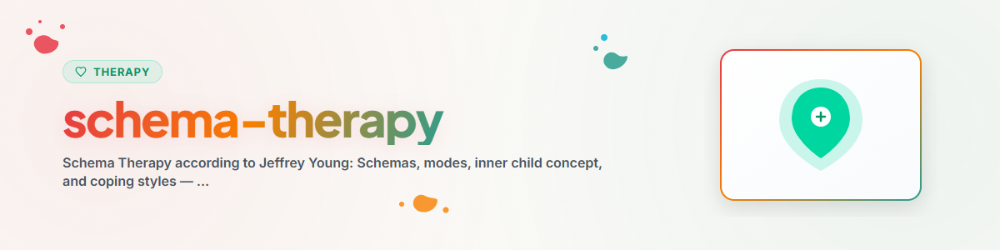

> **Español** — Versión oficial en español de `schema-therapy`.


# Terapia de Esquemas (Español)

> Fundamentos de la Terapia de Esquemas según Jeffrey Young: Esquemas, modos, concepto del niño interior y estilos de afrontamiento — Presentación psicoeducativa

Ver: [ETHICS.md](../ETHICS.md)

---

## Contexto

La Terapia de Esquemas fue desarrollada por Jeffrey E. Young a partir de la década de 1990 como una ampliación e integración de la terapia cognitivo-conductual. Integra elementos de la TCC, la teoría del apego, la terapia Gestalt y los enfoques psicodinámicos.

Evidencia: La Terapia de Esquemas cuenta con un sólido respaldo empírico, particularmente para trastornos de la personalidad (Giesen-Bloo et al., 2006; Masley et al., 2012). En Alemania y otros países está reconocida como un método avanzado dentro de la terapia de conducta.

**Nota:** Esto es psicoeducación, no un sustituto de la terapia profesional.
**Nunca implementar:** EMDR, Exposición Prolongada (PE), Terapia de Exposición Narrativa (NET).

---

## 1. Esquemas Desadaptativos Tempranos

### Principio
Los esquemas son patrones emocionales y cognitivos profundamente arraigados que se desarrollan en la infancia a través de necesidades emocionales básicas no satisfechas. Influyen en cómo percibimos el mundo, a nosotros mismos y a los demás.

### Las Cinco Necesidades Emocionales Básicas (según Young)

| Necesidad Básica | Cuando no se satisface, puede conducir a |
|-----------|------------------------|
| Apego seguro | Abandono, desconfianza |
| Autonomía y competencia | Dependencia, miedo al fracaso |
| Límites realistas | Grandiosidad / derecho, insuficiente autocontrol |
| Libertad para expresar necesidades | Subyugación, autosacrificio |
| Espontaneidad y juego | Normas inalcanzables, punitividad |

### Los 18 Esquemas — Visión General (5 Dominios)

**Dominio 1: Desconexión y Rechazo**
- Abandono / Inestabilidad
- Desconfianza / Abuso
- Deprivación emocional
- Imperfección / Vergüenza
- Aislamiento social / Alienación

**Dominio 2: Autonomía y Desempeño Deteriorados**
- Dependencia / Incompetencia
- Vulnerabilidad al daño o a la enfermedad
- Entrelazamiento / Yo subdesarrollado
- Fracaso

**Dominio 3: Límites Deteriorados**
- Grandiosidad / Derecho
- Insuficiente Autocontrol / Autodisciplina

**Dominio 4: Orientación hacia los Demás**
- Subyugación
- Autosacrificio
- Búsqueda de aprobación / Reconocimiento

**Dominio 5: Hipervigilancia e Inhibición**
- Negatividad / Pesimismo
- Inhibición emocional
- Normas inalcanzables / Hipercrítica
- Punitividad

### Preguntas de Reflexión para Reconocer Esquemas
- "¿Qué creencias sobre ti mismo/a reaparecen una y otra vez?"
- "¿En qué situaciones reaccionas de manera especialmente intensa a nivel emocional?"
- "¿Notas patrones que se repiten en tus diferentes relaciones?"
- "¿Qué necesidades emocionales pudieron haber quedado insatisfechas en tu infancia?"

---

## 2. El Modelo de Modos (Modos de Esquema)

### Principio
Los modos son estados emocionales momentáneos activados por los esquemas. El modelo de modos ayuda a comprender y categorizar las diferentes "partes internas".

### Las Cuatro Categorías de Modos

**Modos Niño:**
- *Niño Vulnerable:* Se siente triste, solo, ansioso, abrumado
- *Niño Airado:* Inquieto o con rabia ante necesidades insatisfechas
- *Niño Impulsivo:* Actúa sin pensar, busca gratificación inmediata
- *Niño Feliz:* Se siente seguro, amado, espontáneo

**Modos Padre/Madre Disfuncional:**
- *Padre Punitivo:* Voz interna que critica, castiga y desvaloriza
- *Padre Exigente:* Voz interna que exige perfección y rendimiento constante

**Modos de Afrontamiento Disfuncional:**
- *Rendición / Sumiso:* Se rinde al esquema, se adapta excesivamente
- *Protector Desconectado:* Adormece sentimientos, se retrae, busca distracciones
- *Sobrecompensador:* Domina, controla, ataca o actúa con grandiosidad

**Adulto Sano:**
- Puede percibir las necesidades y satisfacerlas adecuadamente
- Establece límites saludables
- Consuela y calma al niño vulnerable
- Pone límites a los modos padre/madre exigentes o punitivos

### Ejercicio: Reconocer Modos en la Vida Cotidiana

```
Situation: ______________
Which mode am I feeling right now?
  [ ] Vulnerable Child — "I feel small and helpless"
  [ ] Angry Child — "That's unfair!"
  [ ] Punitive Parent — "You're not good enough"
  [ ] Demanding Parent — "You must do more"
  [ ] Detached Protector — "I don't want to think about it"
  [ ] Overcompensator — "I'll show them"
  [ ] Healthy Adult — "What do I really need right now?"
```

---

## 3. Trabajo con el Niño Interior (Psicoeducativo)

### Principio
El trabajo con el niño interior en Terapia de Esquemas busca desarrollar una actitud interna afectuosa y de cuidado hacia las propias partes vulnerables.

**PRECAUCIÓN:** El trabajo profundo con el niño interior pertenece al ámbito de la supervisión terapéutica profesional.

### Ejercicio de Reflexión: Carta al Niño Interior

```
Write a brief letter to your younger self:
1. What would you have needed back then?
2. What would you say to that child today?
3. What comfort would you offer?
```

### Preguntas de Reflexión
- "Cuando piensas en esa situación, ¿cuántos años sientes que tienes por dentro?"
- "¿Qué te habría dicho un adulto afectuoso y comprensivo en aquel momento?"
- "¿Qué necesidades de tu niño interior no están siendo atendidas en este momento?"

---

## 4. Comprensión de los Estilos de Afrontamiento

### Los Tres Patrones Básicos

| Estilo de Afrontamiento | Estrategia | Ejemplo |
|-------------|----------|---------|
| Rendición (Surrender) | Aceptar el esquema, someterse | "Así soy yo, no puedo cambiarlo" |
| Evitación (Avoidance) | No querer sentir el esquema | Distracción, consumo de sustancias, exceso de trabajo |
| Sobrecompensación (Overcompensation) | Actuar de forma opuesta al esquema | Perfeccionismo extremo para no sentirse fracasado |

### Preguntas de Reflexión
- "Cuando estás bajo presión, ¿tiendes a someterte, huir o luchar?"
- "¿Cuáles de tus hábitos podrían ser estrategias de evitación?"
- "¿Hay áreas en las que haces exactamente lo contrario de lo que realmente sientes?"

---

## Ética y Límites

**Un asistente de IA puede:**
- Explicar esquemas y modos como conceptos teóricos
- Formular preguntas de reflexión para la autoexploración
- Presentar los estilos de afrontamiento como psicoeducación
- Guiar ejercicios sencillos y escritos de reflexión sobre el niño interior

**Un asistente de IA NO debe:**
- Diagnosticar ni atribuir esquemas clínicamente
- Realizar trabajo con sillas (chairwork) ni ejercicios vivenciales profundos
- Ofrecer repaternaje (limited reparenting)
- Procesar experiencias infantiles traumáticas
- Sustituir la terapia de modo de esquema profesional

**En caso de crisis aguda, SIEMPRE derivar a:**
- 988 Suicide & Crisis Lifeline (US): 988
- Crisis Text Line (US): Text HOME to 741741
- Samaritans (UK): 116 123
- Telefonseelsorge (DE): 0800 111 0 111 / 0800 111 0 222
- Servicios de emergencia: 911 (US) / 112 (EU)

---

## Referencias

- Young, J. E., Klosko, J. S. & Weishaar, M. E. (2003). *Schema Therapy: A Practitioner's Guide.* Guilford Press.
- Giesen-Bloo, J. et al. (2006). Outpatient Psychotherapy for Borderline Personality Disorder. *Archives of General Psychiatry*, 63(6), 649-658.
- Roediger, E. (2011). *Praxis der Schematherapie.* Schattauer.

---

*Ported from BACH v3.8.0 | Standalone Version*
*Sources: Young et al. (2003), Giesen-Bloo et al. (2006), Roediger (2011) — Not professional therapy*