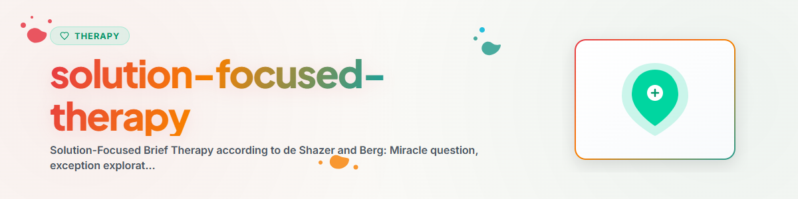

> **日本語** — `solution-focused-therapy` の公式日本語版。


# 解決志向療法 (日本語)

> スティーブ・ド・シェザーとインスー・キム・バーグに基づく解決志向ブリーフセラピーの基礎：ミラクル・クエスチョン、例外の探求、スケーリング、リソースの活性化

参照: [ETHICS.md](../ETHICS.md)

---

## 背景とコンテキスト

解決志向ブリーフセラピー（SFBT）は、ミルウォーキーのブリーフファミリーセラピーセンター（BFTC）においてスティーブ・ド・シェザー（Steve de Shazer）とインスー・キム・バーグ（Insoo Kim Berg）によって開発されました。最も研究が進んでいる短期心理療法のひとつです。

中核概念：問題の原因を分析するのではなく、直接「解決策」の構築に取り組みます。「問題についての対話は問題を生み出し、解決についての対話は解決を生み出す」（ド・シェザー）。

エビデンス：メタアナリシスにより、うつ病、不安障害、行動上の問題、物質使用障害、夫婦・カップル葛藤に対する有効性が支持されています（Gingerich & Peterson 2013, Kim et al. 2019）。

**注意：** 本スキルは心理教育的解説を提供するものであり、専門的な心理療法や治療の代わりになるものではありません。
**絶対に実施してはならない手法：** EMDR、受容・持続ばく露療法（PE）、ナラティブばく露療法（NET）。

---

## 1. SFBTの基本原則

### 3つの基本ルール (de Shazer)

1. **「壊れていないなら、直すな」（"If it ain't broke, don't fix it"）** — うまくいっていることを変える必要はない
2. **「うまくいっているなら、それを続けよ」（"If it works, do more of it"）** — 効果のある行動を強化・拡大する
3. **「うまくいかないなら、違うことをせよ」（"If it doesn't work, do something different"）** — 助けにならないやり方を変更する

### 人間観
- すべての人はリソース（資源）と強み、能力を有している
- クライエントこそが自分自身の人生におけるエキスパート（専門家）である
- 小さな変化がより大きな変化を引き起こす（バタフライ効果）
- 解決策は必ずしも問題そのものと直接因果関係がなくてもよい

---

## 2. ミラクル・クエスチョン（奇跡の質問）— 深い実践

### 基本的な問いかけの型

```
"Imagine that tonight, while you are sleeping, a miracle happens.
The problem that has been troubling you is solved.
But you don't know it, because you were asleep.

What would you notice first thing tomorrow morning that tells you
the miracle has happened?"
```

### 問いかけを深める追質問

**五感レベルで具体化する：**
- 「明日の朝、具体的にどのような行動の違いがありますか？」
- 「どのように起きますか？最初に何をしますか？」
- 「目を開けたとき、どのような感覚がありますか？」

**関係性レベル：**
- 「パートナーや身近な人は、奇跡が起きたことにどのように気づくでしょうか？」
- 「その人の目には、あなたの何が違って映るでしょうか？」
- 「身近な人のうち、誰が一番最初にその変化に気づくでしょうか？」

**奇跡の断片を現在の中に探す：**
- 「この奇跡のどの部分が、もしかすると今日すでに少しだけ起きていますか？」
- 「0から10のスケールで言うと、その奇跡に向かってすでにどこまで進んでいますか？」

---

## 3. 例外の探求 (Exception Exploration)

### 基本原理
「例外」とは、問題が発生していない、あるいは問題が軽度にとどまっている瞬間を指します。そこにはすでに機能している解決への手がかりが含まれています。

### 体系的な例外探求の手順

**フェーズ 1：例外を見つける**
- 「最近、ほんのわずかでも状況が良かったのはいつですか？」
- 「問題がそれほど深刻ではなかった日はありますか？」

**フェーズ 2：例外を詳細に描写する**
- 「その瞬間をできるだけ正確に描写してください」
- 「その日は何が違っていましたか？」

**フェーズ 3：自分自身の貢献を認識する**
- 「状況が良くなるために、あなた自身はどのように貢献しましたか？」
- 「どのような決断をしましたか？」

**フェーズ 4：例外を強化・定着させる**
- 「それを意識的に繰り返すにはどうすればよいですか？」
- 「その方向への最初の小さな一歩は何でしょうか？」

### 例外のタイプ

| タイプ | 説明 | 追質問・対応 |
|------|-------------|-----------|
| 意図的な例外 | クライエントが意識的に普段と違う行動をとった | 「それをさらに続けましょう！」 |
| 偶然の例外 | 意識的な努力なしに状況が違っていた | 「周囲の状況の何が違っていましたか？」 |
| 外部要因による例外 | 他者が普段と違う行動をとった | 「それが再現されるために、あなたにできることは何ですか？」 |

---

## 4. スケーリング・テクニック（数値化質問）

### 基本的な数値化
「0を最悪の状態、10を考えられる最高の状態とすると、現在の状態は0から10の何点くらいですか？」

### 発展的な数値化の形態

**コーピング・スケール（対処の数値化）：**
- 「問題があるにもかかわらず、日常をどれくらい対処・管理できていますか？」

**確信度スケール：**
- 「前進できるという確信はどのくらいありますか？」

**進捗スケール：**
- 「1週間前や1ヶ月前と比べて、今はどの位置にいますか？」
- 「数値が上がった要因は何ですか？」

### 「あと1点高くするには」のテクニック
常に「次の1点」についてのみ質問し、最終目標をいきなり求めない。

```
"What would be different at a 6 compared to the current 5?"
"What could you do TOMORROW that moves toward a 6?"
```

---

## 5. その他のSFBTテクニック

### コーピング・クエスチョン（対処質問）
- 「これほどの困難にもかかわらず、毎日どのようにして起き上がり対処できていますか？」
- 「何があなたの支えになっていますか？」

### 関係性質問 (Relationship Questions)
- 「もしあなたのパートナーに尋ねたら、何とおっしゃるでしょうか？」
- 「あなたの変化に最初に気づくのは誰でしょうか？」

### コンプリメント（ねぎらいとリソースの承認）
- 「困難な状況であるにもかかわらず、こうして解決策を探そうとされていることに感銘を受けます。」

---

## 6. セルフワークのための振り返りの質問

- 「私の人生で何がうまくいっているか — そして自分はそれをどのように実現しているか？」
- 「自分がさらに広げていけるような小さな『例外の瞬間』は何だろうか？」
- 「もし明日問題が消失していたら — 最初に何をするだろうか？」
- 「過去に困難だったにもかかわらず、自分はどのようにして乗り越えただろうか？」

---

## 伦理と限界

**AIアシスタントができること：**
- SFBTの概念や枠組みの解説と文脈化
- ミラクル・クエスチョン、例外の探求、スケーリングのガイド
- 振り返りの質問の提示
- 強みやリソースの明確化

**AIアシスタントが禁止されていること：**
- 臨床的な解決志向心理療法を実施すること
- 深刻な問題を軽視したり表面的に扱うこと（「ただ前向きに考えよう」等）
- 急性危機状況において解決志向を盾に問題を回避すること
- SFBTの技法が自動的に問題を解決すると約束すること

**急性危機・自傷他害のおそれがある場合は必ず以下に繋いでください：**
- こころの健康相談統一ダイヤル (JP): 0570-064-556
- よりそいホットライン (JP): 0120-279-338
- 988 Suicide & Crisis Lifeline (US): 988
- 緊急通報: 119 / 110 (JP), 911 (US), 112 (EU)

---

## 参考文献

- de Shazer, S. (1988). *Clues: Investigating Solutions in Brief Therapy.* Norton.
- Berg, I. K. & Miller, S. D. (1992). *Working with the Problem Drinker.* Norton.
- Gingerich, W. J. & Peterson, L. T. (2013). Effectiveness of Solution-Focused Brief Therapy. *Research on Social Work Practice*, 23(3), 266-283.
- Kim, J. S. et al. (2019). Solution-Focused Brief Therapy: A Meta-Analysis. *Journal of Marital and Family Therapy*, 45(2), 271-286.

---

*Ported from BACH v3.8.0 | Standalone Version*
*Sources: de Shazer (1988), Berg & Miller (1992), Gingerich & Peterson (2013), Kim et al. (2019) — Not professional therapy*