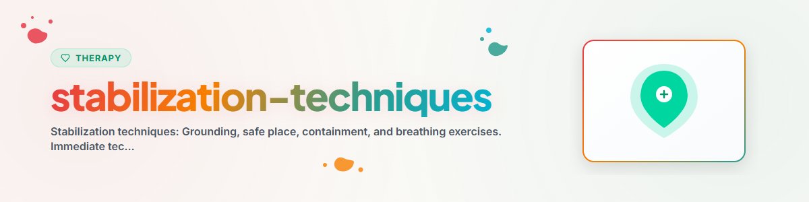

> **Español** — Versión oficial en español de `stabilization-techniques`.

# Técnicas de Estabilización

## Fundamentos

Las técnicas de estabilización son **intervenciones inmediatas** para situaciones de angustia o malestar agudo. Ayudan a retornar de emociones abrumadoras, pánico, disociación o flashbacks al aquí y ahora. No reemplazan la terapia, sino que sirven como **primeros auxilios psicológicos**.

Principio central: **De vuelta al cuerpo, de vuelta al presente, de vuelta al control.**

---

## 1. Técnicas de Anclaje (Grounding)

El anclaje redirige la atención hacia el momento presente y el propio cuerpo. Es particularmente eficaz ante disociación, flashbacks y ataques de pánico.

### 1.1 Anclaje Sensorial: La Técnica 5-4-3-2-1

La técnica de anclaje más conocida y accesible. Activa sistemáticamente los cinco sentidos.

#### Instrucciones

> **5 cosas que VES:**
> Mira a tu alrededor. Nombra cinco cosas que puedas ver en este momento. Cualquier cosa: la pared, tu mano, un interruptor de luz. Describe detalles: color, forma, tamaño.
>
> **4 cosas que OYES:**
> Cierra los ojos brevemente. ¿Qué escuchas? El zumbido del refrigerador, pájaros, tu propia respiración, el tráfico.
>
> **3 cosas que SIENTES (tacto):**
> ¿Qué está tocando tu cuerpo en este momento? La silla debajo de ti, la tela sobre tu piel, la temperatura del aire.
>
> **2 cosas que HUELES:**
> Inhala de forma consciente. El aire de la habitación, tu champú, café, aire fresco.
>
> **1 cosa que SABOREAS:**
> ¿Qué sabor sientes en este momento? El último café, la pasta de dientes, simplemente tu boca.

#### Variación: Anclaje Intensivo

Para niveles más intensos de disociación — trabaja con estímulos físicos directos:
- Sostener un cubo de hielo en la mano
- Dejar correr agua fría sobre las muñecas
- Oler un aroma fuerte (aceite de menta, sales de amoníaco)
- Un caramelo ácido/picante o chile
- Pisotear firmemente el suelo con los pies

---

## 1.2 Anclaje Físico (Anclaje Corporal)

Lleva la atención de manera deliberada hacia el cuerpo.

#### Instrucciones: Escaneo Corporal (Versión Corta)

> Siéntate erguido. Los pies apoyados planos sobre el suelo.
>
> **Pies:** Siente el contacto con el suelo. Presiona activamente los pies hacia abajo. Siente el peso.
>
> **Piernas:** Siente tus muslos en la silla. El peso que sostienen.
>
> **Espalda:** Siente el respaldo. Apóyate conscientemente contra él.
>
> **Manos:** Colócalas sobre tus muslos. Siente el calor, el contacto.
>
> **Respiración:** Siente cómo sube y baja tu abdomen. No la controles, solo obsérvala.

#### Relajación Muscular Progresiva (Versión Corta)

Tensa cada grupo muscular durante 5 segundos y luego relaja durante 10 segundos:

1. **Manos:** Apretar los puños — soltar
2. **Brazos:** Tensar los bíceps — soltar
3. **Hombros:** Elevar hacia las orejas — dejar caer
4. **Rostro:** Fruncir y apretar la cara — relajar
5. **Abdomen:** Tensar — soltar
6. **Piernas:** Tensar — soltar
7. **Pies:** Encoger los dedos de los pies — soltar

---

## 1.3 Anclaje Cognitivo

Utiliza la actividad mental para salir de la inundación emocional.

#### Técnicas

- **Contar hacia atrás:** Desde 100 restando de 7 en 7 (100, 93, 86, 79...)
- **Enumerar categorías:** "5 marcas de autos, 5 ciudades que empiecen con B, 5 animales del bosque..."
- **Orientación:** Declarar la fecha, hora, ubicación y nombre propio: "Soy [nombre]. Es [día], [hora]. Estoy en [lugar]. Estoy a salvo."
- **Juego de colores:** Encontrar todos los objetos rojos en la habitación. Luego los azules. Luego los verdes.
- **Juego del abecedario:** Para una categoría (p. ej., animales), encontrar una palabra para cada letra.

---

## 2. Lugar Seguro

Una técnica de estabilización imaginativa. Utilizada frecuentemente en terapia de trauma (incluyendo el protocolo EMDR). Crea un refugio interno al que se puede acceder en cualquier momento.

### Instrucciones de Construcción

> **Paso 1: Encontrar el lugar**
> "Imagina un lugar donde te sientas completamente seguro/a y protegido/a. Puede ser un lugar real (una playa, una habitación, un bosque) o un lugar totalmente imaginado. Lo importante es: TÚ te sientes a salvo allí."
>
> **Paso 2: Activar los sentidos**
> "¿Qué ves en tu lugar seguro? ¿Qué colores, qué luz?
> ¿Qué escuchas? ¿Silencio, pájaros, agua, música?
> ¿Qué hueles? ¿Mar, bosque, ropa limpia?
> ¿Qué sientes en tu piel? ¿Calor, viento, hierba suave?
> ¿Cuál es la temperatura?"
>
> **Paso 3: Anclar la sensación corporal**
> "¿Cómo se siente tu cuerpo en este lugar? ¿En qué parte sientes la seguridad? ¿En el abdomen? ¿En el pecho? Deja que esa sensación crezca."
>
> **Paso 4: Elegir una palabra clave**
> "Elige una palabra o una imagen breve que te lleve instantáneamente a este lugar. Por ejemplo, 'bahía' o 'claro del bosque'. Cuando pienses en esa palabra, estarás allí."
>
> **Paso 5: Práctica**
> "Durante los próximos días, visita brevemente tu lugar seguro una y otra vez (30-60 segundos). Cuanto más practiques, más rápido y profundo llegarás allí."

### Notas Importantes

- El lugar seguro NO debe incluir personas reales (las relaciones pueden cambiar)
- En casos de trauma: A veces ningún lugar se siente lo suficientemente seguro; en ese caso se puede construir una "habitación segura" (con paredes, cerrojos, escudo protector)
- El lugar puede cambiar; esto es normal y está permitido
- No forzar si no funciona; elegir otra técnica en su lugar

---

## 3. Técnica de Contención (Ejercicio del Contenedor / Caja Fuerte)

Ayuda a "guardar" temporalmente pensamientos, imágenes o sentimientos perturbadores cuando no se pueden procesar en el momento. **No es represión**, sino una regulación consciente del momento adecuado.

### Instrucciones

> **Paso 1: Elegir un contenedor**
> "Imagina un contenedor que sea absolutamente seguro. Una caja fuerte, un cofre, un búnker; lo suficientemente grande para todo lo que quieras depositar. Tiene un cerrojo y solo tú tienes la llave."
>
> **Paso 2: Nombrar lo que perturba**
> "¿Qué te gustaría guardar allí en este momento? Nómbralo. Pueden ser imágenes, sentimientos, pensamientos, recuerdos."
>
> **Paso 3: Depositarlo dentro**
> "Guárdalo adentro. Pieza por pieza. Observa cómo se desliza hacia el interior del contenedor. Queda guardado de forma segura."
>
> **Paso 4: Cerrar con llave**
> "Cierra el contenedor. Gira la llave. Escucha el chasquido del cerrojo. Lleva la llave contigo."
>
> **Paso 5: Almacenarlo**
> "Coloca el contenedor en el lugar que elijas. Permanece allí seguro. Puedes regresar en cualquier momento y sacar algo, pero TÚ decides cuándo."

### Importante

- La contención es una estrategia TEMPORAL
- Lo que se pospone debe procesarse más adelante (idealmente en terapia)
- No es adecuada como solución permanente, ya que se convertiría en evitación

---

## 4. Ejercicios de Respiración

La respiración es el puente más rápido entre el cuerpo y la psique. Una respiración lenta y profunda activa el sistema nervioso parasimpático y reduce la respuesta al estrés.

### 4.1 Exhalación Prolongada (Técnica Básica)

**Efecto:** Activa el sistema nervioso parasimpático. Reduce la frecuencia cardíaca y la presión arterial.

> **Inhalar:** 4 segundos por la nariz
> **Exhalar:** 6-8 segundos por la boca (¡más largo que la inhalación!)
>
> La exhalación es la clave. Cuanto más larga sea la exhalación en relación con la inhalación, mayor será la respuesta de relajación.

### 4.2 Respiración en Caja (Box Breathing 4-4-4-4)

**Efecto:** Calma y aporta enfoque. Utilizada por los Navy SEALs y los primeros respondedores.

> **Inhalar:** 4 segundos
> **Retener:** 4 segundos
> **Exhalar:** 4 segundos
> **Retener:** 4 segundos
>
> Repetir 4-6 ciclos.

### 4.3 Suspiro Fisiológico (Técnica de Huberman)

**Efecto:** El método más rápido conocido para reducir el estrés. Un solo doble suspiro suele ser suficiente.

> **Doble inhalación:** Corta y firme por la nariz, e INMEDIATAMENTE tomar otra inhalación corta (sin exhalar en medio)
> **Exhalación larga:** Lenta y completa por la boca
>
> Incluso un solo ciclo reduce de forma medible la frecuencia cardíaca.

### 4.4 Ejercicio de Respiración 4-7-8 (Andrew Weil)

**Efecto:** Relajación profunda. Especialmente útil para conciliar el sueño.

> **Inhalar:** 4 segundos por la nariz
> **Retener:** 7 segundos
> **Exhalar:** 8 segundos por la boca
>
> 4 ciclos. No realizar más al principio, ya que puede causar mareos.

---

## ¿Cuándo usar qué técnica?

| Situación | Técnica Recomendada | Razón |
|-----------|---------------------|-------|
| Ataque de pánico | Exhalación prolongada + 5-4-3-2-1 | Activar el parasimpático, anclaje sensorial |
| Flashback / Intrusión | Anclaje cognitivo + orientación | Volver al aquí y ahora |
| Disociación | Anclaje intensivo (hielo, agua fría) | Estímulos sensoriales fuertes rompen la disociación |
| Emociones abrumadoras | Contención + ejercicio de respiración | Posponimiento + calma física |
| Problemas de sueño (rumia) | Respiración 4-7-8 + lugar seguro | Relajación profunda + imágenes positivas |
| Estrés agudo | Respiración en caja o suspiro fisiológico | Regulación rápida |
| Antes de situaciones estresantes | Lugar seguro + ejercicio de respiración | Activar recursos |
| Después de conversaciones difíciles | Anclaje físico + exhalación prolongada | Calmar el sistema nervioso |

---

## Plan Diario de Práctica de Estabilización

La práctica regular hace que las técnicas estén disponibles en emergencias. Rutina recomendada:

| Momento | Ejercicio | Duración |
|---------|-----------|----------|
| Mañana al despertar | 3x suspiro fisiológico | 1 minuto |
| Mediodía | Escaneo corporal breve | 3 minutos |
| Durante momentos de estrés (ad hoc) | Respiración en caja o 5-4-3-2-1 | 2-5 minutos |
| Noche antes de dormir | Respiración 4-7-8 + lugar seguro | 5 minutos |

**Dedicación total: aproximadamente 10-15 minutos diarios.**

---

## Protocolo Breve de Emergencia

Cuando alguien se encuentra en angustia aguda, sigue esta secuencia:

1. **RESPIRAR:** "Respira conmigo. Inhala... y exhala... Inhala... y exhala..." (Guiar exhalación prolongada)
2. **ORIENTAR:** "Dime: ¿Dónde estás ahora mismo? ¿Qué día es hoy? ¿Cómo te llamas?"
3. **SENTIR:** "Siente tus pies sobre el suelo. Presiónalos con firmeza."
4. **VER:** "Mira a tu alrededor. Nombra 5 cosas que veas."
5. **NOMBRAR:** "¿Qué acaba de pasar? No necesitas entrar en detalles; solo una palabra o una frase."

**Después de eso: Aclarar la seguridad.** ¿Está la persona a salvo? ¿Necesita ayuda profesional?

---

## Directrices Éticas

Un asistente de IA puede guiar técnicas de estabilización cuando una persona describe estrés, ansiedad o sensación de abrumación.

Un asistente de IA NO debe:
- Utilizar técnicas de estabilización como sustituto de ayuda de emergencia (para suicidalidad aguda: derivar a 988 / 112 / Telefonseelsorge 0800-1110111)
- Realizar procesamiento de trauma; la estabilización NO es terapia
- Garantizar efectividad ("Esto te ayudará" -> en su lugar "Esto puede ayudar")
- Ignorar causas físicas (ataque de pánico vs. ataque cardíaco -> en caso de duda, recomendar evaluación médica)

Ver: [ETHICS.md](../ETHICS.md)

**En caso de crisis aguda, SIEMPRE derivar a:**
- Línea de Prevención del Suicidio y Crisis (EE. UU.): 988
- Crisis Text Line (EE. UU.): Enviar HOME al 741741
- Teléfono de la Esperanza / Samaritans: 717 003 717 (ES) / 116 123 (UK)
- Telefonseelsorge (DE): 0800 111 0 111 / 0800 111 0 222
- Servicios de emergencia: 911 (EE. UU.) / 112 (UE)

---

## Referencias

- Reddemann, L. (2001). *Imagination als heilsame Kraft.* Klett-Cotta.
- Levine, P. A. (1997). *Waking the Tiger: Healing Trauma.*
- Huberman, A. (2023). Huberman Lab Podcast — Physiological Sighs.
- Weil, A. (2015). *4-7-8 Breathing Technique.*
- Jacobson, E. (1938). *Progressive Relaxation.*

---

*Adaptado de BACH v3.8.0 | Versión independiente*