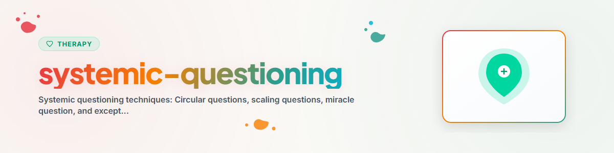

> **Español** — Versión oficial en español de `systemic-questioning`.

# Técnicas de Preguntas Sistémicas

## Fundamentos

Las técnicas de preguntas sistémicas provienen de la terapia y asesoramiento sistémico. Tienen como objetivo **ampliar perspectivas**, **hacer visibles los patrones** y **abrir nuevas posibilidades**. Están orientadas a las soluciones y a los recursos, no fijadas en los problemas.

Premisa central: **Los problemas no se originan dentro de los individuos, sino en las relaciones y patrones entre ellos.**

---

## Tipos de Preguntas

### 1. Preguntas Circulares

**Propósito:** Fomentar el cambio de perspectiva. Se invita a la persona a adoptar la posición de otros y reconocer patrones relacionales.

#### Estructura Básica
"¿Qué crees que [Persona X] ve/siente/piensa sobre esto?"

#### Variaciones

**Preguntas de relación:**
- "¿Qué crees que piensa tu pareja cuando te retiras?"
- "¿Cómo describiría tu mejor amigo/a tu relación?"
- "Si le preguntara a tu hermano cuál es el mayor problema en la familia, ¿qué diría?"

**Preguntas de diferencia:**
- "¿Quién en la familia sufre más por la situación?"
- "¿Quién notaría primero el cambio?"
- "¿Con quién tienes más cercanía: con tu madre o con tu padre?"

**Preguntas de acuerdo:**
- "¿Estaría tu pareja de acuerdo con eso?"
- "¿Quién en tu entorno lo ve de manera similar a ti?"

**Preguntas de clasificación:**
- "Si clasificaras a los miembros de tu familia según quién maneja mejor los conflictos, ¿cuál sería el orden?"

---

### 2. Preguntas de Escala

**Propósito:** Hacer medibles los estados abstractos, visibilizar el progreso y concretar metas. Desarrolladas por **Steve de Shazer** e **Insoo Kim Berg**.

#### Estructura Básica
"En una escala del 0 al 10, donde 0 es [Polo A] y 10 es [Polo B], ¿dónde te encuentras en este momento?"

#### Variaciones

**Escala de estado:**
- "En una escala del 0 al 10, ¿qué tan abrumado/a te sientes en este momento?"
- "¿En qué punto de la escala estabas la semana pasada?"

**Escala de progreso:**
- "¿Dónde estabas en esta escala hace un mes?"
- "¿Qué contribuyó a que pasaras de un 3 a un 5?"

**Escala de meta:**
- "¿En qué punto de la escala necesitarías estar para que fuera 'suficientemente bueno'?"
- "¿Qué sería diferente si estuvieras un punto más arriba?"

**Escala de confianza:**
- "¿Qué tan seguro/a estás, en una escala del 0 al 10, de que puedes lograr esto?"
- "¿Qué necesitarías para sentirte un punto más seguro/a?"

**Escala de relación:**
- "¿En qué punto de la escala calificaría tu pareja su relación?"

#### Preguntas de Seguimiento (¡Esenciales!)

- "¿Qué ha evitado que estés en 0?" (Activación de recursos)
- "¿Qué tendría que pasar para que subieras un punto más?" (Orientación a soluciones en pequeños pasos)
- "¿Cómo sabrías que estás en [valor objetivo]?" (Concreción)

---

### 3. La Pregunta del Milagro

**Propósito:** Clarificación de metas y visión de solución. Desvía el pensamiento centrado en problemas y activa la imaginación de soluciones. Desarrollada por **Steve de Shazer**.

#### Formulación Original

> "Imagina que esta noche te vas a la cama y te duermes. Y mientras duermes, ocurre un milagro. El problema que te trajo aquí se resuelve. Pero no lo sabes, porque estabas durmiendo. ¿Qué sería lo primero que notarías mañana por la mañana que te indicaría que el milagro ha ocurrido?"

#### Preguntas de Profundización

- "¿Qué más sería diferente?"
- "¿Quién lo notaría primero?"
- "¿Qué notaría [pareja/colega/amigo/a] en ti que fuera nuevo?"
- "¿Qué harías de manera diferente?"
- "¿Hay momentos en los que el milagro ya esté ocurriendo un poco?"

#### Variaciones Cortas

- "Si el problema desapareciera mañana, ¿qué sería diferente?"
- "¿Cómo sería tu rutina diaria ideal?"
- "Si todo fuera como deseas, ¿qué estarías haciendo?"

---

### 4. Preguntas de Excepción

**Propósito:** Identificar momentos en los que el problema NO ocurre o ocurre con menor intensidad. Muestra que la persona ya posee recursos de solución.

#### Estructura Básica
"¿Cuándo es diferente? ¿Cuándo no ocurre el problema?"

#### Variaciones

- "¿Ha habido momentos recientemente en los que las cosas hayan estado mejor?"
- "¿Qué fue diferente en esos momentos?"
- "¿Qué hiciste TÚ de manera diferente en esas ocasiones?"
- "¿Quién estaba allí? ¿Cómo era el entorno?"
- "¿Cómo lograste que fuera mejor en ese momento?"
- "¿Qué tendría que pasar para que esas excepciones fueran más frecuentes?"

---

### 5. Preguntas Hipotéticas

**Propósito:** Abrir nuevos espacios de pensamiento, flexibilizar creencias rígidas y ensayar mentalmente opciones de acción.

#### Variaciones

- "Supongamos que lo intentaras, ¿qué podría pasar en el mejor de los casos?"
- "¿Qué pasaría si hicieras lo opuesto a lo que haces normalmente?"
- "Si tuvieras que darle un consejo a alguien en la misma situación, ¿qué le dirías?"
- "Si el miedo no jugara ningún papel, ¿qué harías?"
- "Si miraras hacia el día de hoy desde dentro de 5 años en el futuro, ¿qué te aconsejarías a ti mismo/a?"

---

### 6. Preguntas de Empeoramiento (Intervención Paradójica)

**Propósito:** Fortalecer el sentido de control. Si alguien puede describir cómo empeorar el problema, demuestra que influye sobre él y, por lo tanto, también puede mejorarlo.

#### Variaciones

- "¿Qué podrías hacer para garantizar que todo empeore?"
- "¿Cómo podrías asegurarte de que la discusión se intensifique?"
- "¿Qué tendría que ocurrir para que todo saliera completamente mal?"

**Importante:** Esta técnica NO es adecuada en situaciones de crisis aguda, suicidalidad o depresión severa.

---

## Selección Según el Contexto

| Situación | Técnica Recomendada | Razón |
|-----------|---------------------|-------|
| La persona está atascada en el problema | Pregunta del milagro | Rompe el trance del problema |
| El progreso no es visible | Preguntas de escala | Hace medibles los pequeños pasos |
| Conflictos relacionales | Preguntas circulares | Permite el cambio de perspectiva |
| "SIEMPRE es así" | Preguntas de excepción | Rompe las generalizaciones |
| Temor al cambio | Preguntas hipotéticas | Permite ensayar pensamientos sin riesgo |
| Impotencia / pérdida de control | Preguntas de empeoramiento | Muestra la propia influencia |
| Metas poco claras | Pregunta del milagro + escala | Clarifica la dirección y el punto de partida |

---

## Combinaciones

Las preguntas sistémicas despliegan todo su potencial al combinarse:

### Patrón: Escala + Excepción + Pequeño Paso

1. "En una escala del 0 al 10, ¿dónde estás ahora?" -> p. ej., "4"
2. "¿Qué ha evitado que estés en 0?" (¡Recursos!)
3. "¿Hubo momentos en los que estuviste en 5 o más alto?" (¡Excepciones!)
4. "¿Qué fue diferente entonces?" (¡Reconocer patrones!)
5. "¿Cuál sería el paso más pequeño para pasar de 4 a 5?" (¡Acción!)

### Patrón: Pregunta del Milagro + Circular + Escala

1. Plantear la pregunta del milagro (generar imagen objetivo)
2. "¿Quién lo notaría primero?" (Circular — contexto relacional)
3. "¿Qué tan avanzado/a estás ya en el camino hacia el milagro?" (Escala — progreso)

### Patrón: Circular + Hipotética

1. "¿Qué crees que ve tu jefe/a en esta situación?"
2. "Supongamos que dijera exactamente lo que sospechas, ¿qué podrías hacer entonces?"

---

## Lo que se Debe y NO se Debe Hacer (Dos & Don'ts)

### Recomendaciones (Dos)
- **Preguntar abiertamente** — sin preguntas inducidas o dirigidas
- **Mantener la curiosidad** — la respuesta es más valiosa que la pregunta
- **Permitir pausas** — las buenas preguntas requieren tiempo
- **Construir sobre las respuestas** — profundizar es más importante que la siguiente técnica
- **Enmarcar con apreciación** — "¿Qué lograste?" en lugar de "¿Qué hiciste mal?"

### Advertencias (Don'ts)
- **No interrogar** — máximo 2-3 preguntas seguidas, luego reflexionar
- **No usar en crisis agudas** — primero estabilizar, luego explorar
- **No usar como manipulación** — las preguntas deben reflejar curiosidad auténtica
- **Preguntas de empeoramiento NUNCA en suicidalidad** — jamás

---

## Directrices Éticas

Un asistente de IA puede formular preguntas sistémicas para fomentar la reflexión y la ampliación de perspectivas.

Un asistente de IA NO debe:
- Utilizar preguntas sistémicas como instrumento diagnóstico
- Realizar asesoramiento de pareja/relacional que reemplace la terapia profesional
- Trabajar exclusivamente con preguntas en crisis agudas — la estabilización es prioritaria
- Usar preguntas de empeoramiento en estados frágiles

Ver: [ETHICS.md](../ETHICS.md)

**En caso de crisis aguda, SIEMPRE derivar a:**
- Línea de Prevención del Suicidio y Crisis (EE. UU.): 988
- Crisis Text Line (EE. UU.): Enviar HOME al 741741
- Teléfono de la Esperanza / Samaritans: 717 003 717 (ES) / 116 123 (UK)
- Telefonseelsorge (DE): 0800 111 0 111 / 0800 111 0 222
- Servicios de emergencia: 911 (EE. UU.) / 112 (UE)

---

## Referencias

- de Shazer, S. (1985). *Keys to Solution in Brief Therapy.*
- Selvini Palazzoli, M. et al. (1981). *Hypothesizing — Circularity — Neutrality.*
- Schlippe, A. von & Schweitzer, J. (2012). *Lehrbuch der systemischen Therapie und Beratung.*
- Berg, I. K. & Dolan, Y. (2001). *Tales of Solutions.*

---

*Adaptado de BACH v3.8.0 | Versión independiente*