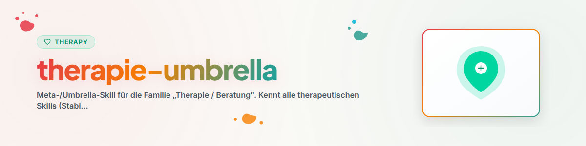

# Therapie / Beratung — Umbrella

## Zweck

Einstiegspunkt für die Familie „Therapie / Beratung". Bündelt das übergreifende Routing und leitet
für Spezialfälle an den passenden Skill weiter. Drei aktive Einstiegspunkt-Skills bilden die Front;
dahinter liegt ein längerer Schwanz deregistrierter Spezialverfahren, die über `code-skill-index`
(Katalog `catalog-therapy.md`) erreichbar sind.

## Mitglieder & Routing

| Skill | Wofür | Wann diesen statt der anderen |
|-------|-------|-------------------------------|
| `/stabilization-techniques` | Krisenintervention, Grounding, Sicherer Ort, PMR, Panik, Window of Tolerance | **Zuerst** bei akuter Belastung/Krise — Stabilisierung vor Methodik |
| `/guideline-therapies-overview` | Überblick Richtlinienverfahren: KVT, ACT, Schematherapie, Exposition, Systemische, Tiefenpsychologie | Wenn die passende **Methode** gewählt/erklärt werden soll |
| `/counseling-basics` | Gesprächsführung: aktives Zuhören, Spiegeln, Validierung, MI/OARS, zirkuläre Fragen | Wenn es um das **WIE des Gesprächs** geht, nicht um die Methode |
| (deregistrierte Spezial-Skills) | Einzelverfahren (Genogramm, Expositionsdetails, Positive Psychologie, …) | Wenn ein konkretes Einzelverfahren tief gebraucht wird → via `code-skill-index` |

> Routing-Regel: akute Krise → `/stabilization-techniques` · Methode wählen/erklären →
> `/guideline-therapies-overview` · Gesprächstechnik → `/counseling-basics` · tiefes Einzelverfahren →
> deregistrierter Spezial-Skill über `code-skill-index`.

## Gut gekoppelte Kombinationen

- `/stabilization-techniques` (zuerst, akut) → `/guideline-therapies-overview` (danach, mittelfristig):
  erst Sicherheit/Window of Tolerance herstellen, dann das passende Richtlinienverfahren wählen.
- `/counseling-basics` begleitet **beide** — die Gesprächshaltung (MI/OARS, Validierung) trägt durch
  Stabilisierung wie Methodenarbeit.

## Gemeinsame Konventionen

- Keine Diagnosestellung ersetzen; psychoedukativ und ressourcenorientiert arbeiten.
- Window of Tolerance als Leitachse: bei Übererregung zuerst stabilisieren, nicht konfrontieren.
- Live-Dateien der Einzelskills vor Anwendung lesen — diese Umbrella reproduziert keine Inhalte.

## Changelog

### 0.1.0 (2026-06-17)
- Initiale Version. Erzeugt vom Audit-Modus (1c1) für die Familie Therapie / Beratung.
