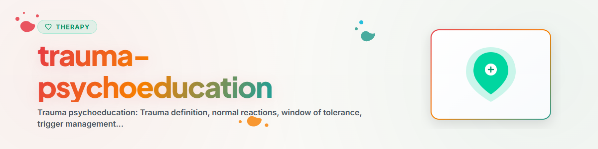

> **日本語** — `trauma-psychoeducation` の公式日本語版。


# トラウマ心理教育（Trauma Psychoeducation）

> トラウマ、トラウマ後遺症状、および「耐性の窓（ウインドウ・オブ・トレランス）」に関する知識：異常な出来事に対する正常な反応を理解する — 純粋な心理教育であり、トラウマ処理・再加工ではありません

参照：[ETHICS.md](../ETHICS.md)

---

## 背景と文脈

トラウマに関する心理教育（サイコエデュケーション）は、当事者が自身の反応を理解し、整理・文脈化するのに役立ちます。フラッシュバック、過覚醒、回避といった症状が「異常な出来事に対する正常な反応」であるという知識を得るだけでも心理的安堵をもたらし、自責の念や恥の感情を軽減します。

エビデンス：心理教育はトラウマ療法の公認された構成要素です（Flatten et al. 2011, S3ガイドラインPTSD）。単独の介入としては不十分ですが、治療へのモチベーションを高め、症状を和らげる効果があります。

**重要：** 本スキルはトラウマに関する「知識」を伝えることに特化しています。トラウマの処理・再加工を行ったり、辛い記憶を掘り下げたり、トラウマの詳細を尋ねたりすることは「一切行いません」。
**実施厳禁：** EMDR、持続暴露療法（PE）、ナラティブ暴露療法（NET）。

---

## 1. トラウマとは何か？

### 定義

トラウマとは、個人の対処能力を超えた出来事であり、無力感、コントロールの喪失、および／または死の恐怖の体験を伴うものです。トラウマを定義づけるのは出来事そのものだけでなく、個人の「主观的体験」です。

### トラウマのタイプ

| タイプ | 説明 | 具体例 |
|------|-------------|----------|
| Ⅰ型（単発性トラウマ） | 単発の予期せぬ出来事 | 交通事故、暴行被害、自然災害 |
| Ⅱ型（慢性・複雑性トラウマ） | 繰り返される長期的なトラウマ体験 | 虐待、ネグレクト、戦争体験 |
| 事故性トラウマ | 偶発的な突発イベント | 交通障害、火災、労災事故 |
| 対人的トラウマ | 人為的に引き起こされたもの | 暴力、虐待、拷問 |
| 二次トラウマ | 他者の体験の目撃・共有によるもの | 支援職（医療・心理）、家族 |

### トラウマではないもの（臨床的鑑別）

苦痛やストレスを伴うすべての出来事が臨床的意味でのトラウマであるとは限りません：
- 失恋、失業、口論 — 苦痛ではありますが、通常はトラウマではありません
- いじめ（Bullying） — トラウマ的になり得ますが（特に小児期）、自動的にトラウマとなるわけではありません
- 出来事の種類だけでなく、個人の評価と体験のあり方が決定要因となります

---

## 2. 異常な出来事に対する正常な反応

### 3つの主な反応パターン

```
過覚醒（Hyperarousal）
- 絶え間ない警戒と緊張状態
- 誇張された驚愕反応
- 睡眠障害・不眠
- イライラ、怒りの爆発
- 集中困難

再体験 / 侵入症状（Intrusion）
- フラッシュバック（現実に起きているかのような侵入的記憶）
- 悪夢
- 突然湧き上がる辛い記憶
- 思い出した際の身体反応（動悸、発汗）

回避と麻痺（Constriction / Avoidance）
- 特定の場所、人物、状況の回避
- 感情の麻痺・感覚の喪失
- 他者からの引きこもり・孤立
- 疎外感・よそよそしさ
- 興味や喜びの喪失（アンヘドニア）
```

### 当事者への重要なメッセージ

```
「これらの反応は、異常な出来事に対する『正常な反応』です。

あなたの身体と心は、あなたを守ろうとしています。
警戒心は、新たな危険からあなたを守っています。
記憶が湧き上がるのは、起きたことを消化・処理しようとしているからです。
回避は、圧倒されることからあなたを守っています。

あなたは『おかしく』なっていませんし、『弱く』もありません。
あなたの神経システムは、極限の脅威に対してプログラミングされた通りに
反応しているだけなのです。」
```

### 経過のタイムライン

```
トラウマ的出来事後の経過

0〜4週間：    急性ストレス反応（正常な経過）
              - ショック、麻痺、不安・落ち着かなさ
              - 睡眠問題、驚愕反応
              - フラッシュバック、悪夢
              - 多くの人において：自然回復していく

4週間以降：   症状が持続する場合：PTSDの可能性
              - 専門家による評価を推奨
              - 早期の介入が予後を改善する

数ヶ月〜数年：慢性化の可能性
              - 長年経過した後でも心理療法は有効
              - 「助けを求めるのに遅すぎるということはない」
```

---

## 3. 耐性の窓モデル（Dan Siegel 耐性の窓）

### モデルの図解

```
            ________________________________________________
           |                                                |
           |   窓の上方：過覚醒（Hyperarousal）              |
           |   パニック、激怒、過剰興奮、フラッシュバック    |
           |   動悸、発汗、震え                             |
           |   「戦うか逃げるか」反応（Fight or Flight）     |
           |________________________________________________|
           |                                                |
           |   耐性の窓（WINDOW OF TOLERANCE）              |
           |                                                |
           |   この状態では：                               |
           |   - 思考と感情を同時に保持できる               |
           |   - 情報を処理できる                           |
           |   - 人間関係を維持できる                       |
           |   - 課題を解決できる                           |
           |   - 学び、成長できる                           |
           |________________________________________________|
           |                                                |
           |   窓の下方：低覚醒（Hypoarousal）              |
           |   凍りつき（Freeze）、麻痺、解離                |
           |   気力の欠如、空虚感、シャットダウン           |
           |   「死んだふり反射」（Shutdown）               |
           |________________________________________________|
```

### これは何を意味するか？

- **窓の中にある時：** ストレスを調節し、日常生活を機能させることができる
- **窓の上に外れた時：** 覚醒が高すぎる — 身体がアラームモードに入っている
- **窓の下に外れた时：** 覚醒が低すぎる — 身体がシャットダウンしている

### トラウマと耐性の窓

```
トラウマ前：               トラウマ後（未治療）：

|_______________|         |_____|
|               |         |     |  <- 耐性の窓が「狭く」なっている
|    耐性の窓   |         | 窓. |
|    （広い）   |         |     |
|_______________|         |_____|

トラウマを経験した後は、小さな刺激（トリガー）でも
窓の外に押し出されやすくなります。

療法のゴール：耐性の窓を再び「広げる」こと。
```

### トリガー（引き金）の理解

```
トリガーとは、トラウマを想起させ、無意識のうちに
神経システムをアラームモードに落とし込む刺激のことです。

トリガーとなり得るもの：
- 音（爆音、悲鳴、特定の音楽）
- におい（煙、香水、アルコール）
- 視覚（ニュース、映画、特定の場所）
- 身体感覚（胸の苦しさ、接触、痛み）
- カレンダーの日付（記念日・命日など）
- 人間関係の状況（口論、コントロールの喪失）

トリガーは「弱さ」ではありません。神経システムが記憶している
警告信号です。療法の中では、トリガーに気づき、
神経システムを落ち着かせる方法を学んでいきます。
```

---

## 4. セルフケア戦略

### 基本的ニーズの確保

```
基本的ニーズのチェックリスト

[ ] 睡眠：規則正しい就寝時間、少なくとも7時間
[ ] 栄養：規則正しい食事、十分な水分補給
[ ] 運動：毎日少なくとも20分（散歩で十分）
[ ] 社会的接触：信頼できる人が少なくとも1人いる
[ ] 安全：自分の環境で安全だと感じられる
[ ] 構造：固定されたアンカーポイントのある日課
```

### 日常生活におけるセルフケア戦略

**身体的ケア：**
- 適度な運動（ストレスホルモンを低減させる）
- 呼吸法
- 十分な睡眠（睡眠衛生の遵守）
- カフェインやアルコールの削減（過覚醒や麻痺を増幅させるため）

**社会的ケア：**
- 信頼できる人を持つ（トラウマについて話す必要はない）
- 孤立を避ける — 小さな交流でも効果がある
- 境界線を引くことを学ぶ（「いいえ」と言ってよい）
- 支援を受け入れる

**感情的ケア：**
- 感情に名前をつける（裁いたり否定したりしない）
- 安定化技法を活用する（5-4-3-2-1法、セーフ・プレイス）
- 日記をつける（任意。無理強いはしない）
- 創造的な表現方法を見つける（絵画、音楽、執筆）

**認知的ケア：**
- 知識を得る（心理教育 — 本スキル）
- 自責の念に挑む（「私のせいではなかった」）
- 破局的思考を現実検証する
- 自分に優しく焦らない（回復には時間がかかる）

---

## 5. 専門的な支援を求める

### いつ専門家に相談すべきか？

```
以下の場合は専門的な支援が推奨されます：

- 症状が4週間以上続いている
- 症状が改善せず悪化している
- 日常生活（仕事、人間関係）に深刻な支障が出ている
- フラッシュバックや悪夢が頻繁に起きる
- 回避行動によって生活が著しく制限されている
- 対処法として物質（アルコール・薬物）に頼っている
- 自殺念慮や自傷行為がある
- 「一人では抱えきれない」と感じている
```

### 相談窓口・リソース

```
緊急支援（日本）：
- こころの健康相談統一ダイヤル：0570-064-556
- よりそいホットライン：0120-279-338
- いのちの電話：0570-783-556（ナビダイヤル）
- 警察・救急：110 / 119

トラウマ専門相談：
- 性犯罪・性暴力被害者のためのワンストップ支援センター：#8891
- 配偶者暴力相談支援センター（DV相談+）：0120-279-388
- 精神保健福祉センター（各都道府県）

精神科医・心理療法士を探す：
- 医療機関（精神科・心療内科）の受診
- 「トラウマ療法」「PTSD治療」「EMDR」を専門とする臨床心理士・公認心理師を探す
```

---

## 6. よくある質問（FAQ）

### 「私は今、トラウマを負っているのでしょうか？」

辛い出来事を経験したすべての人がトラウマ関連障害を発症するわけではありません。大部分の人は数週間以内に自然回復します。PTSDに該当するかどうかは、専門家によるアセスメントが必要です。

### 「出来事について話さなければいけませんか？」

いいえ。無理に話すことは有害になる場合があります。話すことで助かる人もいれば、そうでない人もいます。「話さなければならない」ということはありません。セラピーでは、適切なタイミングを一緒に相談しながら決定します。

### 「昔のことなのに、なぜ今になって反応するのですか？」

トラウマ的な記憶は、通常の記憶とは異なる方法で保存されます。トリガーによって再活性化され、まるで「今」起きているかのように感じられることがあります。脳は「当時」と「今」を区別できません。セラピーはこれらの記憶を「再整理」する手助けをします。

### 「一人で対処できない私は弱いのでしょうか？」

いいえ。助けを求めることは強さの証です。トラウマ療法は非常に効果的であり、ほとんどの人が専門的な支援によって大幅に改善します。

---

## 倫理と限界

**AIアシスタントができること：**
- トラウマおよびトラウマ後遺症状に関する知識の提供（心理教育）
- 正常な反応であることを伝えて安心感を与えること
- 耐性の窓モデルの解説
- セルフケア戦略の提案
- 専門的な支援窓口への案内
- 安定化技法の提示

**AIアシスタントが絶対にできないこと・行ってはならないこと：**
- トラウマ処理・再加工作業（EMDR、暴露療法、NET、IRRTなど）を実施すること
- トラウマの詳細を尋ねたり掘り下げたりすること
- フラッシュバックの内容自体を処理・深掘りすること（安定化のみ行う）
- PTSDやその他のトラウマ障害を診断すること
- 自殺リスクのアセスメントを行うこと
- 薬物・処方に関する推奨を行うこと
- 責任や罪の所在について判断を下すこと
- 記憶を「加工・処理」しようとすること
- 誘導的な質問をすること（「〜だったのではないでしょうか？」など）

**極めて厳格な限界：** トラウマの処理・加工作業は、専門のトレーニングを受けたトラウマセラピストの領域です。本スキルは「心理教育と安定化」のみを提供します。いかなる形式のトラウマ探求に対しても「直ちに停止」し、専門家へリファーしてください。

**切迫した危機の場合は、必ず以下の窓口をご案内ください：**
- こころの健康相談統一ダイヤル（日本）：0570-064-556
- よりそいホットライン（日本）：0120-279-338
- いのちの電話（日本）：0570-783-556（ナビダイヤル）
- 988 Suicide & Crisis Lifeline（米国）：988
- 警察・救急：110 / 119（日本） / 911（米国） / 112（欧州）

---

*BACH v3.8.0 より移植 | スタンドアロン版*
*出典：Flatten et al. (2011), Siegel (2012), Reddemann (2001), S3 Guideline PTSD (2019) — 専門的心理療法ではありません*