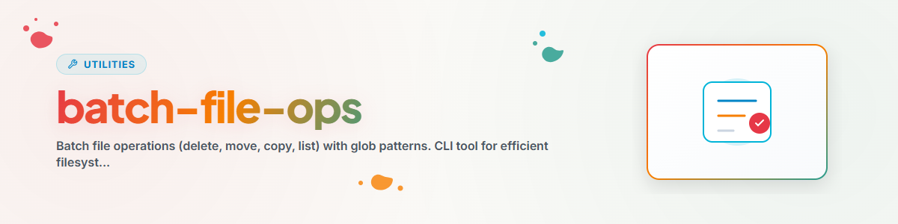

> **Русский** — Официальная русская версия `batch-file-ops`.


# batch_file_ops - Пакетные операции с файлами (Русский)

CLI-инструмент для эффективных пакетных операций над файлами с использованием шаблонов glob.
Поддерживает: delete, move, copy, list. Без зависимостей (только стандартная библиотека Python).

---

## Действия

| Действие | Описание |
|----------|----------|
| `delete` | Удалить файлы, соответствующие шаблону |
| `move` | Переместить файлы, соответствующие шаблону |
| `copy` | Копировать файлы, соответствующие шаблону |
| `list` | Вывести список файлов, соответствующих шаблону |

## Использование CLI

```bash
python batch_file_ops.py <action> <source> [<target>] --pattern "<glob>" [--dry-run] [--recursive]
```

### Аргументы

| Аргумент | Описание |
|----------|----------|
| `action` | `delete`, `move`, `copy` или `list` |
| `source` | Исходная директория |
| `target` | Целевая директория (только для `move` и `copy`) |
| `--pattern`, `-p` | Шаблон glob (например, `*.py`, `TOOLS_*.py`) - По умолчанию: `*` |
| `--dry-run`, `-n` | Только предварительный просмотр, без изменений |
| `--recursive`, `-r` | Рекурсивный поиск в поддиректориях |

---

## Примеры и использование

```bash
# Список всех файлов Python в директории (Русский)
python batch_file_ops.py list /path/to/directory --pattern "*.py"

# Удалить все файлы .tmp (сначала запустите с --dry-run!) (Русский)
python batch_file_ops.py delete /path/to/directory --pattern "*.tmp" --dry-run
python batch_file_ops.py delete /path/to/directory --pattern "*.tmp"

# Переместить файлы (Русский)
python batch_file_ops.py move /source /target --pattern "*.txt"

# Копировать файлы (рекурсивно) (Русский)
python batch_file_ops.py copy /source /target --pattern "*.md" --recursive

# Примеры шаблонов (Русский)
python batch_file_ops.py delete /path --pattern "TOOLS_*.py"
python batch_file_ops.py list /path --pattern "backup_202?-*"
```

---

## Примечания

- **Сначала Dry-run:** Всегда сначала используйте `--dry-run` для `delete` и `move`
- **Шаблоны Glob:** Используется Python `pathlib.glob()` / `pathlib.rglob()`
- **Совместимость с Windows:** Автоматическая кодировка вывода UTF-8
- **Только файлы:** Директории пропускаются (обрабатываются только файлы)