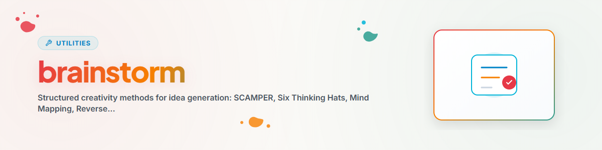

> **Français** — Documentation officielle complète traduite en français pour la compétence `brainstorm`.


> **English** — Offizielle English-Version / Documento Oficial en English.


# Brainstorm (English)

> Structured creativity for innovation — SCAMPER, Six Hats, Mind Mapping, Reverse Brainstorming, TRIZ, Rapid Ideation

---

## When to Use?

- New ideas needed
- Stuck / creativity block
- Innovation sought
- Solve a problem creatively

**Trigger words:** brainstorm, ideas, creative, innovative, ideation

---

## Methods

### 1. SCAMPER

**Substitute, Combine, Adapt, Modify, Put to other use, Eliminate, Reverse**

Systematically improve existing solutions:
- **S**ubstitute: What can be replaced?
- **C**ombine: What can be combined?
- **A**dapt: What can be adapted?
- **M**odify: What can be changed?
- **P**ut to other use: What else could it be used for?
- **E**liminate: What can be removed?
- **R**everse: What can be reversed?

---

### 2. Six Thinking Hats (Edward de Bono)

Systematically think through 6 perspectives:

- **White Hat — Facts:** What information do we have? What's missing?
- **Red Hat — Emotion:** How does it feel? Intuition, gut feeling
- **Black Hat — Critique:** What could go wrong? Risks, weaknesses
- **Yellow Hat — Optimism:** What are the opportunities? Best case
- **Green Hat — Creativity:** New ideas? Out-of-the-box?
- **Blue Hat — Meta:** Process control, summary, next steps

**Process:** Define problem (Blue) -> Facts (White) -> Emotions (Red) -> Critique (Black) -> Positives (Yellow) -> New ideas (Green) -> Summarize (Blue)

---

### 3. Mind Mapping

Visualize thoughts hierarchically:
1. Central topic
2. Main branches (3-7)
3. Sub-branches for each category
4. Add details and ideas
5. Identify connections

---

### 4. Reverse Brainstorming

Invert the problem: "How do we make it WORSE?"

1. Invert the problem
2. Collect bad ideas
3. Reverse = Good ideas

Particularly effective when direct ideation is stalled.

---

### 5. TRIZ (Theory of Inventive Problem Solving)

Top 10 Principles for Software:
1. **Segmentation:** Split monolith into modules
2. **Extraction:** Isolate disturbing property
3. **Local Quality:** Different components, different properties
4. **Merging:** Combine similar functions
5. **Universality:** One element, multiple functions
6. **Nesting:** Components within components
7. **Preliminary Action:** Preparation in advance
8. **Feedback:** Monitoring and adaptation
9. **Self-Service:** System maintains itself
10. **Asymmetry:** Non-symmetrical designs

---

### 6. Rapid Ideation

Quantity over quality — 50+ ideas in 20 min.

**Rules:**
- NO criticism during ideation
- WILD ideas welcome
- Build on others' ideas
- Quantity FIRST

**Timer-based:**
- Round 1 (5 min): Open ideation
- Round 2 (5 min): Variations
- Round 3 (5 min): Combinations
- Round 4 (5 min): Extreme ideas

---

## Flux de Travail et Étapes d'Exécution & Execution Steps

```
1. User request
2. Understand goal
3. Choose method(s)
4. Generate ideas (no criticism!)
5. Clustering
6. Feasibility/Impact matrix
7. Top 5-10 selection
8. Output + recommendation
```

---

## Journal des Modifications

### 1.0.0 (2026-03-15)
- Ported from BACH v3.8.0

---

*Ported from BACH v3.8.0 | Standalone Version*