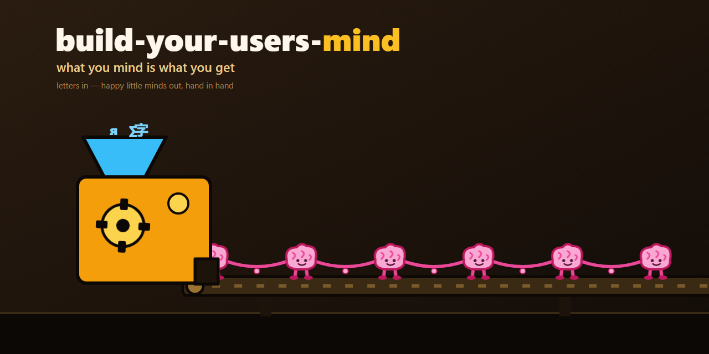

# build-your-users-mind — öffentlicher, anbieterneutraler Verweis

Dieser Skill ist ein schlanker Verweis auf das öffentliche Modul
[`ellmos-ai/build-your-users-mind`](https://github.com/ellmos-ai/build-your-users-mind).
Das Modul enthält das vollständige Verfahren, Vorlagen, Schemas, Skripte, Tests
und die Dokumentation der Quelladapter. Dieser Katalog dupliziert den Code
nicht.

## Was das Modul leistet

Mit ausdrücklicher Freigabe der zuständigen Person unterstützt das Modul einen
Agenten dabei:

1. echte, vom Nutzer verfasste Beiträge aus dessen eigenen
   Interaktionsprotokollen zu extrahieren;
2. sensible Inhalte vor dauerhafter Speicherung zu redigieren;
3. Belege über wiederkehrende Präferenzen und Entscheidungen zu reduzieren und
   zu klassifizieren;
4. ein lokales Präferenzmodell mit Konfidenzstufen und Herkunftsnachweisen
   aufzubauen;
5. einen kurzen Verweis in die gewählte Agentenlaufzeit einzubinden; und
6. Vorhersagen anhand späterer echter Rückmeldungen zu kalibrieren.

Das öffentliche Modul ist ein Verfahren für beliebige Nutzer und unterstützte
Agentenlaufzeiten. Es enthält kein Modell einer bestimmten Person.

## Sicherheits- und Datenschutzgrenze

- Vor dem Lesen von Interaktionsprotokollen ist die Freigabe der zuständigen
  Person erforderlich.
- Persönliche Profile, Rohprotokolle, Belegkorpora und lokale Pfade bleiben
  privat.
- Vorhersagen sind unsichere Hypothesen, kein Gedankenlesen, keine Diagnose und
  keine Aussagen des Nutzers.
- Eine Präferenzvorhersage erweitert niemals die Befugnisse des Agenten.
- Externe, irreversible, sicherheitskritische, rechtliche, medizinische,
  berufliche, finanzielle oder ähnlich folgenreiche Handlungen benötigen eine
  ausdrückliche Bestätigung.
- Vom Agenten erzeugte Vorhersagen dürfen niemals zu Primärbelegen über den
  Nutzer werden.

## Installation

```bash
git clone https://github.com/ellmos-ai/build-your-users-mind.git <clone-path>
```

Befolge die aktuellen Dateien `README.md`, `SKILL.md`,
`SOURCE-ADAPTERS.md` und die Datenschutzanweisungen des Moduls. Bewahre das
erzeugte Nutzerprofil außerhalb öffentlicher Repositories auf. Für
Implementierung und Versionierung ist das Modul-Repository maßgeblich.

## Öffentlicher Kern und private Profile

`build-your-users-mind` ist der öffentliche, nutzerneutrale Modulname.
`decision-avatar` ist das öffentliche Laufzeitprotokoll dieses Katalogs. Der
Avatar einer benannten Person, Belegdateien, lokale Befehle und
profilspezifische Vorgaben sind private Erweiterungen und dürfen nicht unter
einem persönlichen Skill-Namen veröffentlicht werden.

## Änderungsprotokoll

### 1.0.0 (2026-07-30)

- Neutralen Verweis auf das eigenständige öffentliche Modul ergänzt.
- Das zuvor veröffentlichte persönliche Avatar-Profil durch eine strikte
  Grenze zwischen öffentlichem Kern und privatem Profil ersetzt.
