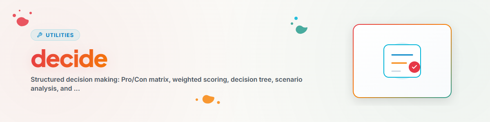

> **日本語** — `decide` の公式日本語版。


# Decide — 構造化意思決定 (日本語)

> 構造化されたフレームワークと評価手法による合理的意思決定

---

## 使用タイミング

- 複数の選択肢から選択する場合
- メリット・デメリット一覧が必要な場合
- 多基準評価による意思決定
- 重要な決定に不確実性がある場合

**トリガーワード:** decide, choose, compare, evaluate, weigh

---

## フレームワーク

### 1. メリット・デメリット行列（シンプル）

2つの選択肢間の迅速な決定。

```
PRO A:                    CON A:
- Advantage 1             - Disadvantage 1
- Advantage 2             - Disadvantage 2

PRO B:                    CON B:
- Advantage 1             - Disadvantage 1
- Advantage 2             - Disadvantage 2

Recommendation: [A/B] because [reasoning]
```

---

### 2. 加重スコアリング（複雑）

重み付けを伴う多基準評価。

| 評価基準 | 重み | 選択肢 A | スコア A | 選択肢 B | スコア B |
|-----------|--------|----------|---------|----------|---------|
| 基準 1 | 30% | 8 | 2.4 | 6 | 1.8 |
| 基準 2 | 25% | 7 | 1.75 | 9 | 2.25 |
| 合計 | 100% | - | X.XX | - | X.XX |

**プロセス:**
1. 評価基準を収集
2. 重みを割り当て（合計 = 100%）
3. 選択肢を評価（1〜10点スケール）
4. スコアを計算（評価 × 重み）
5. 比較して推奨事項を提示

---

### 3. 意思決定ツリー（シーケンシャル）

明確な if-then パスを持つ意思決定：
1. 出発点となる質問を定義
2. 第1分岐（最も重要な基準）
3. 次のレベル（2番目に重要な基準）
4. 最終選択肢に到達

---

### 4. シナリオ分析（不確実性）

```
Best Case (X% probability):
  Outcome: +Y points -> Expected value: +Z

Realistic Case (X%):
  Outcome: +Y -> Expected value: +Z

Worst Case (X%):
  Outcome: -Y -> Expected value: -Z

Total expected value: [Sum]
```

---

### 5. アイゼンハワーマトリクス（優先順位付け）

```
              URGENT          NOT URGENT
IMPORTANT     1. DO           2. PLAN
NOT IMPORTANT 3. DELEGATE     4. ELIMINATE
```

---

## 品質チェックリスト

最終推奨事項の提示前にチェック：
- [ ] 関連するすべての基準が特定されているか？
- [ ] ユーザーの価値観が考慮されているか？
- [ ] 長期的な影響が考慮されているか？
- [ ] リスクが特定され評価されているか？
- [ ] バイアスチェックが実施されているか？
- [ ] 可逆性が評価されているか？

---

## ベストプラクティス

### 評価基準の定義
- 具体的に測定可能
- 多すぎない（3〜7個が理想）
- 互いに独立していること

### 重み付け
- 合計 = 100%
- 最も重要な基準 >= 25%
- 5%未満の重みは設定しない

### 推奨事項
- 明確で根拠がある
- 代替案に言及
- リスクを明示
- 可逆性を考慮

---

## ワークフローと手順

```
1. User request
2. Understand decision
3. Identify options (2-5)
4. Choose framework
5. Collect criteria
6. Apply framework
7. Bias check (optional)
8. Make recommendation
9. Document reasoning
```

---

## 変更履歴

### 1.0.0 (2026-03-15)
- BACH v3.8.0 より移植

---

*BACH v3.8.0 より移植 | スタンドアロン版*