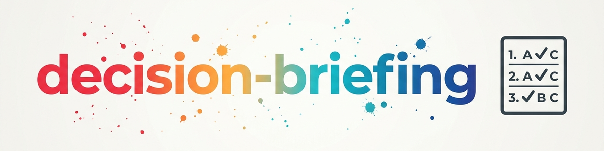

> **中文** — `decision-briefing` 官方中文版本。


# Decision-Briefing — 集中高效处理同一主题下的多个决策 (中文)

> 将一堆待处理决策梳理为带推荐建议的编号简报，用户只需通过单个字母（逐个或批量）即可极速完成决策。

---

## 适用场景

**只要有多个决策待处理**，无论涉及什么主题，均应使用。典型场景：

- 某领域/主题下积压了大量未决决策
- 某文档（计划、TODO 列表、方案）包含多个待定事项
- 在对话过程中积累了多个决策问题
- Agent 本身有多个问题需要询问用户——将其打包为简报，而非逐一发问
- 用户希望在坚实的基础上快速清空待办事项

**触发词 (Trigger words):** open decisions, decision session, briefing, work through, go through, let's decide all of me

**适用范围:** [decide](../decide/SKILL.en.md) 为单个问题提供分析框架。`decision-briefing` 负责协调处理同一主题下的多个决策，并在面对复杂个案时调用 `decide`。

---

## 核心交互体验 (Core UX)

本技能的核心在于简报格式。每个决策的呈现方式都经过优化，使用户只需回复单个字母即可回答：

- **编号体系:** `[E01]`, `[E02]`, … — 在整个会话过程中保持稳定引用
- **简短问题** + 1–2 句背景上下文
- **字母选项** A/B/C/D（2–4 个选项，仅在必要时提供更多）
- **明确推荐** 及一句话理由（例如：`→ 推荐: A — 因为 …`）
- 可选：后果提示（做出选择后会带来什么影响）

**用户回复格式:**

```
Single:    "E01: A"  or  "1A"
Batch:     "1A 2C 3B"  or  "E01: A, E02: C, E03: B"
Deepen:    "E02: more info"  or  "2?"
Defer:     "E03: later"
```

---

## 工作流与步骤

```
Topic + decisions at hand
     |
     v
Phase 1: CAPTURE & INVENTORY
     |
     v
Phase 2: PREPARE THE BRIEFING
     |
     v
Phase 3: DECISION SESSION
     |
     v
Phase 4: RECORD & WRITE BACK
```

### 阶段 1: 捕获与清点

来源：用户提到的内容、现有文档或对话上下文。无需进行全系统扫描——仅针对现有的内容。

1. 列出所有未决决策（每行一个：简短标题）
2. 识别并合并**重复项**（表述不同但本质相同的问题）
3. 标记**依赖关系**（“E04 依赖于 E01”）
4. 设定**处理顺序**: 阻塞性决策优先（其他决策依赖的前提），其次按紧急程度排序
5. 将列表展示给用户进行确认（“是否已全额收集？是否有遗漏？”）

### 阶段 2: 准备简报

针对每个决策：

```
[E01] <Short question>
  Context: <1-2 sentences: Why is this up? What depends on it?>
  A) <Option>
  B) <Option>
  C) <Option>
  → Recommendation: <letter> — <one-sentence rationale>
  (optional) Consequence: <what follows from the choice / next action>
```

良好选项设置的规则：

- 选项之间必须互斥，且能够覆盖各种可能性
- 如果适用，包含“保持现状”或“暂缓”选项
- 推荐理由透明充分——绝不可隐晦引导
- 当事实尚不明确时：先进行澄清（或标记为开放性问题），切勿盲目猜测

### 阶段 3: 决策会话

1. 呈现简报——每次消息提交一个决策，或作为批量一次性提交；当决策数量 >5 时，按 3–5 个一组分块呈现
2. 接收字母回复并予以确认
3. 当收到“需要更多信息”的回复时：深入分析该决策（参照下方方法工具箱）
4. 对于复杂个案（维度多、风险高）：升格至 [decide](../decide/SKILL.en.md) 技能（加权评分、情景分析）
5. 将推迟的决策显式保留为待处理状态——切勿默默丢弃

### 阶段 4: 记录与写回

1. 建立**结果表格**:

```
| No.  | Decision            | Chosen | Status   |
|------|---------------------|--------|----------|
| E01  | <short title>       | A      | decided  |
| E02  | <short title>       | C      | decided  |
| E03  | <short title>       | —      | deferred |
```

2. 将已决事项写回**源文档/TODO 文件**——在原开放性问题的位置，例如：

```
DECISION: <question>
  → DECIDED 2026-06-13: Option A (<short form>)
  → Next action: <if the decision implies a follow-up action>
```

3. 将**推迟事项显式保留为开放状态**（在源文档或 TODO 列表中），以便在下一次简报中再次呈现

---

## 示例与应用

主题：某俱乐部网站重构——项目计划中的 3 个待定决策。

```
[E01] Which system for the new website?
  Context: Current site is hand-maintained HTML; 2 people will maintain content in the future.
  A) Static site generator (fast, secure, maintained via Git)
  B) Classic CMS with admin interface
  C) Hosted website builder
  → Recommendation: B — two non-technical editors need an interface, not Git.

[E02] How is it hosted?
  Context: Budget ~10 EUR/month, no dedicated admin in the club.
  A) Shared hosting with the current provider
  B) Small dedicated VPS
  C) Managed hosting matching the chosen system
  → Recommendation: C — least maintenance effort without an admin; consequence: depends on E01.

[E03] When does the new site go live?
  Context: Content is 60% migrated; club anniversary in 3 months.
  A) Immediately as a soft launch (rest follows)
  B) After complete content migration
  C) On the anniversary as the deadline
  → Recommendation: A — reversible and yields early feedback; final content follows.
```

用户以批量方式回复：**"1B 2C 3A"** → 生成结果表格，随后在项目计划中将这三个决策标记为 DECIDED。

---

## 方法工具箱 (用于“更多信息”及深入分析)

| 方法 | 适用场景 | 概要 |
|--------|------|---------|
| **优缺点矩阵** | 2–3 个选项，快速对比 | 并排评估所有选项 |
| **加权评分** | 多项评估标准 | 加权标准，为各选项打分（尽可能定量） |
| **二阶思维** | 后果/利害关系不明确 | 后果的后果是什么？ |
| **事前剖析 (Premortem)** | 风险决策 | “项目失败了——为什么？” 提前找出薄弱环节 |
| **10/10/10 法** | 情绪/时间维度偏差 | 10分钟/10个月/10年后，这个决策看起来会怎样？ |

---

## 工作原则

- **切勿强推决策:** 提供充分信息，透明地解释推荐理由——最终决定权在用户
- **偏见识别:** 当思维误区变得显现时明确指出（确认偏误、沉没成本等）
- **注意可逆性:** 快速做出可逆决断，对不可逆的决定更加审慎地对待
- **尊重时间压力:** 快速决策需要更简捷的方法——并非每个问题都需要做加权评分分析

---

## 适用范围与协同效应

| 功能 | `decide` | `decision-briefing` |
|---|---|---|
| 使用特定框架结构化单个决策 | ✓ | — |
| 清点梳理某一主题下的多个决策 | — | ✓ |
| 带有 A/B/C 选项的编号简报 | — | ✓ |
| 批量回复处理 ("1A 2C 3B") | — | ✓ |
| 将决策写回源文档 | — | ✓ |

**协同效应:** 对于会话中遇到的复杂个案，`decision-briefing` 可以应用来自 `decide` 的框架（如加权评分、情景分析）。对于此前更宏大的思考过程（分析 → 构思 → 决策），请参阅 [structured-thinking](../structured-thinking/SKILL.en.md)。

---

## 更新日志

### 1.0.0 (2026-06-13)
- 从 BACH 专家 `decision-briefing` v1.0.0 移植；刻意移除了扫描器组件 (scanner.py, sources.json, marker scans) —— 捕获过程保持轻量，基于现有上下文进行

---

*从 BACH 移植 | 不带扫描器的独立版本*

**参见:** [decide](../decide/SKILL.en.md) (单个决策的分析框架) | [structured-thinking](../structured-thinking/SKILL.en.md) (分析 → 构思 → 决策 元工作流)