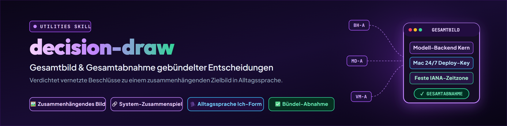

# decision-draw — Big Picture and Overall Sign-Off for Bundled Decisions

> When five or ten decisions are pending, one easily gets lost in the weeds of
> isolated options and loses sight of the emerging system. decision-draw does not
> describe the alternatives; it paints the working whole: How do the systems
> cooperate once all recommendations are in place? The user signs off on the picture
> as a whole or provides targeted feedback.

---

## When to use

- Multiple interdependent decisions (from [decision-briefing](../decision-briefing/SKILL.md) or a decision briefing document) should not be grinded through as a tedious checklist of individual questions.
- The user wants to see how components actually interact in daily practice after implementation before approving them.
- A cluster of tightly coupled decisions identified via the dependency graph ([decision-path](../decision-path/SKILL.md)) can be signed off together as a functional unit.
- Trigger words: `/decision-draw`, "what does the whole thing look like if we agree to everything", "draw the big picture", "overall decision concept", "decision draw", "how do the systems work together afterwards", "overall sign-off picture".
- Do **not** use:
  - When the user wants to evaluate distinct options per item and choose via letters (A/B/C) — that is done by [decision-briefing](../decision-briefing/SKILL.md).
  - For pure causality and bottleneck analysis in the terminal — that is done by [decision-path](../decision-path/SKILL.md).
  - For isolated option evaluations in 5-part discrete blocks (context, pro/con per option, recommendation) for single issues or tightly grouped questions — that is done by [decision-shot](../decision-shot/SKILL.md).
  - To methodically evaluate a single open policy question — that is done by [decide](../decide/SKILL.md).

---

## Boundaries in the Decision Family

| Skill | UX & Focus | Stance on Options | Sign-off Mode |
|---|---|---|---|
| `decision-briefing` | **Decomposes** into individual items | Shows all options A/B/C/D | Letter codes (`1A 2C 3B`) |
| `decision-path` | **Structures** causalities | Evaluates options in graph | Terminal diagnostics (ASCII) |
| `decision-draw` | **Cohesive target picture** (bundles interdependent decisions) | Describes **only the recommended variant** (alternatives linked) | Holistic sign-off or correction sentence |
| `decision-shot` | **Structured discrete blocks** (for single issues or tight groups) | Shows options with 2–4 pro/con bullet points | Executive decision / individual review |
| `decide` | **Works out** single issue | Evaluation matrix (criteria) | Analytical recommendation |

> **Core Rule:**
> `decision-draw` describes **exclusively the recommended variant**. The discarded alternatives have not vanished — they are documented in [decision-briefing](../decision-briefing/SKILL.md), [decision-shot](../decision-shot/SKILL.md), or linked tickets, and are referenced in the header table. A draw without this link takes away the user's choice instead of simplifying it.

---

## Mandatory Structure (Seven Parts)

A complete `decision-draw` strictly follows this seven-part layout:

### 1. Bundle and Scope
Tabular summary of all items included in the bundle:
- Abbreviation / ID (e.g. `BH-A`, `MD-A`, `CF-A`)
- Ticket reference
- Short title of the item
- Assumed recommendation (the premise of this overarching picture)
- `decision-avatar` confidence (🟢 documented, 🟡 trade-off, 🔴 needs escalation)
- Link to full analysis / alternatives

### 2. Concept
The target state in cohesive prose:
- What system landscape or workflow emerges when all recommendations are executed exactly as planned?
- No side-by-side option comparison, no subjunctive hedging ("one could also").
- Clear, confident indicative tense: This is how the system operates in its target state.

### 3. Interplay
The functional core of the skill:
- How do the decided components actually mesh together **after** implementation?
- Framed along a concrete end-to-end operational flow (e.g. "A ticket arrives → agent starts → backend assigns → deploy to host") rather than a static list of components.
- Clarifies data flows, interfaces, and operational responsibilities.

### 4. Implementation
The concrete sequence of rollout steps:
- What happens in practice, step by step?
- Inherits execution sequence and dependency logic directly from [decision-path](../decision-path/SKILL.md).
- Independent workstreams are represented honestly as parallel tracks (do not invent artificial causal chains; a bundle can consist of multiple parallel tracks). Sequential ordering is asserted only where substantiated dependencies or deadlines exist.
- Highlights gates, migration scripts, and validation checks.

### 5. What This Picture Does Not Cover
Boundary defense against false completeness:
- Which secondary questions, unresolved issues, or 🔴 confidences are deliberately excluded?
- Where are the boundary lines to neighboring systems?
- A picture that conceals its margins produces a false sense of safety.

### 6. Sign-Off
The user interaction:
- The user reviews the picture as a whole.
- Response option 1: **Explicit overall sign-off** ("Looks good", "Approved", "Implement everything as proposed"). Only in this case are all bundle items booked as decided.
- Response option 2: **Targeted correction in natural language** ("Prefer the smaller variant for BH-A", "No auto-restart for MD-A", "Keep VM-A as is"). Triggers decomposition into discrete decisions; all uncorrected items remain open.

### 7. Back-Transfer
The systematic translation of user feedback into individual ledger entries:
- **No Automatic Co-Booking:** Unaltered items are booked **only upon explicit overall sign-off**. A partial correction is **not** an overall approval!
- **Isolation upon Correction:** If the user submits a correction, it is decomposed into individual decisions; all other items in the bundle remain strictly **open** (in source tickets / ledger) until the user accepts the adjusted picture as a whole or confirms remaining items individually.
- **Mandatory Back-Transfer Table:** Every partial feedback generates a structured evaluation table with four columns:
  1. *Original Correction*: Verbatim user statement.
  2. *Affected Keys*: Which bundle IDs are altered (including multi-hits when one statement touches multiple decisions).
  3. *Domino Status*: Which dependent nodes or downstream assumptions in [decision-path](../decision-path/SKILL.md) collapse or require re-evaluation.
  4. *Open Ambiguities*: Where the correction allows multiple interpretations requiring clarification before booking.
- **Handling Multi-Hits:** A single user statement can alter multiple decisions simultaneously. The back-transfer must untangle this coupling and capture all affected keys together.
- **Exclusive Write Path via Phase 4:** `decision-draw` has **no** native write path to tickets or registers. Ledger updates occur **exclusively** via the standardized protocol in [decision-briefing](../decision-briefing/SKILL.md) Phase 4 (logging and persistence into `DECIDED-AND-DONE.md` or `TO-DECIDE-USER.txt`).

---

## Example (Pilot Dataset: Ticket-Master 2026-09-13 — BACH & System Cluster)

Real bundle from the Ticket-Master decision briefing dated 2026-09-13: `BH-A`, `MD-A`, `CF-A`, `VM-A`, `PD-A`.

```markdown
# DECISION-DRAW: BACH Core Cluster & Operational Integrity

## 1. Bundle and Scope

| Key | Ticket / Source | Topic | Assumed Recommendation | Confidence | Alternatives & Details |
|---|---|---|---|---|---|
| `BH-A` | `T-20260913-896336887` | Model backend = Heart | 1A / 2A / 3A / 4B / 5A / 6A | 🟢 | `docs/MODELL-BACKEND-KONZEPT_2026-09-13.md` |
| `MD-A` | `T-20260913-799464688` | Mac deploy & restart | A1 + script (report-only for 24/7) | 🟢 | Ticket `T-20260913-799464688.txt` |
| `CF-A` | `T-20260913-947070291` | Config targets across hosts | 1C (justified) / 2B (host-dep.) / 3B (high) | 🟢 / 🟡 | Ticket `T-20260913-947070291.<HOST>.txt` |
| `VM-A` | `T-20260906-496406575` | VersicherungsManager timezone | A (app-wide settings like routinika) | 🟢 | Ticket `T-20260906-496406575.<HOST>.txt` |
| `PD-A` | `T-20260913-609930207` | USMC page visibility | A (align declaration to public, status quo) | 🟢 | Ticket `T-20260913-609930207.txt` |

*Note: All discarded alternatives (e.g. BH-A E5=B ocean-heart, MD-A A2 full write keys, VM-A B per-profile zones) remain documented in the Ticket-Master decision briefing.*

---

## 2. Concept

We establish a clean, decoupled multi-host architecture where the model backend is
operated as an independent core module named `agents-heart`. Roles, rights, and budgets
are cleanly maintained in a relational SQLite database, while model routing decisions
occur in two stages: BACH builds the domain-qualified candidate set, and clutch selects
the cost- and capability-optimal model within that set.

On the Mac Studio, 24/7 background services operate safely and reliably using a read-only
deploy key; code updates are pulled automatically, and running 24/7 services are gently
notified rather than violently terminated. Configurations may remain host-specific where
performance demands it, while app-wide settings (such as timezones in VersicherungsManager
following the proven routinika pattern) are deterministically hard-wired. USMC remains
the canonical public memory facade and retains its place on the public website.

---

## 3. Interplay

The five items do not form a serial causal chain; instead, they represent modular, decoupled pillars of daily operational integrity that interlock in parallel across the system:

- **Core Architecture & Model Routing (`BH-A`):** The `agents-heart` module decouples model assignment. When a task arrives, BACH determines the domain-qualified candidate set and clutch selects the cost- and capacity-optimal model.
- **Host Configuration & Deploy Integrity (`CF-A`, `MD-A`):** While consistent reasoning effort applies to the laptop and workstation (`CF-A`; host-dependent models remain transparent), the Mac Studio runs persistent background processes under validated settings. For updates, the Mac pulls code via read-only deploy key (`MD-A`); the GUI server restarts while long-running 24/7 services gently notify the dashboard of update requirements.
- **Domain Persistence & Deadlines (`VM-A`):** Applications such as VersicherungsManager persist deadlines against an app-wide `settings` table following the routinika pattern. Calculations and deadline watchers operate deterministically across all profiles on the same IANA timezone.
- **Public Presentation (`PD-A`):** The nightly site builder validates repository states. USMC is published cleanly under its corrected `public` declaration, triggering zero alerts in the security gates.

---

## 4. Implementation

Because the source dataset does not substantiate a serial chain across these five items in the dependency graph ([decision-path](../decision-path/SKILL.md)), rollout is honestly structured into four independent, parallel workstreams (Approach a: parallel tracks instead of invented causality). Sequential ordering applies only where external deadlines or internal steps exist:

- **Track A (Time-Critical — Deadline 2026-09-14):**
  1. Align USMC metadata to `public` (`PD-A`); discard Draft PR #2. Delays cannot be tolerated due to the nightly builder run, yet this step is technically completely independent of all other tracks.
- **Track B (Host Configuration & Mac Deploy — Parallelizable):**
  1. B1: Codify configuration targets in `.SYNC` (`CF-A`), synchronizing reasoning effort to `high` across both hosts.
  2. B2 (independent of B1): Install read-only deploy key on Mac Studio and set up the pull-and-report automation script (`MD-A`).
- **Track C (Domain Database — Parallelizable):**
  1. Implement the app-wide `settings` table migration in VersicherungsManager following the routinika pattern (`VM-A`), establishing the clean baseline for subsequent publisher development.
- **Track D (Architectural Extraction — Internal Multi-Stage Plan):**
  1. D1: Set up SQLite schema for roles and budgets in `agents-heart` (`BH-A` E1).
  2. D2: Carve out the backend catalog as a Python module (`BH-A` E3) and bind the clutch allocation seam (`BH-A` E2).
  3. D3: Extract and bind the `agents-heart` module (`BH-A` E5, E6).

---

## 5. What This Picture Does Not Cover

- **Task-Claiming Race Condition:** The concurrency bug allowing duplicate task claims
  is being addressed in a dedicated hotfix ticket and is outside this sign-off.
- **Cockpit Frontend:** The monitoring cockpit (`BH-A` E4) is deliberately deferred until
  the backend produces live operational telemetry.
- **Publishing Public Repositories:** Merging and staging code does not automatically
  make private repositories public; final visibility toggles remain reserved for the user.

---

## 6. Sign-Off

You can sign off on this system cluster as a whole or provide natural-language adjustments:

- **Explicit Overall Sign-Off:** "Looks good, implement exactly as proposed." (Only this triggers booking of all items).
- **Example Corrections:**
  - *"No host-specific special handling for the Mac: MD-A needs full write keys (A2) for direct pushing, and CF-A should strictly align all configurations to the workstation (Group 1=A, 2=A)."* (Multi-hit)
  - *"For BH-A E5, name it ocean-heart instead of agents-heart."*
  - *"Postpone VM-A for now; the publisher can wait."*

---

## 7. Back-Transfer

When the concept is approved or amended, the skill translates the feedback into ledger entries:

### Case A: Explicit Overall Sign-Off
When the user explicitly approves the overarching picture as a whole (e.g. *"Looks good, implement exactly as proposed"*):
- All five items (`BH-A: 1A/2A/3A/4B/5A/6A`, `MD-A: A1`, `CF-A: 1C/2B/3B`, `VM-A: A`, `PD-A: A`) are passed as DECIDED to [decision-briefing](../decision-briefing/SKILL.md) Phase 4.
- Phase 4 performs the ledger entry into `DECIDED-AND-DONE.md` and updates the five source tickets.

### Case B: Partial Correction with Multi-Hit
When the user submits substantive feedback, e.g.:
> *"No host-specific special handling for the Mac: MD-A needs full write keys (A2) for direct pushing, and CF-A should strictly align all configurations to the workstation (Group 1=A, 2=A)."*

**1. Structured Back-Transfer Table:**

| Original Correction (User Wording) | Affected Keys | Domino Status (dependent nodes affected) | Open Ambiguities |
|---|---|---|---|
| *"No host-specific special handling for the Mac: MD-A needs full write keys (A2) for direct pushing, and CF-A should strictly align all configurations to the workstation (Group 1=A, 2=A)."* | `MD-A`, `CF-A` *(Multi-hit: 1 statement moves 2 items)* | **`MD-A`:** Flips from A1 to A2. Requires SSH write key on Mac Studio, push rights in GitHub repo `bach`, and security review of the LaunchAgent.<br>**`CF-A`:** Group 1 flips from C to A (laptop Claude Desktop becomes more restrictive). Group 2 flips from B to A (`codex.model` strictly aligned). Group 3 remains B (`high`), already synchronized. | **`CF-A` Group 1:** User demands alignment to workstation (1=A) — clarification required whether the previously deliberate permissiveness on the laptop should truly be revoked.<br>**`MD-A`:** Unclear whether write key applies to all repositories or exclusively to `bach`. |

**2. Status of Untouched Items (Protection against Unsolicited Co-Booking):**
- The unaltered items `BH-A`, `VM-A`, and `PD-A` are **not** booked!
- They remain strictly in status **OPEN** (`PENDING`) in the briefing template / register `TO-DECIDE-USER.txt`.
- A partial correction is **not** an overall sign-off. Only when the adjusted overall picture is subsequently approved or the remaining items are individually confirmed may they be booked.

**3. Booking Path:**
- `decision-draw` has no native write mechanism.
- Only what the table marks as unambiguous is handed to **[decision-briefing](../decision-briefing/SKILL.md) Phase 4**: `CF-A` Group 2 = A and Group 3 = B.
- `MD-A` and `CF-A` Group 1 are **not** handed over — both carry an entry in the *Open Ambiguities* column. An ambiguity you wanted clarified before booking must not be booked as clarified in the same round.
- Phase 4 logs the unambiguous parts with rationales into ticket `T-20260913-947070291.txt` and updates `DECIDED-AND-DONE.md`. Ticket `T-20260913-799464688.txt` (`MD-A`) stays open until the clarification is answered.
```

---

## Practical Rules

1. **Avoid Subjunctive Phrasing in Concept:** Describe the system as if already built. The user needs total clarity on the end state, not theoretical possibilities.
2. **Causality Precedes Chronology:** Execution order in *Implementation* mirrors the dependency graph layers from [decision-path](../decision-path/SKILL.md). Independent workstreams must be honestly represented as parallel tracks rather than bent into an artificial causal chain.
3. **Explicit Domino Checks during Back-Transfer:** Never record a user correction in isolation without verifying whether dependent nodes in the graph are invalidated or impacted.
4. **No Automatic Co-Booking upon Partial Corrections:** Only explicit overall sign-off books unaltered items. For every partial correction, all untouched items remain strictly open until the revised picture is approved or items are individually confirmed.
5. **Exclusive Write Path via Phase 4:** `decision-draw` possesses no native write mechanism. All ledger and ticket bookings proceed strictly via [decision-briefing](../decision-briefing/SKILL.md) Phase 4.
6. **Adhere to Ledger Rules:** All bookings must comply with register contracts (no ID renumbering, canonical booking codes, canonical target `DECIDED-AND-DONE.md`).

---

## Session Provenance

When a decision draw is stored as a persistent concept artifact, it concludes with:

`session: <session-id> | <agent>@<host> | YYYY-MM-DD`

- Source priority: Explicit runtime/CLI argument, then authoritative provider environment or hook, otherwise `unknown`.
- Subagents inherit their parent session ID.
- Routine chat outputs do not receive a provenance stamp.

---

## Changelog

### 1.0.1 (2026-09-13)
- Rework following independent review:
  - Hardened back-transfer contract: No automatic co-booking on partial corrections; untouched items remain strictly open until overall sign-off.
  - Introduced mandatory 4-column back-transfer table (Original Correction, Affected Keys, Domino Status, Open Ambiguities).
  - Demonstrated multi-hit feedback in example (one user statement moving `MD-A` and `CF-A` simultaneously).
  - Established exclusive write path via `decision-briefing` Phase 4 in both contract and example.
  - Eliminated unsubstantiated causal chain in example: Independent items honestly mapped into four parallel workstreams (Approach a).
  - Clarified distinction with `decision-shot` based on output format (structured discrete blocks with pro/con vs. cohesive target picture with overall sign-off).

### 1.0.0 (2026-09-13)
- Initial release based on user order T-20260913-107991667.
- Mandatory seven-part structure (bundle, concept, interplay, implementation, boundaries, sign-off, back-transfer).
- Bundling logic based on `decision-path` and back-transfer bridge to `decision-briefing` Phase 4.
