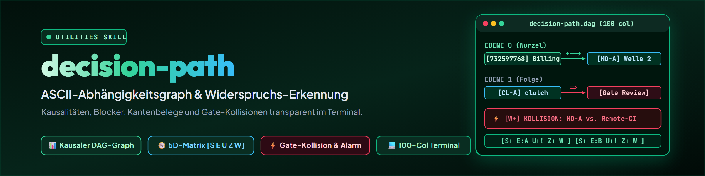

# decision-path — ASCII Dependency Graph of Pending Decisions

> Decisions do not happen in a vacuum. What seems reasonable in isolation
> frequently blocks subsequent work, presupposes unbuilt precursors, or circumvents
> established safety gates. decision-path brings causalities, execution sequences,
> and contradictions transparently to the terminal.

---

## When to use

- An existing inventory of open decisions (from [decision-briefing](../decision-briefing/SKILL.md) Phase 1, a session context, or a ticket-master decision briefing) needs to be structured.
- You must identify which decisions can be acted on immediately (root nodes) and which depend on prerequisites or external blockers.
- You need an overview of which recommendations fit together harmoniously and where two recommendations logically or operationally collide.
- Trigger words: `/decision-path`, "which decisions depend on each other", "decision dependency graph", "visualize decision path", "ASCII decision tree", "contradictions between decisions", "check causal dependencies".
- Do **not** use:
  - To first discover and inventory open questions — that is done by [decision-briefing](../decision-briefing/SKILL.md) Phase 1.
  - To bundle recommended choices into a single coherent concept for sign-off — that is done by [decision-draw](../decision-draw/SKILL.md).
  - For compact five-part blocks with options and pro/contra per option — that is done by [decision-shot](../decision-shot/SKILL.md).
  - To methodically evaluate a single complex decision with frameworks (weighted scoring, scenario analysis) — that is done by [decide](../decide/SKILL.md).

---

## Boundaries in the Decision Family

| Skill | Role | Input | Output |
|---|---|---|---|
| `decide` | Methodically structures **a single** decision | Criteria, options | Scoring matrix, single decision |
| `decision-briefing` | **Decomposes many** open decisions into individual questions with options | List of pending points | Numbered A/B/C/D briefing, rough dependency markers, batch booking |
| `decision-path` | **Validates and visualizes causalities and contradictions** across many decisions | Rough markers from briefing / register | ASCII dependency graph with 5 node evaluations and edge status |
| `decision-draw` | **Bundles recommendations into a coherent whole** for sign-off | Bundles from `decision-path` | Concept, interplay (recommended variant only), back-transfer |
| `decision-shot` | Compresses **finished analyses** to their executive essence (1 decision or tight bundle) | 1 analyzed question or group | Five-part short form with options, pro/contra, and full analysis link |
| `decision-avatar` | Models **user preferences and behavioral history** | Context, past choices | Confidence rating 🟢 / 🟡 / 🔴 |

### Contract and Responsibility regarding decision-briefing

`decision-briefing` Phase 1 already derives rough dependencies and execution order during intake (e.g. from signals such as "Afterwards automatically:", blockers, or ticket references). `decision-path` does not duplicate this derivation, but builds directly upon these rough markers:

1. **decision-briefing provides rough markers:** It supplies the raw inventory of pending items and initial coupling cues.
2. **decision-path validates, evaluates, and visualizes:** It verifies signals against documented facts, separates confirmed from presumed edges, assigns the five evaluations per node, and exposes gate collisions.
3. **Feedback loop on discrepancies:** If `decision-path` discovers a dependency missing or misrepresented in the briefing, it never silently absorbs it, but explicitly reports it back as a correction note to the briefing.

---

## The Five Ratings per Node (and Edge Verification Status)

The five dimensions `[S E U Z W]` evaluate the **nodes** (pending or settled decisions in their systemic context). Edges carry their semantic relationship type (e.g. unlocking, blocking, prerequisite) and verification status (confirmed vs. presumed).

Every node in the graph displays a compact five-element assessment string:

```
[S+ E:<Option> U<Direction><Confidence> Z+ W-]
```

1. **Sensible (`S`)** — Technical and architectural soundness:
   - `S+`: Solution is robust, addresses a real problem, avoids artificial complexity.
   - `S~`: Partially sound, but carries maintenance or operational overhead.
   - `S-`: False solution, cosmetic activism, or a proven dead end (e.g. filtering at the wrong lever).

2. **Recommended (`E`)** — Concrete, evidence-backed recommended action:
   - `E:<Option>`: Clear choice (e.g. `E:A`, `E:B`, `E:resolve`, `E:Step1`).
   - `E-`: No actionable recommendation possible (missing facts or high-level policy question).

3. **User-typical (`U`)** — Alignment with the user's past habits and codified rules (via `decision-avatar`):
   Codes **direction** (does the option fit habits?) and **verification confidence** separately:
   - **Direction (first character after U):**
     - `+`: User-typical — matches past decisions, policies (`CLAUDE.md`), or explicit preferences.
     - `~`: Neutral / open — no dominant historical preference documented.
     - `-`: Atypical — departs from customary workflow or established habits.
   - **Verification confidence (second character):**
     - Pure ASCII inside the ASCII graph:
       - `!`: High / grounded (in prose: 🟢 documented).
       - `~`: Medium / plausible (in prose: 🟡 trade-off fundamentally belongs to user).
       - `?`: Low / unverified (in prose: 🔴 policy question, unprecedented). **Escalate rather than guess!**
   - *Examples:* `U+!` (typical and documented), `U+~` (typical, but user judgment), `U-!` (documented atypical), `U~?` (open, no precedent -> escalate).

4. **Coherent (`Z`)** — Soft architectural and stylistic harmony with neighboring nodes:
   - `Z+`: Integrates seamlessly with precursors and downstream decisions; forms a cohesive whole without friction.
   - `Z~`: Minor stylistic friction or operational overhead, but functionally viable.
   - `Z-`: Noticeable friction in systemic interplay (e.g. configuration sprawl, awkward coupling), but does not break a hard rule.

5. **Contradictory (`W`)** — Hard contradiction and policy/gate violation (**most critical output — alarm!**):
   - `W-`: Free of contradictions against other recommendations, policies, and active safety gates.
   - `W+`: **Hard collision / alarm!** Invalidates another recommendation, violates an established policy (`CLAUDE.md`, P-00x), or circumvents an active safety gate. Colliding nodes are always explicitly highlighted in the `CONTRADICTIONS` section with root cause and resolution path.

---

## Edge Types and Derivation Rules

Dependencies are **derived strictly from source text**, never invented. Edges carry their relationship type and verification status:

| Signal in Source | Edge Type | Notation | Meaning |
|---|---|---|---|
| "Afterwards automatically: ...", "unlocks", "enables" | Unlocks | `+-->` | Target decision becomes actionable only after source decision (documented) |
| "blocks", "prevents", "safety gate triggers" | Blocks | `=>` | Target is blocked until source is resolved |
| "requires", "needs beforehand", "prerequisite" | Requires | `-->` | Target logically and chronologically requires source |
| "follow-up decision", "step 2 afterwards" | Sequence | `-->` | Downstream logical progression after execution |
| "refuted by measurement", "obsolete", "superseded" | Invalidates | `--X-->` | Source insight renders target obsolete |
| Shared D-ID, Ticket-ID, or same subsystem without text proof | Presumed | `?-->` | Plausible coupling without documented causal proof (unverified) |

> **Rule for Unverified Edges:**
> When no explicit causal statement exists in the text, the edge must be marked as presumed (`?-->`) — never as confirmed fact. Where no relationship is documented, nodes remain unconnected side-by-side.

---

## Format Guidelines for the ASCII Graph

1. **Monospace & Terminal-Optimized:** Maximum line width **100 columns**. No wide tables that wrap and break terminal layout.
2. **Character Set & Purity:** Pure ASCII. Inside the graph code fence, no emojis (🟢🟡🔴) may appear; confidence is represented exclusively via ASCII markers (`!`, `~`, `?`).
3. **Node IDs:** Only existing identifiers (`PD-A`, `MD-A`, `BH-A`, `VM-A`, `QR-A`, `CL-A`, `MO-A`, `D-001`, `732597768`). Never invent synthetic IDs! If an item lacks an abbreviation, its item number is used. Follow-up internal steps are represented as unnumbered edge annotations `(...)`.
4. **Layered Structure:**
   - `LEVEL 0 - independent`: Root nodes, unblocked items, external triggers.
   - `LEVEL 1 - depends on exactly one`: Direct follow-ups.
   - `LEVEL 2 - depends on multiple / deep chain`: Multi-dependency or deep sequential nodes.
   - `CONTRADICTIONS`: Hard collisions, gate violations, and conflicting recommendations (`W+`).
   - `LEGEND`: Mandatory in every graph output. Every structural character used in the graph (`|`, `=Option`, `(...)`, edge arrows) must be listed and explained in the legend.
5. **Optional Mermaid Fence:** An additional `mermaid` code block may be appended if useful; the ASCII graph remains the primary, authoritative output.

---

## Example (Pilot Dataset: Ticket-Master 2026-09-13)

Real excerpt from the Ticket-Master decision briefing (`732597768`, `MO-A`, `CL-A`, `QR-A`, `387521104`, `CL-B`):

```
====================================================================================================
DECISION-PATH: DEPENDENCY GRAPH (Pilot Ticket-Master 2026-09-13)
====================================================================================================

LEVEL 0 - independent (Root decisions & external blockers)
  [732597768] Resolve GitHub billing issue                  [S+ E:resolve U+! Z+ W-]
      |  unlocks
      +--> [MO-A] Release Wave 2                            [S+ E:A       U+~ Z+ W-]

  [CL-A] clutch admin merge PR #6 & PR #8                   [S+ E:A       U+! Z+ W-]
      |  blocked by: [Gate "1 Approving Review" (self-approval impossible)]
      --> (follow-up decision: set branch protection to 0 or bot)

  [QR-A] Queue rename NTFS junction (_TICKETS -> TICKETS)   [S+ E:B       U+! Z+ W-]
      +--> [387521104] Night window runs                    (documented: only under B)

  [CL-B] Review gate pilot: Mac signing key                 [S+ E:Step1   U+~ Z+ W-]
      --> (follow-up steps 2-4: model automation after key provisioning)

LEVEL 1 - depends on exactly one precursor
  [MO-A] Release Wave 2                                     [S+ E:A       U+~ Z+ W-]
      |  requires: [732597768] (billing resolved, remote CI gates active again)
      |  requires: [Gate PRIVATE.txt "green remote CI"]
      --> (follow-up step: toggling visibility remains user-only action)

LEVEL 2 - depends on multiple / deep chain
  [387521104] Autonomous migration run in night window      [S+ E:B       U+! Z+ W-]
      |  requires: [QR-A]=B (NTFS junction established)
      |  requires: (junction set on the second host via transfer ticket -
      |             ticket number not stated in the briefing)

----------------------------------------------------------------------------------------------------
CONTRADICTIONS & GATE COLLISIONS
----------------------------------------------------------------------------------------------------
  [MO-A]=B  X  [Gate PRIVATE.txt "green remote CI"]
               Conflict: Option B would release Wave 2 based solely on local tests,
               even though two module contracts explicitly demand green remote CI.
               Resolution: Recommendation A forces [732597768] (billing) first, resolving collision.

  [CL-A]=StatusQuo  X  [Gate "1 Approving Review" (self-approval impossible)]
               Conflict: master demands 1 review, but sole repository account is lukisch.
               Resolution: Recommendation A (admin merge) legitimately breaks the dead end.

----------------------------------------------------------------------------------------------------
LEGEND & RATING KEY
----------------------------------------------------------------------------------------------------
  Edges & Structure:
    +-->   unlocks / enables (causality documented in source)
    =>     blocks / prevents (gate or external blocker)
    -->    requires / sequence (precondition or follow-up step)
    ?-->   presumed dependency (plausible coupling, but undocumented)
    --X--> invalidates / supersedes (source insight renders target obsolete)
    X      contradiction / collision (gate or policy violation)
    |      vertical hierarchy line / attribute mapping
    [ID]   decision node (item abbreviation or item number from briefing)
    [Gate]  external gate / rule / contract - NOT a decision node
    =Opt   specific option for a node (e.g. [MO-A]=B)
    (...)  unnumbered edge annotation / follow-up step (no invented synthetic ID)

  Node Assessment [S E U Z W]:
    S: Sensible      (+ sound / ~ qualified / - unsound)
    E: Recommended   (A, B, C, resolve, Step1, - none)
    U: User-typical  (direction: + typical / ~ neutral / - atypical;
                      confidence: ! grounded / ~ trade-off / ? escalation)
                      [! = documented (prose green), ~ = user trade-off (prose yellow),
                       ? = unverified / escalation (prose red)]
    Z: Coherent      (+ harmonizes / ~ slight friction / - architectural break)
    W: Contradictory (- conflict-free / + hard collision with gate or policy)
====================================================================================================
```

---

## What decision-path Does NOT Do

1. **Does not make decisions:** The skill provides structural transparency. Authority to decide stays with the user.
2. **Does not invent options:** The skill does not brainstorm new alternatives or weighting criteria; that belongs to [decide](../decide/SKILL.md) or [decision-briefing](../decision-briefing/SKILL.md).
3. **Does not write back to registers:** The graph does not modify register or ticket files. State updates happen via [decision-briefing](../decision-briefing/SKILL.md) Phase 4 or through the back-transfer workflow in [decision-draw](../decision-draw/SKILL.md).

---

## Session Provenance

When the dependency graph is saved as a persistent analysis artifact, the document ends with:

`session: <session-id> | <agent>@<host> | YYYY-MM-DD`

- Source priority: Explicit runtime/CLI argument, then authoritative provider environment or hook, otherwise `unknown`.
- Subagents inherit their parent session ID.
- Routine chat and temporary terminal outputs do not receive a provenance stamp.

---

## Changelog

### 1.0.0 (2026-09-13)
- Initial release based on user order T-20260913-107991667.
- Five-part evaluation key per node (sensible, recommended, user-typical with separate direction and confidence via `decision-avatar`, coherent, contradictory); edges carry relationship type and verification status.
- Mandatory contract with `decision-briefing`: briefing provides rough markers, decision-path validates and visualizes; discrepancy feedback loop.
- Sharp boundary with `decision-shot` based on output format (compact five-part blocks with options and pro/contra).
- Corrected causal structure: CL-A at approval gate instead of billing; elimination of synthetic IDs in favor of unnumbered edge annotations.
- Consistent ASCII specification (max 100 columns) with unified edge notation `--X-->`, comprehensive structural legend, and emoji-free graph code fence.
