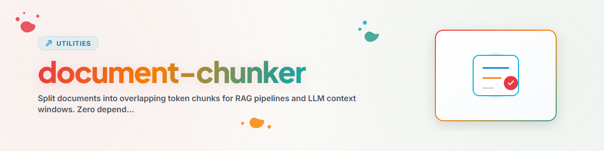

> **Русский** — Официальная русская версия `document-chunker`.


# Document Chunker (Русский)

Разбивает документы на перекрывающиеся чанки (фрагменты) токенов. Оптимизировано для конвейеров RAG и контекстных окон LLM. Нулевые внешние зависимости — только стандартная библиотека Python + модуль `re`.

## Использование

### Как библиотека
```python
from document_chunker import DocumentChunker

chunker = DocumentChunker(chunk_size=400, overlap=80)
chunks = chunker.chunk_text("Long text...")

for chunk in chunks:
    print(f"Chunk {chunk['chunk_id']}: {chunk['tokens']} tokens")
```

### Разбиение файла на чанки
```python
chunks = chunker.chunk_document("document.md", source="My Project")
```

### Разбиение всего каталога на чанки
```python
from document_chunker import chunk_corpus

chunks = chunk_corpus(["doc1.md", "doc2.txt"], source="Corpus")
```

### Интерфейс командной строки (CLI)
```bash
python document_chunker.py document.md    # Single file
python document_chunker.py ./docs/        # Entire directory
```

## Параметры

| Параметр | По умолчанию | Описание |
|-----------|---------|-------------|
| chunk_size | 400 | Максимальное количество токенов в чанке |
| overlap | 80 | Перекрытие токенов между чанками |

## Поддерживаемые типы файлов

`.txt`, `.md`, `.py`, `.sh`

## Журнал изменений

### 1.0.0 (2026-03-12)
- Перенесено из BACH system/tools/document_chunker.py