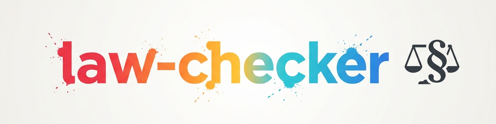

> **日本語** — `law-checker` の公式日本語版。

# law-checker (法務部門) -- Pointer Skill

このスキルは、独立した公開モジュールリポジトリ [`ellmos-ai/law-checker`](https://github.com/ellmos-ai/law-checker)（MITライセンス、公開）への**軽量ポインター（ラッパー）**です。実際のスキルはそこに存在します。このリポジトリは、中央スキルカタログを通じてモジュールを発見できるように、リンクとインストール方法のみをドキュメント化しています。

## モジュールの機能

`law-checker` はドイツ法に関する根拠に基づいた AI 初動法律評価を生成します:

- **法令レジストリ (`config.json`):** 切り替え可能な法令。すべての法律上の主張は、ローカルで取得した公式法律テキスト（必要に応じて条文、項、文、短い引用、ソース、取得日）によって裏付けられる必要があります。
- **法令体現エージェント (`agents/gesetzbuch.md`):** 登録された任意の法律に対して「法令の内側から」回答する汎用エージェント — レジストリに追加された任意の法令に拡張可能です。
- **独立した判例法レイヤー:** 裁判所の判決は、Webでの検証（裁判所、日付、事件番号、利用可能な場合はECLI）の後にのみ引用されます。
- **リスクとエスカレーションのワークフロー:** リスクレベルスケール、期限遵守、および弁護士の専門分野ルーティングマトリックスを備えたレポート形式。

## 境界線（重要）

- **AI支援による初動オリエンテーションのみを目的としており、個別のアドバイスの代わりにはならず、ライセンスを持つ弁護士によって提供されるものでもありません。**
- 法律事務所ではなく、ホストされた法的サービスでもなく、期限カレンダーでもありません。
- 実際の法的郵便物（警告状、公式通知、訴訟、期限）が関与している場合: 原本を確保し、期限をメモし、資格のある弁護士に相談してください — 自動化処理を行わないでください。

## インストール（汎用、ローカルパスなし）

1. モジュールをクローンします:
   ```bash
   git clone https://github.com/ellmos-ai/law-checker.git <clone-path>
   ```
2. `<clone-path>/SKILL.md` を自身のスキル環境（例: `~/.claude/skills/law-checker/` またはエージェントランタイムの同等物）に導入します。
3. 導入した `SKILL.md` とその参照内のモジュールパスを `<clone-path>` に設定します — 実際のローカルパスやホスト名をバージョン管理されたスキル環境にコミットしないでください。
4. 法令レジストリをロードします: `python <clone-path>/_tools/gesetze_fetch.py`（設定された公式法令テキストを取得します。古いポータル快照の再配布を避けるため、テキスト自体は意図的にリポジトリに含まれていません）。
5. 構造、ライセンス、および責任の詳細については、モジュールリポジトリの README を参照してください。

## このポインタースキルの由来

このラッパーは、`ellmos-ai/skills` リポジトリのショーケースエントリーとして2026-07-23に追加されました。**コードの重複はありません** — メンテナンスとバージョン管理は `ellmos-ai/law-checker` モジュールリポジトリにのみ残ります。

## 変更履歴

### 0.1.0 (2026-07-23)
- `ellmos-ai/law-checker` の初期ポインタースキル。