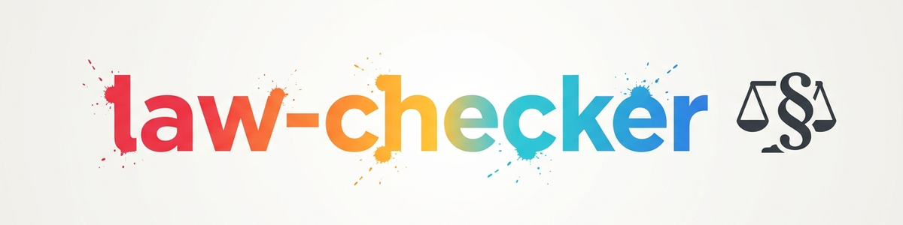

# law-checker (Rechtsabteilung) -- Verweis-Skill

Dieser Skill ist ein **schlanker Verweis (Wrapper)** auf das eigenstaendige,
oeffentliche Modul-Repository
[`ellmos-ai/law-checker`](https://github.com/ellmos-ai/law-checker) (MIT-Lizenz,
public). Der eigentliche Skill lebt dort -- dieses Repository verlinkt und
dokumentiert nur die Installation, damit das Modul ueber den zentralen
Skill-Katalog auffindbar ist.

## Was das Modul tut

`law-checker` liefert quellenbasierte KI-Ersteinschaetzungen fuer deutsches
Recht:

- **Gesetzes-Registry** (`config.json`): zuschaltbare Gesetzbuecher; jede
  Gesetzesaussage muss aus lokal geladenen, amtlichen Normtexten belegt werden
  (Artikel/Paragraph, Absatz, Satz, Kurzzitat, Quelle, Abrufdatum).
- **Gesetzbuch-Verkoerperungs-Agent** (`agents/gesetzbuch.md`): generischer
  Agent, der fuer jedes registrierte Gesetz "aus dem Gesetz heraus" antwortet
  -- skaliert auf beliebige Gesetze in der Registry.
- **Getrennte Rechtsprechungsschicht:** Urteile werden nur nach
  Web-Verifikation zitiert (Gericht, Datum, Aktenzeichen, ECLI wo verfuegbar).
- **Risiko- und Eskalations-Workflow:** Gutachtenformat mit Risiko-Ampel,
  Fristen-Disziplin und Anwalts-Fachgebiets-Matrix.

## Grenzen (wichtig)

- **KI-gestuetzte Erstorientierung, kein Ersatz fuer individuelle
  Rechtsberatung und keine Anwaltszulassung.**
- Kein Kanzleibetrieb, kein gehosteter Rechtsdienst, kein Fristenkalender.
- Bei echter Rechtspost (Abmahnung, Bescheid, Klage, Frist): Original sichern,
  Frist notieren, qualifizierte anwaltliche Beratung einholen -- den Vorgang
  NICHT automatisieren.

## Installation (generisch, ohne lokale Konkretpfade)

1. Modul klonen:
   ```bash
   git clone https://github.com/ellmos-ai/law-checker.git <klon-pfad>
   ```
2. `<klon-pfad>/SKILL.md` in die eigene Skill-Umgebung uebernehmen (z. B.
   `~/.claude/skills/law-checker/` oder das Aequivalent der genutzten
   Agenten-Runtime).
3. Den Modulpfad in der uebernommenen `SKILL.md` bzw. den zugehoerigen
   Referenzen auf `<klon-pfad>` setzen -- KEINE realen lokalen Pfade oder
   Hostnamen in eine versionierte Skill-Umgebung committen.
4. Gesetzes-Registry laden: `python <klon-pfad>/_tools/gesetze_fetch.py`
   (holt die konfigurierten amtlichen Normtexte; die Normtexte selbst liegen
   bewusst nicht im Repo, damit keine veralteten Portal-Abzuege
   redistribuiert werden).
5. Details zu Struktur, Lizenz und Haftung: siehe README des Modul-Repos.

## Herkunft dieses Verweis-Skills

Dieser Wrapper wurde am 2026-07-23 als Showcase-Eintrag fuer das
`ellmos-ai/skills`-Repository angelegt. Es findet **keine Code-Duplikation**
statt -- Pflege und Versionierung bleiben allein im Modul-Repo
`ellmos-ai/law-checker`.

## Changelog

### 0.1.0 (2026-07-23)
- Initialer Verweis-Skill auf `ellmos-ai/law-checker`.
