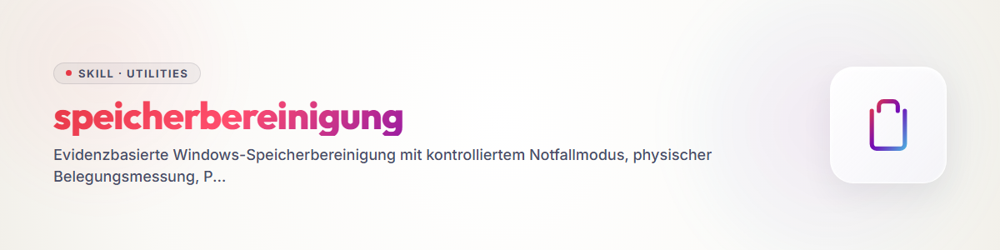

# Storage Cleanup

## Purpose and outcome

This skill recovers storage on Windows in a controlled way and prevents
the same fill path from immediately re-occupying the drive again. It
works in three phases: emergency relief, root-cause forensics and
permanent limitation.

Every mutation follows the same protocol:

`Finding -> decision -> bounded execution -> readback -> measurement`

Unless the user names a higher goal, the task only counts as complete
once the system volume reports at least 50 GB of free space again after
the last mutation. The first emergency threshold of an additional 10 GB
only ends the acute state, not the overall task.

## When to activate

Use this skill for:

- a tight system drive or recurring loss of space;
- unusually large logs, caches, pagefiles, archives or builds;
- duplicate clones, backup generations or local cloud copies;
- resource-exhaustion events or processes with strongly growing commit;
- suspicion that a scheduler, watcher or sync client keeps regenerating
  data.

## Safety rules

- Before every mutation, determine free space, volume, process state,
  locks, reparse points and the resolved absolute target path.
- For recursive actions, check that the target lies within the explicitly
  chosen root. Never use variables or globs as unchecked delete targets.
- Never delete a volume, user, repository, cloud or project root.
- Preserve active sources, uncommitted work, secrets, conflict copies,
  foreign locks, `.git` and the only recovery copy.
- Prefer the recycle bin, quarantine, compression or cloud dehydration. An
  irreversible deletion is only permitted for an exactly identified,
  regenerable finding; document path, size and how to restore it.
- Only change the pagefile, hibernation, services or system-wide limits
  with the necessary rights, a rollback and a full readback. "Access
  denied" is not a successful measure.
- Never delete OneDrive cloud objects to free up local storage. Cloud
  deletion and local dehydration are different operations.

## Phase 1: emergency relief

### 1. Baseline

Capture at least:

```powershell
Get-PSDrive -Name C | Select-Object Used, Free
Get-CimInstance Win32_LogicalDisk -Filter "DeviceID='C:'" |
  Select-Object DeviceID, Size, FreeSpace
Get-Process | Sort-Object PrivateMemorySize64 -Descending |
  Select-Object -First 15 Name, Id, PrivateMemorySize64, WorkingSet64
```

Note the time, the starting value and the target. Distinguish
`PrivateMemory` or commit from `WorkingSet`: a process can show little RAM
in the working set and still heavily occupy the pagefile.

### 2. Inventory in a bounded way

Start from known local roots and recent change windows. Don't search
recursively and blindly across all cloud or user directories. Suitable
candidates are:

- clearly regenerable model, package and build caches;
- old, finished build outputs;
- rotatable application logs;
- verified archive or backup generations;
- fully synchronized local cloud copies.

File length is not physical usage for sparse, compressed and cloud
placeholder files. Use NTFS allocation (`GetCompressedFileSizeW`),
`compact` or an equivalent tool and compare the free space before/after.

### 3. Work one finding

Work exactly one finding per measurement step. Afterward check:

- bytes actually recovered;
- errors, open handles and remaining locks;
- the continued existence of the protected source;
- recoverability or regenerability;
- whether a process immediately regenerates the finding.

Emergency mode only ends after a proven additional 10 GB. After that, the
flow moves straight into forensics.

## Phase 2: forensically determine filling processes and origin

### 1. Resource exhaustion and the pagefile

Read current and historical evidence together:

```powershell
Get-CimInstance Win32_ComputerSystem |
  Select-Object AutomaticManagedPagefile
Get-CimInstance Win32_PageFileUsage |
  Select-Object Name, AllocatedBaseSize, CurrentUsage, PeakUsage
Get-WinEvent -FilterHashtable @{LogName='System'; Id=2004} -MaxEvents 20
```

Event 2004 of the Windows Resource Exhaustion Detector contains the
processes with the highest commit at the time of the event. Map PID,
process name, timestamp and bytes to today's processes. A large
`pagefile.sys` alone doesn't prove that the file itself is the culprit;
what's sought is the process that triggered the commit.

### 2. File growth

Group new or changed files by:

- creation and modification hour;
- parent path and extension;
- owner or generating process;
- daily rate in files and physically occupied bytes.

Check log, cache, sync, backup, build, download and session directories
in particular. A seven-day retention is unsuitable if a client writes
several gigabytes per day and the volume is small.

### 3. Automations

Check task scheduling, services, watchers and startup programs for
frequency, retention and success:

```powershell
Get-ScheduledTask | Where-Object State -ne 'Disabled'
Get-ScheduledTaskInfo -TaskName '<task-name>'
```

Verify action, trigger, repeat interval, last return code and next run
time separately. An existing task is not proof that retention or
frequency actually govern the real growth.

## Phase 3: permanent limitation

Choose the smallest effective, reversible measure:

- run log rotation more often and additionally set a size limit;
- controlled restart of a conspicuous client and measure its commit;
- limit terminal scrollback or debug logging to a reasonable value;
- remove old, regenerable caches and watch their automatic regeneration;
- dehydrate verified cloud content with "Free up space";
- align scheduler frequency and retention with the empirical daily rate;
- only make pagefile or hibernation changes administratively, with a
  reboot and rollback plan.

For Windows Terminal, a bounded default scrollback can for example look
like this:

```json
{
  "profiles": {
    "defaults": {
      "historySize": 2000
    }
  }
}
```

Preserve existing settings and validate the JSON file after the change.

### OneDrive-specific gate

Before a dehydration, sync status and pending uploads must be checked.
Use a cloud-filter-aware file manager or the Explorer command "Free up
space". Dehydration must not delete the cloud content.

Check the local OneDrive log area under
`$env:LOCALAPPDATA\Microsoft\OneDrive\logs` separately. If a subarea
generates gigabytes per day, combine time-based retention with a hard
size cap and a sufficiently frequent scheduled run. Protect very new or
open files and check both task status and remaining size after the run.

## Completion check and report

After the last mutation:

1. Wait until asynchronous cloud or delete operations have finished.
2. Read free space and process commit again.
3. Check changed configurations, tasks and log sizes via readback.
4. Run a short retest: does the observation window generate excessive
   storage again?
5. Report the starting value, every finding and its decision, physically
   recovered bytes, filling processes, permanent adjustments, rollbacks,
   remaining risks and the final value.

Don't claim a cleanup, process limitation or reaching the 50 GB target
without a matching current readback.

## Known limits

- Without administrative rights, pagefile, hibernation or service changes
  can remain blocked. Document the exact remaining step.
- Historical process events prove a past filler; the current situation
  additionally needs process and file-growth data.
- A planned backup concept is not a backup. Transfer or deletion requires
  current target identity, a manifest or hash, proof of restore, and a
  mount.
- With unclear ownership, ongoing foreign work or an unknown target, the
  decision is `nothing`.

## Changelog

### 1.0.0 (2026-08-05)

- Initial portable version for the central skill library.
- Added resource-exhaustion, pagefile and process forensics.
- Clearly separated physical NTFS usage and OneDrive dehydration.
- Added OneDrive log rotation with a time and size limit.
- Defined hard emergency and completion gates with readback.
