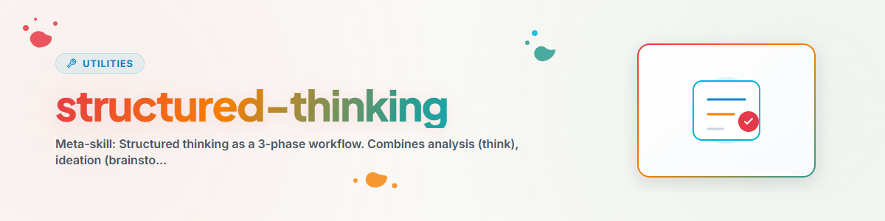

> **中文** — `structured-thinking` 官方中文版本。


# Structured Thinking — 分析、构思、决策

> 结构化思维的元工作流：从问题分析到创新解决方案，再到依据充分的决策

---

## 工作流与步骤

```
Problem/Question
     |
     v
Phase 1: ANALYZE (think)
  Divide & Conquer, Root Cause, Constraint Relaxation
     |
     v
Phase 2: IDEATE (brainstorm)
  SCAMPER, Six Hats, Reverse Brainstorming, Rapid Ideation
     |
     v
Phase 3: DECIDE (decide)
  Pro/Con, Weighted Scoring, Scenario Analysis, Eisenhower
     |
     v
Result + Rationale
```

---

## 第 1 阶段：分析 (Analyze)

目标：理解问题，识别原因，认识结构。

### 方法

| 方法 | 适用时机 | 步骤 |
|------|----------|------|
| **Divide & Conquer** | 复杂问题 | 问题 → 子问题 → 独立解决 → 组合 |
| **Root Cause (5x Why)** | 症状明显，原因不明 | 症状 → 为什么？ → 为什么？ → ... → 原因 → 解决方案 |
| **Constraint Relaxation** | 问题看似无解 | 放宽约束 → 解决 → 重新施加约束 |
| **Analogy Search** | 新颖问题 | 寻找类似的已知问题 → 调整其解决方案 |

### 分析框架

| 框架 | 应用 |
|------|------|
| **SWOT** | 优势 / 劣势 / 机会 / 威胁 |
| **Pareto** | 80/20 — 什么能提供最大的杠杆效应？ |
| **Fishbone** | 系统的原因分析（石川图） |

### 不确定性下的启发式方法

1. 最坏的情况是什么？
2. 是否可逆？
3. 不采取行动的代价是什么？

### 复杂性下的启发式方法

1. 最简单的第一步是什么？
2. 专家会怎么做？
3. 80% 的解决方案会是什么？

---

## 第 2 阶段：构思 (Ideate)

目标：生成尽可能多的解决方案。数量重于质量。在此阶段切勿进行批评。

### 方法

**SCAMPER** —— 系统地改进现有解决方案：
- **S**ubstitute（替代）：替换什么？ | **C**ombine（组合）：组合什么？ | **A**dapt（调整）：调整什么？
- **M**odify（修改）：修改什么？ | **P**ut to other use（另作他用）：还能用于什么？ | **E**liminate（消除）：放弃什么？
- **R**everse（反转）：反转什么？

**六顶思考帽**（de Bono）—— 依次采取 6 种视角：
1. 蓝色：过程控制（"问题是什么？"）
2. 白色：事实（"我们知道什么？"）
3. 红色：情感（"直觉告诉我们什么？"）
4. 黑色：批评（"可能出什么问题？"）
5. 黄色：乐观（"有什么机会？"）
6. 绿色：创意（"有什么新想法？"）

**逆向头脑风暴** —— 反转问题：
1. "我们如何让情况变得更糟？"
2. 收集坏想法
3. 反转 = 好想法

**快速构思** —— 20 分钟内生成 50+ 个想法：
- 第 1 轮（5 分钟）：开放式构思
- 第 2 轮（5 分钟）：变体
- 第 3 轮（5 分钟）：组合
- 第 4 轮（5 分钟）：极端想法

### 构思之后

1. 聚类（Clustering）：将类似想法分组
2. 可行性/影响矩阵：评估可行性与影响
3. 为第 3 阶段选择前 5-10 个想法

---

## 第 3 阶段：决策 (Decide)

目标：以透明的理由选择最佳选项。

### 框架选择

| 情况 | 框架 |
|------|------|
| 2 个选项，快速决策 | **利弊矩阵 (Pro/Con Matrix)** |
| 3+ 个选项，多项标准 | **加权评分 (Weighted Scoring)** |
| 顺序 if-then 决策 | **决策树 (Decision Tree)** |
| 高不确定性 | **情景分析 (Scenario Analysis)** |
| 任务优先级排序 | **艾森豪威尔矩阵 (Eisenhower Matrix)** |

### 加权评分（核心方法）

1. 收集标准（3-7 个，具体且可衡量）
2. 设定权重（总和 = 100%，最重要的 >= 25%）
3. 为选项评分（1-10 分制）
4. 计算得分（评分 x 权重）
5. 比较并提出建议

### 情景分析

```
Best Case (X%):      Outcome → expected value
Realistic Case (X%): Outcome → expected value
Worst Case (X%):     Outcome → expected value
Total expected value: [sum]
```

### 艾森豪威尔矩阵

```
              URGENT          NOT URGENT
IMPORTANT     1. DO           2. PLAN
NOT IMPORTANT 3. DELEGATE     4. ELIMINATE
```

### 最终建议前的质量检查清单

- [ ] 是否已识别所有相关标准？
- [ ] 是否已考虑用户的价值观？
- [ ] 是否考虑了长期影响？
- [ ] 是否已识别并评估了风险？
- [ ] 是否执行了偏见检查？
- [ ] 是否检查了可逆性？

---

## 按语境选择

| 情况 | 推荐阶段 |
|------|----------|
| "我有一个问题" | 第 1 阶段（分析）→ 可能第 2+3 阶段 |
| "我需要想法" | 第 2 阶段（构思） |
| "我必须做出决定" | 第 3 阶段（决策） |
| "我卡住了" | 第 2 阶段（逆向头脑风暴） |
| "我应该优先处理什么？" | 第 3 阶段（艾森豪威尔） |
| "理解复杂问题" | 第 1 阶段（Divide & Conquer + SWOT） |

---

## 变更日志

### 1.0.0 (2026-05-19)
- 作为元 skill 基于 think、brainstorm 和 decide 创建

---

*Meta-skill | 详细参考：[think](../think/SKILL.md), [brainstorm](../brainstorm/SKILL.md), [decide](../decide/SKILL.md)*