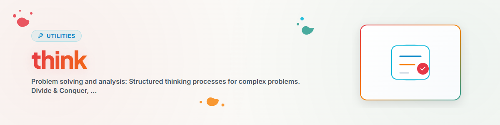

> **Español** — Versión oficial en español de `think`.


# Think — Resolución de problemas y análisis

> Procesos de pensamiento estructurado para problemas complejos

---

## Enfoques de resolución de problemas

### 1. Divide & Conquer (Divide y vencerás)

```
Problem -> Sub-problems -> Solve individually -> Combine
```

### 2. Root Cause Analysis (Análisis de causa raíz)

```
Symptom -> Why? -> Why? -> Why? -> Root cause -> Solution
```

### 3. Constraint Relaxation (Flexibilización de restricciones)

```
Unsolvable problem -> Relax constraints -> Solve -> Re-apply constraints
```

### 4. Analogy Search (Búsqueda de analogías)

```
New problem -> Similar known problem -> Adapt solution
```

---

## Métodos de análisis

| Método | Aplicación |
|--------|------------|
| **SWOT (FODA)** | Fortalezas / Oportunidades / Debilidades / Amenazas |
| **Pros/Contras** | Toma de decisiones |
| **Pareto** | Priorización 80/20 |
| **Fishbone** | Análisis de causa raíz (Ishikawa) |

---

## Heurísticas de decisión

### Bajo incertidumbre

```
1. ¿Cuál es el peor escenario posible?
2. ¿Es reversible?
3. ¿Cuál es el costo de no actuar?
```

### Bajo complejidad

```
1. ¿Cuál es el primer paso más simple?
2. ¿Qué haría un experto?
3. ¿Cuál sería la solución al 80%?
```

---

## Historial de cambios

### 1.0.0 (2026-03-15)
- Adaptado de BACH v3.8.0

---

*Adaptado de BACH v3.8.0 | Versión independiente*