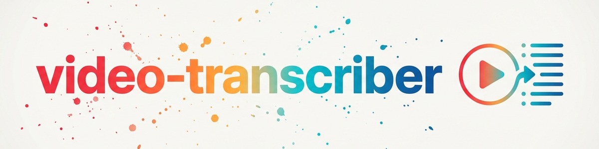

> **Русский** — Официальная русская версия `video-transcriber`.


# Video Transcriber (Русский)

Извлекает расшифровки (субтитры) и метаданные (название, канал, дата, просмотры,
описание) из онлайн-видео. Предпочитает вручную созданные субтитры, с резервным переходом
на автоматически сгенерированные. Вывод в формате Markdown, JSON или обычного текста.

В настоящее время поддерживаемый источник: **YouTube** (youtube.com, youtu.be, youtube-nocookie.com).

Для видео используйте этот инструмент вместо ручного суммирования содержания —
расшифровка является надежным источником.

> **Уведомление:** Этот инструмент не связан с YouTube или Google, не одобрен и не
> спонсируется ими. Использование осуществляется под личную ответственность пользователя. Пользователи
> несут единоличную ответственность за соблюдение условий обслуживания соответствующей платформы
> и действующего законодательства об авторском праве. Без обхода DRM, пейволлов или ограничений
> доступа. Без массового парсинга. Без распространения защищенных авторским правом расшифровок
> без согласия правообладателя.

## Зависимости и лицензии

```bash
pip install youtube-transcript-api   # расшифровки (обязательно) — лицензия MIT
pip install yt-dlp                   # метаданные (необязательно, fallback: noembed) — Unlicense (Общественное достояние)
```

## Использование

> **Примечание для Windows:** Всегда устанавливайте `PYTHONIOENCODING=utf-8`, иначе умлауты и
> специальные символы будут искажены при выводе (кодировка cp1252).

```bash
# По умолчанию: Markdown с временными метками
PYTHONIOENCODING=utf-8 python video_transcriber.py "https://www.youtube.com/watch?v=VIDEO_ID"

# Выбор формата вывода
PYTHONIOENCODING=utf-8 python video_transcriber.py URL --format markdown|json|plain

# Сохранение в файл
PYTHONIOENCODING=utf-8 python video_transcriber.py URL -o transcript.md

# Предпочитаемые языки (по умолчанию: de en)
PYTHONIOENCODING=utf-8 python video_transcriber.py URL --lang de en fr
```

### Параметры

| Параметр | Эффект |
|----------|--------|
| `--format markdown\|json\|plain` | Формат вывода (по умолчанию: markdown) |
| `--output, -o <file>` | Запись в файл вместо stdout |
| `--lang <codes...>` | Предпочитаемые языки субтитров (по умолчанию: de en) |
| `--meta-only` | Только метаданные, без расшифровки |
| `--transcript-only` | Только расшифровка, без метаданных |
| `--no-timestamps` | Расшифровка без временных меток |
| `--no-meta` | Быстрее: пропустить метаданные yt-dlp |

### Как библиотека Python

```python
from video_transcriber import extract_video_id, fetch_metadata, fetch_transcript, format_markdown

video_id = extract_video_id("https://www.youtube.com/watch?v=VIDEO_ID")
meta = fetch_metadata(video_id)
transcript = fetch_transcript(video_id, languages=["de", "en"])
output = format_markdown(meta, transcript)
```

## Типичные сценарии использования

- Исследования: сделать видеоконтент цитируемым в виде текста
- Анализ источников: изучение аргументации/метафор в выступлениях
- Сводки: расшифровка как надежная основа вместо галлюцинаций

## Ограничения

- Работает только в том случае, если видео содержит субтитры (ручные или автоматические)
- Автоматические субтитры могут содержать ошибки распознавания
- Без скачивания аудио, без встроенного распознавания речи

## История изменений

### 1.1.0 (2026-06-20)
- Переименовано из `yt-transcriber` → `video-transcriber` (Политика брендинга YouTube:
  "yt" является явно запрещенным сокращением; см. RECHTSCHECK_2026-06-20.md)
- Скрипт: `yt_transcriber.py` → `video_transcriber.py`
- Добавлен отказ от ответственности и лицензии зависимостей (ответственность пользователя, ToS, без одобрения)
- YouTube упоминается только описательно как источник, но не как часть названия/бренда
- Совместимый с прошлыми версиями wrapper `yt_transcriber.py` сохранен по старому пути

### 1.0.0 (2026-06-12)
- Добавлен SKILL.md (инструмент уже существовал как скрипт + README)
- Скрипт v1.0.0: расшифровка + метаданные, 3 формата вывода, языковые предпочтения