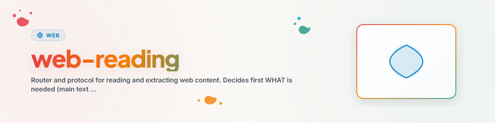

> **Русский** — Официальная русская версия `web-reading`.


# Веб-чтение (Router)

## Обзор и назначение

Получайте и обрабатывайте веб-контент — но не выбирайте инструмент вслепую. Навык выполняет маршрутизацию: **сначала цель, затем лучший из доступных инструментов.** Фактическая реализация находится в **модуле `web-scraper`**; этот навык показывает только то, что доступно в текущий момент и как этим пользоваться.

## Шаг 1 — Что требуется?

```
Process a web page?
  |
  +-- Main text (article / prose)   → "Content"     → Step 2A
  +-- Links / forms / headers       → "Structure"   → Step 2B
  +-- Rendered image of the page    → "Screenshot"  → Step 2C
```

## Шаг 2 — Какой инструмент? (Router)

Используйте **первый доступный** инструмент в каждом списке. «Доступный» означает, что инструмент/навык/модуль действительно присутствует в этой сессии.

### 2A — Контент (основной текст, чистый markdown)

| Приоритет | Инструмент | Доступен, когда… | Использование |
|---|---|---|---|
| 1 | Навык **`defuddle`** | навык `defuddle` в списке | чистый markdown из обычных веб-страниц |
| 2 | Встроенный **`WebFetch`** | у агента есть инструмент WebFetch | быстрое чтение/краткое изложение URL |
| 3 | **`fc_web_fetch`** (MCP) | загружен FileCommander MCP | `mode: "extract"` |
| 4 | Модуль **`web-scraper`** | модуль установлен/доступен для импорта | `web-scraper extract <url>` / `extract(url)` |

> Примечание: URL с расширением `.md` уже в формате markdown → используйте `WebFetch` напрямую, без экстрактора.

### 2B — Структура (ссылки, формы, заголовки)

`WebFetch`/`defuddle` **не подходят** для этих целей (они возвращают обработанный текст, а не исходную структуру). Используйте вместо них:

| Приоритет | Инструмент | Доступен, когда… | Использование |
|---|---|---|---|
| 1 | **`fc_web_fetch`** (MCP) | загружен FileCommander MCP | `mode: "links" \| "forms" \| "headers"` |
| 2 | Модуль **`web-scraper`** | модуль установлен/доступен для импорта | `web-scraper links\|forms\|headers <url>` |

### 2C — Скриншот

| Приоритет | Инструмент | Доступен, когда… | Использование |
|---|---|---|---|
| 1 | Модуль **`web-scraper`** | модуль с опцией `[screenshot]` | `web-scraper screenshot <url> --out img.png` |
| 2 | Инструмент автоматизации браузера | например, доступен Playwright/Computer-Use | зависит от страницы |

## Шаг 3 — Резервный вариант: ничего подходящего не найдено?

Если для этой цели **нет** доступных инструментов, рекомендуем установить **модуль `web-scraper`** (полный функционал: get/links/forms/headers/extract/screenshot):

```bash
# из локальной папки модуля (.MODULES/.TOOLS/web-scraper)
pip install ".[http,extract]"          # + [screenshot] для скриншотов

# затем:
web-scraper extract <url>
```

Как библиотека Python:

```python
from web_scraper import WebScraper, extract
print(extract("https://example.com")["content"])
```

## Крайний случай — автономный фрагмент (без зависимостей, кроме requests/bs4)

```python
import requests
from bs4 import BeautifulSoup

def extract_content(url: str) -> str:
    """Simple content extraction."""
    response = requests.get(url, timeout=30)
    response.raise_for_status()
    soup = BeautifulSoup(response.text, "html.parser")
    for tag in soup(["script", "style", "nav", "header", "footer", "aside"]):
        tag.decompose()
    return soup.get_text(separator="\n", strip=True)
```

## Журнал изменений

### 1.1.0 (2026-07-05)
- Переработан из обычного протокола в **маршрутизатор (Router)**: определяет доступные веб-возможности (`defuddle`, `WebFetch`, `fc_web_fetch`, модуль `web-scraper`) и маршрутизирует по назначению (контент/структура/скриншот); в противном случае рекомендует модуль `web-scraper`.
- Унифицировано имя в `web-reading` (ранее `webseiten-lesen` в DE-версии).
- Удалены примеры BACH CLI из основного текста (соответствие автономному стандарту; происхождение задокументировано в метаданных `bach_integration`).

### 1.0.0 (2026-03-12)
- Экспорт из рабочего процесса BACH v3.8.0 `webseiten-lesen.md`